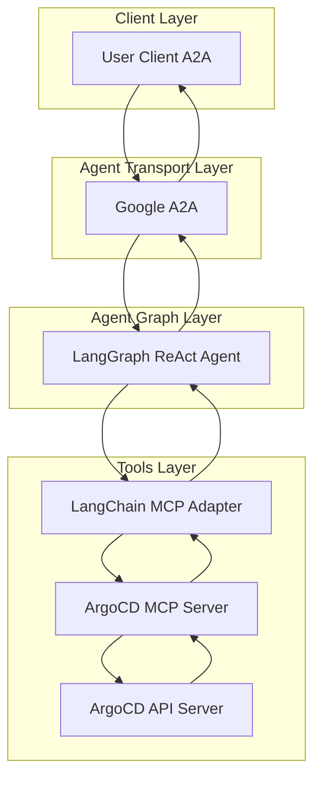

# 🚀 ArgoCD AI Agent

[](https://www.python.org/)
[](https://python-poetry.org/)
[](LICENSE)

[](https://github.com/cnoe-io/openapi-mcp-codegen/actions/workflows/conventional_commits.yml)
[](https://github.com/cnoe-io/openapi-mcp-codegen/actions/workflows/ruff.yml)
[](https://github.com/cnoe-io/agent-argocd/actions/workflows/unit-tests.yml)

[](https://github.com/cnoe-io/agent-argocd/actions/workflows/a2a-docker-build.yml)
---

---

- 🤖 **ArgoCD Agent** is an LLM-powered agent built using the [LangGraph ReAct Agent](https://langchain-ai.github.io/langgraph/agents/agents/) workflow and ArgoCD [MCP Server](https://modelcontextprotocol.io/introduction).
- 🌐 **Protocol Support:** Compatible with [A2A](https://github.com/google/A2A) protocol for integration with external user clients.
- 🛡️ **Secure by Design:** Enforces ArgoCD API token-based RBAC and supports secondary external authentication for strong access control.
- 🏭 **MCP Server:** The MCP server is generated by our first-party [openapi-mcp-codegen](https://github.com/cnoe-io/openapi-mcp-codegen/tree/main) utility, ensuring version/API compatibility and software supply chain integrity.
- 🔌 **MCP Tools:** Uses [langchain-mcp-adapters](https://github.com/langchain-ai/langchain-mcp-adapters) to glue the tools from ArgoCD MCP server to LangGraph ReAct Agent Graph.

---

## 🚦 Getting Started

### 1️⃣ Environment Setup

- Copy and configure your `.env` based on your LLM provider.
- Use [.env.example](.env.example) and refer to the [cnoe-agent-utils guide](https://github.com/cnoe-io/cnoe-agent-utils#-usage).

### 2️⃣ Start the Agent (A2A Mode)

  > **Note:** `a2a-stable` is the latest stable version of the agent. For production use cases, consider using a pinned version.

  ```bash
  docker run -p 0.0.0.0:8000:8000 -it \
    -v $(pwd)/.env:/app/.env \
    ghcr.io/cnoe-io/agent-argocd:a2a-stable
  ```

> 💡 Don’t have ArgoCD running? See [Local Dev Setup](#local-development-setup).

### 3️⃣ Run the A2A Client

Pick one of the following methods:

- **Docker:**

  ```bash
  docker run -it --network=host ghcr.io/cnoe-io/agent-chat-cli:stable
  ```

- **Python CLI:**

  ```bash
  uvx https://github.com/cnoe-io/agent-chat-cli.git a2a
  ```

---

## 🏗️ Architecture

### System Diagram



### Sequence Diagram

```mermaid
sequenceDiagram
  participant User
  participant A2A
  participant Agent as LangGraph ReAct Agent
  participant LLM
  participant MCP as ArgoCD MCP Server
  participant APIServer as ArgoCD API Server

  note over Agent,MCP: 🛠️ Agent Setup Phase
  rect rgb(245, 245, 220)
    Agent->>MCP: Get Tools
    Agent->>LLM: Bind Tools
  end

  rect rgb(220, 232, 243)
    note over User,A2A: 🧑‍💻 User Input Phase
    User->>A2A: Send request
    A2A->>Agent: Forward to LangGraph Agent

    note over Agent,LLM: 🧠 Agent Reasoning & Tool Selection
    Agent->>LLM: [Reason] User Input
    LLM-->>Agent: [Act] Excecute MCP Tool

    note over MCP,APIServer: 🛠️ API Invocation Phase
    Agent->>MCP: Invoke tool
    MCP->>APIServer: Call API
    APIServer-->>MCP: Return data
    MCP-->>Agent: Return data

    note over Agent,LLM: 🧠 Agent Reasoning & Output Structuring
    Agent->>LLM: Input API result data for further ReAct loop
    LLM-->>Agent: Return Structured Output

    note over User,A2A: 📤 User Output Phase
    Agent-->>A2A: Respond with Structured Output
    A2A-->>User: Respond to user (Non-stream or streaming)
  end
```



---

## ⚙️ Local Development Setup

Use this setup to test the agent against a local ArgoCD instance.

### ▶️ Start ArgoCD with kind cluster

> **Note:** KinD (Kubernetes in Docker) is a tool for running local Kubernetes clusters using Docker.
For detailed setup instructions, refer to the [KinD documentation](https://kind.sigs.k8s.io/). Below is a quickstart to launch a local cluster and install ArgoCD:

```bash
kind create cluster --name cnoe-argocd-agent
kubectl create namespace argocd
kubectl apply -n argocd -f https://raw.githubusercontent.com/argoproj/argo-cd/stable/manifests/install.yaml
kubectl port-forward svc/argocd-server -n argocd 8080:443
```

```bash
kind create cluster --name cnoe-argocd-agent
kubectl create namespace argocd
kubectl apply -n argocd -f https://raw.githubusercontent.com/argoproj/argo-cd/stable/manifests/install.yaml
kubectl port-forward svc/argocd-server -n argocd 8080:443
```

### 🛂 Retrieve Admin Credentials

```bash
kubectl -n argocd get secret argocd-initial-admin-secret \
  -o jsonpath="{.data.password}" | base64 -d && echo
```

### 📦 Install CLI (Optional)

```bash
brew install argocd
```

### 🚀 Deploy Guestbook Example

```bash
argocd login localhost:8080 --username admin --password <password> --insecure
argocd app create guestbook \
  --repo https://github.com/argoproj/argocd-example-apps.git \
  --path guestbook \
  --dest-server https://kubernetes.default.svc \
  --dest-namespace default
argocd app sync guestbook
```

### 🔑 Get API Token

```bash
kubectl -n argocd patch configmap argocd-cm --type merge -p '{"data":{"accounts.admin":"login,apiKey"}}'
kubectl -n argocd rollout restart deployment argocd-server
argocd account generate-token --account admin
```

Add to your `.env`:

```env
ARGOCD_TOKEN=<your_token>
ARGOCD_API_URL=https://localhost:8080
ARGOCD_VERIFY_SSL=false
```

---

## 🛠️ Common Development Tasks

### 1️⃣ Run A2A Agent Locally (without Docker)

- **Makefile Target:** `run-a2a`
- **What it does:**
  - Ensures your `.env` file exists.
  - Activates the Python virtual environment.
  - Loads environment variables from `.env`.
  - Runs the agent using [`uv`](https://github.com/astral-sh/uv) (a fast Python runner) on the port specified by `A2A_PORT` in your `.env` (defaults to `8000` if not set).

### 2️⃣ Build Local Docker Image

- **Makefile Target:** `build-docker-a2a`
- **What it does:**
  - Builds a Docker image for the A2A agent using `build/Dockerfile.a2a`.
  - Tags the image as `agent-<name>:a2a-latest` (e.g., `agent-argocd:a2a-latest`).

### 3️⃣ Run the Agent in Docker

- **Makefile Target:** `run-docker-a2a`
- **What it does:**
  - Reads `A2A_PORT` and `A2A_AGENT_IMAGE` from `.env` (uses defaults if not set).
  - Runs the Docker image, mapping the chosen port to container port `8000`.
  - Mounts your `.env` file into the container for configuration.

### ⚡ Typical Workflow & Gotchas

- Ensure your `.env` file exists and is up to date.
- If you change code, rebuild the Docker image before running again.
- The Docker container uses port `8000` internally; you can change the host port via `A2A_PORT` in `.env`.

---

## 🧩 MCP Server

This project includes a **first-party MCP server** generated from ArgoCD’s OpenAPI specification using the [openapi-mcp-codegen](https://github.com/cnoe-io/openapi-mcp-codegen) utility.


---

## 🧪 Evaluations

We use [agentevals](https://github.com/langchain-ai/agentevals) to verify agent behavior with strict trajectory matching.

### Run Evals

```bash
make evals
```

This will:

- Activate the Python virtual environment
- Install test dependencies
- Run strict-match tests against the agent

👉 See results in [evals/strict_match/README.md](evals/strict_match/README.md)

---

## 📜 License

Apache 2.0 – see [LICENSE](./LICENSE)

---

## 👥 Maintainers

See [MAINTAINERS.md](MAINTAINERS.md)
Contributions welcome via issues and PRs!

---

## 🙏 Acknowledgements

- [LangGraph](https://github.com/langchain-ai/langgraph)
- [LangChain](https://github.com/langchain-ai/langchain)
- [langchain-mcp-adapters](https://github.com/langchain-ai/langchain-mcp-adapters)
- [Model Context Protocol (MCP)](https://modelcontextprotocol.io/)
- [Google A2A](https://github.com/google/A2A)
- [AGNTCY Slim](https://docs.agntcy.org/pages/messaging_sdk/slim-index.html)
- OSS contributors & community!