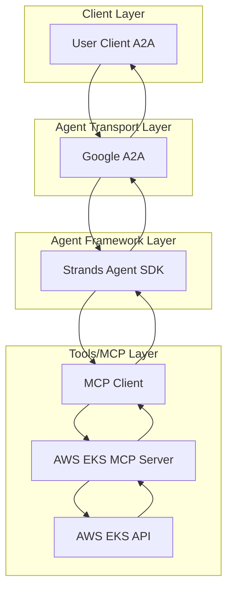

# 🚀 AWS AI Agent

[](https://www.python.org/)
[](https://python-poetry.org/)
[](LICENSE)

[](https://github.com/cnoe-io/ai-platform-engineering/actions/workflows/conventional_commits.yml)
[](https://github.com/cnoe-io/ai-platform-engineering/actions/workflows/ruff.yml)
[](https://github.com/cnoe-io/ai-platform-engineering/actions/workflows/unit-tests.yml)

---

## 📁 Project Structure

This AWS EKS AI Agent is part of the larger `ai-platform-engineering` repository and is located at:
```
ai-platform-engineering/
└── ai_platform_engineering/
    └── agents/
        └── aws/          # ← You are here
            ├── agent_aws/
            │   ├── __init__.py
            │   ├── agent.py
            │   ├── models.py
            │   ├── state.py
            │   └── protocol_bindings/
            ├── evals/
            ├── pyproject.toml
            ├── requirements.txt
            └── README.md
```

---

## 🧪 Evaluation Badges

| Claude | Gemini | OpenAI | Llama |
|--------|--------|--------|-------|
| [](https://github.com/cnoe-io/ai-platform-engineering/actions/workflows/claude-evals.yml) | [](https://github.com/cnoe-io/ai-platform-engineering/actions/workflows/gemini-evals.yml) | [](https://github.com/cnoe-io/ai-platform-engineering/actions/workflows/openai-evals.yml) | [](https://github.com/cnoe-io/ai-platform-engineering/actions/workflows/llama-evals.yml) |

---

- 🤖 **AWS Agent** is an LLM-powered agent built using the [Strands Agents SDK](https://strandsagents.com/0.1.x/documentation/docs/) and official AWS MCP Servers.
- 🌐 **Protocol Support:** Compatible with [A2A](https://github.com/google/A2A) protocol for integration with external user clients.
- 🛡️ **Secure by Design:** Enforces AWS IAM-based RBAC and supports external authentication for strong access control.
- 🔌 **EKS Management:** Uses the official [AWS EKS MCP Server](https://awslabs.github.io/mcp/servers/eks-mcp-server) for comprehensive Amazon EKS cluster management and Kubernetes operations.
- 📦 **ECS Management (Optional):** Integrate the [AWS ECS MCP Server](https://awslabs.github.io/mcp/servers/ecs-mcp-server) for containerizing applications, deploying to Amazon ECS, and managing containerized workloads.
- 💰 **Cost Management (Optional):** Integrate the AWS Cost Explorer MCP Server for FinOps insights, cost breakdowns, comparisons, forecasting, and optimization recommendations.
- 🔐 **IAM Security (Optional):** Integrate the AWS IAM MCP Server for comprehensive Identity and Access Management operations with read-only mode for safety.
- 🏭 **Production Ready:** Built with Strands Agents SDK for lightweight, production-ready AI agent deployment.

---

## 🚦 Getting Started

### 1️⃣ Configure Environment

- Ensure your `.env` file is set up with AWS credentials and region configuration.
- Create a `.env` file based on the configuration requirements below.

**Example .env file:**

```env
# Agent Configuration
AGENT_NAME=aws

# AWS Configuration
AWS_PROFILE=your-aws-profile
AWS_REGION=us-west-2
AWS_ACCESS_KEY_ID=your-access-key-id
AWS_SECRET_ACCESS_KEY=your-secret-access-key

# LLM Configuration (Default: Amazon Bedrock Claude)
# Refer to: https://strandsagents.com/0.1.x/documentation/docs/user-guide/quickstart/#model-providers

# Optional: Strands Agent Configuration
STRANDS_LOG_LEVEL=INFO

# Optional: MCP Server Configuration
FASTMCP_LOG_LEVEL=ERROR
# Enable/Disable individual MCP servers
ENABLE_EKS_MCP=true
ENABLE_ECS_MCP=false
ENABLE_COST_EXPLORER_MCP=false
ENABLE_IAM_MCP=false
# Run IAM MCP in read-only mode to block mutating operations (default: true)
IAM_MCP_READONLY=true
# ECS MCP security controls (default: both false for safety)
ECS_MCP_ALLOW_WRITE=false
ECS_MCP_ALLOW_SENSITIVE_DATA=false
```

To enable AWS ECS container management capabilities, set:

```
ENABLE_ECS_MCP=true
# Optional: Enable write operations for ECS (create/delete infrastructure)
ECS_MCP_ALLOW_WRITE=true
# Optional: Enable access to sensitive data (logs, detailed resource info)
ECS_MCP_ALLOW_SENSITIVE_DATA=true
```

To enable AWS Cost Explorer capabilities, set:

```
ENABLE_COST_EXPLORER_MCP=true
```

To enable AWS IAM management capabilities, set:

```
ENABLE_IAM_MCP=true
```

**Important Notes:**
- **ECS**: By default, write operations and sensitive data access are disabled. Enable `ECS_MCP_ALLOW_WRITE` for infrastructure creation/deletion and `ECS_MCP_ALLOW_SENSITIVE_DATA` for logs and detailed resource information
- **Cost Explorer**: API calls incur cost ($0.01 per request)
- **IAM**: By default runs in read-only mode for safety. Set `IAM_MCP_READONLY=false` to enable write operations

### 2️⃣ Prerequisites

- **Python 3.11+**: [Install Python](https://www.python.org/downloads/)
- **uv package manager**: [Install uv](https://docs.astral.sh/uv/getting-started/installation/)
- **AWS CLI**: [Install and configure AWS CLI](https://docs.aws.amazon.com/cli/latest/userguide/cli-chap-configure.html)
- **AWS Credentials**: Configure AWS credentials with appropriate EKS permissions
- **Amazon Bedrock Access**: Enable Claude model access in Amazon Bedrock console

### 3️⃣ Start the Agent (A2A Mode)

Run the agent in a Docker container using your `.env` file:

```bash
docker run -p 0.0.0.0:8000:8000 -it \
   -v "$(pwd)/.env:/app/.env" \
   ghcr.io/cnoe-io/agent-aws:a2a-stable
```

### 4️⃣ Run the Client

Use the [agent-chat-cli](https://github.com/cnoe-io/agent-chat-cli) to interact with the agent:

```bash
uvx https://github.com/cnoe-io/agent-chat-cli.git a2a
```

## 🏗️ Architecture



## 🛠️ Features

### **EKS Cluster Management**
- Create, describe, and delete EKS clusters with CloudFormation
- Generate EKS cluster templates with best practices
- Full lifecycle management of EKS infrastructure

### **Kubernetes Resource Operations**
- Manage individual Kubernetes resources (CRUD operations)
- Apply YAML manifests to EKS clusters
- List and query Kubernetes resources with filtering
- Generate application deployment manifests

### **Monitoring & Troubleshooting**
- Retrieve pod logs and Kubernetes events
- CloudWatch logs and metrics integration
- EKS troubleshooting guide integration
- Performance monitoring and alerting

### **Security & IAM**
- IAM role and policy management
- Add inline policies for EKS resources
- AWS credential-based authentication
- Kubernetes RBAC integration

### **Application Deployment**
- Generate Kubernetes deployment manifests
- Deploy containerized applications
- Load balancer and service configuration
- Multi-environment support

### **(Optional) AWS Cost Management & FinOps**
- Analyze AWS costs by service, region, account, tag, or usage type
- Compare costs between time periods (e.g., last month vs current month)
- Identify top cost change drivers
- Generate forecasts with confidence intervals
- Retrieve cost & usage grouped by multiple dimensions
- Explore tag values and dimension values interactively
- Provide optimization and budgeting insights

## 🎯 Example Use Cases

Ask the agent natural language questions like:

- **Cluster Management**: "Create a new EKS cluster called 'production' in us-west-2"
- **Application Deployment**: "Deploy a nginx application with 3 replicas to the 'dev' namespace"
- **Monitoring**: "Show me the CPU metrics for pods in the 'frontend' namespace"
- **Troubleshooting**: "Get the logs for the failing pod in the 'backend' namespace"
- **Resource Management**: "List all services in the 'default' namespace"
- **Cost Analysis**: "Show my AWS costs for the last 3 months grouped by service"
- **Cost Comparison**: "Compare my AWS costs between April and May 2025"
- **Cost Forecast**: "Forecast my AWS spending for next month"
- **Cost Drivers**: "Why did my AWS bill increase last month?"

## 📋 AWS Permissions

### Read-Only Operations (Default)
```json
{
  "Version": "2012-10-17",
  "Statement": [
    {
      "Effect": "Allow",
      "Action": [
        "eks:DescribeCluster",
        "cloudformation:DescribeStacks",
        "cloudwatch:GetMetricData",
        "logs:StartQuery",
        "logs:GetQueryResults",
        "iam:GetRole",
        "iam:GetRolePolicy",
        "iam:ListRolePolicies",
        "iam:ListAttachedRolePolicies",
        "iam:GetPolicy",
        "iam:GetPolicyVersion",
        "eks-mcpserver:QueryKnowledgeBase",
        "ce:GetCostAndUsage",
        "ce:GetDimensionValues",
        "ce:GetTags",
        "ce:GetCostForecast",
        "ce:GetCostAndUsageComparisons",
        "ce:GetCostComparisonDrivers",
        "iam:ListUsers",
        "iam:GetUser",
        "iam:ListRoles",
        "iam:ListGroups",
        "iam:GetGroup",
        "iam:ListPolicies",
        "iam:ListAttachedUserPolicies",
        "iam:ListUserPolicies",
        "iam:GetUserPolicy",
        "iam:ListAttachedGroupPolicies",
        "iam:ListGroupPolicies",
        "iam:GetGroupsForUser",
        "iam:ListAccessKeys",
        "iam:SimulatePrincipalPolicy"
      ],
      "Resource": "*"
    }
  ]
}
```

### Write Operations (with --allow-write)
For write operations, the following managed policies are recommended:
- **IAMFullAccess**: For creating and managing IAM roles and policies (when `IAM_MCP_READONLY=false`)
- **AmazonVPCFullAccess**: For VPC resource creation and configuration
- **AWSCloudFormationFullAccess**: For CloudFormation stack management
- **EKS Full Access**: Custom policy for EKS cluster operations

**Note**: IAM MCP server runs in read-only mode by default (`IAM_MCP_READONLY=true`) to prevent accidental modifications. Set to `false` to enable write operations.

## 🔒 Security Best Practices

- Use dedicated IAM roles with least privilege access
- Enable AWS CloudTrail for API call auditing
- Use separate roles for read-only and write operations
- Implement resource tagging for better access control
- Never pass secrets directly to the agent - use AWS Secrets Manager or Parameter Store
- For Cost Explorer usage, monitor API request volume to avoid unnecessary charges

## 🚀 Development

### Local Development Setup

```bash
# Clone the repository
git clone https://github.com/cnoe-io/ai-platform-engineering.git
cd ai-platform-engineering/ai_platform_engineering/agents/aws

# Create virtual environment
python -m venv .venv
source .venv/bin/activate  # On Windows: .venv\Scripts\activate

```bash
# Install dependencies
uv sync

# Run the agent locally (A2A mode)
uv run python -m agent_aws.protocol_bindings.a2a_server
```
```

### Running with Poetry

If you prefer using Poetry for dependency management:

```bash
# Install dependencies with Poetry (if poetry is set up)
poetry install

# Run the agent
poetry run agent_aws_a2a
```

### Running with uv (Recommended)

```bash
# Install dependencies with uv
uv sync

# Run the agent
uv run python -m agent_aws.protocol_bindings.a2a_server
```

## 📦 Dependencies

- **strands-agents**: Lightweight AI agent framework
- **awslabs.eks-mcp-server**: Official AWS EKS MCP Server
- **awslabs.cost-explorer-mcp-server** (via `uvx` when enabled): AWS Cost Explorer MCP Server
- **boto3**: AWS SDK for Python
- **a2a-python**: Google A2A protocol implementation
- **agntcy-acp**: Agent Control Protocol implementation
- **python-dotenv**: Environment variable management
- **click**: Command-line interface creation toolkit
- **pydantic**: Data validation and settings management
- **uvicorn**: ASGI server for production deployment
- **httpx**: Async HTTP client
- **uv**: Fast Python package installer and resolver

## 🧪 Testing

Run the evaluation suite:

```bash
make test
```

Run specific provider evaluations:

```bash
make test-claude
make test-openai
make test-gemini
```

## 📄 License

This project is licensed under the Apache License 2.0 - see the [LICENSE](LICENSE) file for details.

## 🤝 Contributing

Contributions are welcome! Please read our [Contributing Guide](CONTRIBUTING.md) for details on our code of conduct and the process for submitting pull requests.

## 📚 Documentation

- [Strands Agents SDK Documentation](https://strandsagents.com/0.1.x/documentation/docs/)
- [AWS EKS MCP Server Documentation](https://awslabs.github.io/mcp/servers/eks-mcp-server)
- [AWS Cost Explorer MCP Server Documentation](https://awslabs.github.io/mcp/servers/cost-explorer-mcp-server)
- [Model Context Protocol](https://modelcontextprotocol.io/introduction)
- [Amazon EKS User Guide](https://docs.aws.amazon.com/eks/latest/userguide/)