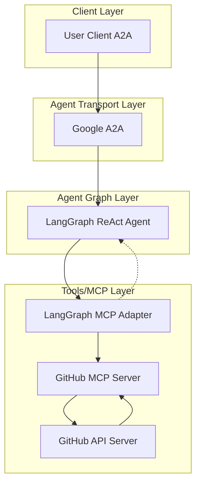

# 🚀 GitHub AI Agent

[](https://www.python.org/)
[](https://python-poetry.org/)
[](LICENSE)

[](https://github.com/cnoe-io/openapi-mcp-codegen/actions/workflows/conventional_commits.yml)
[](https://github.com/cnoe-io/openapi-mcp-codegen/actions/workflows/ruff.yml)
[](https://github.com/cnoe-io/openapi-mcp-codegen/actions/workflows/superlinter.yml)
[](https://github.com/cnoe-io/agent-github/actions/workflows/unit-tests.yml)

[](https://github.com/cnoe-io/agent-github/actions/workflows/a2a-docker-build.yml)
---

## 🧪 Evaluation Badges

| Claude | Gemini | OpenAI | Llama |
|--------|--------|--------|-------|
| [](https://github.com/cnoe-io/agent-github/actions/workflows/claude-evals.yml) | [](https://github.com/cnoe-io/agent-github/actions/workflows/gemini-evals.yml) | [](https://github.com/cnoe-io/agent-github/actions/workflows/openai-evals.yml) | [](https://github.com/cnoe-io/agent-github/actions/workflows/openai-evals.yml) |

---

- 🤖 **GitHub Agent** is an LLM-powered agent built using the [LangGraph ReAct Agent](https://langchain-ai.github.io/langgraph/agents/agents/) workflow and [MCP tools](https://modelcontextprotocol.io/introduction).
- 🌐 **Protocol Support:** Compatible with [A2A](https://github.com/google/A2A) protocol for integration with external user clients.
- 🛡️ **Secure by Design:** Enforces GitHub API token-based authentication and supports external authentication for strong access control.
- 🔌 **Integrated Communication:** Uses [langchain-mcp-adapters](https://github.com/langchain-ai/langchain-mcp-adapters) to connect with the GitHub MCP server within the LangGraph ReAct Agent workflow.
- 🏭 **First-Party MCP Server:** The MCP server is generated by our first-party [openapi-mcp-codegen](https://github.com/cnoe-io/openapi-mcp-codegen/tree/main) utility, ensuring version/API compatibility and software supply chain integrity.

---

## 🏗️ Architecture



## ✨ Features

- 🤖 **LangGraph + LangChain MCP Adapter** for agent orchestration
- 🧠 **Azure OpenAI GPT-4** as the LLM backend
- 🔗 Connects to GitHub via a dedicated GitHub MCP server
- 📊 **Comprehensive GitHub API Support:**
  - Repository Management
  - Issue Management
  - Pull Request Management
  - Branch Management
  - Commit Operations
  - Project Management
  - Team Collaboration

---

## 🚀 Getting Started

### 1️⃣ Configure Environment

#### Setting Up Azure OpenAI

1. Go to [Azure Portal](https://portal.azure.com)
2. Create or select your Azure OpenAI resource
3. Navigate to "Keys and Endpoint" section
4. Copy the endpoint URL and one of the keys
5. In Azure OpenAI Studio:
   - Create a deployment for GPT-4
   - Note down the deployment name
   - You'll need these values for your `.env` file:
     - `AZURE_OPENAI_API_KEY`
     - `AZURE_OPENAI_ENDPOINT`
     - `AZURE_OPENAI_DEPLOYMENT`

#### Setting Up GitHub Token

1. Go to GitHub.com → Settings → Developer Settings → Personal Access Tokens → Tokens (classic)
2. Click "Generate new token (classic)"
3. Give your token a descriptive name
4. Set an expiration date (recommended: 90 days)
5. Select the required permissions:
   - repo (Full control of private repositories)
   - workflow (Update GitHub Action workflows)
   - admin:org (Full control of orgs and teams)
   - admin:public_key (Full control of public keys)
   - admin:repo_hook (Full control of repository hooks)
   - admin:org_hook (Full control of organization hooks)
   - gist (Create gists)
   - notifications (Access notifications)
   - user (Update ALL user data)
   - delete_repo (Delete repositories)
   - write:packages (Upload packages to GitHub Package Registry)
   - delete:packages (Delete packages from GitHub Package Registry)
   - admin:gpg_key (Full control of GPG keys)
   - admin:ssh_signing_key (Full control of SSH signing keys)
6. Click "Generate token"
7. Copy the token immediately (you won't be able to see it again)
8. Save this as your `GITHUB_PERSONAL_ACCESS_TOKEN`

#### Port Configuration

- Default ports:
  - A2A Agent: 8000
  - MCP Server: 9000
- If port 8000 is already in use:
  1. Choose an available port (e.g., 8001, 8002, etc.)
  2. You'll need to update this in both:
     - Your `.env` file as `A2A_AGENT_PORT`
     - Your Docker run command port mapping

Now, create a `.env` file in the root directory with the following configuration:

```env
############################
# Agent Configuration
############################
LLM_PROVIDER=azure-openai
AGENT_NAME=github

## A2A Agent Configuration
A2A_AGENT_HOST=localhost
A2A_AGENT_PORT=8000  # Change this if port 8000 is already in use

## MCP Server Configuration
MCP_HOST=localhost
MCP_PORT=9000

############################
# Azure OpenAI Configuration
############################
# Get these values from your Azure OpenAI resource in Azure Portal
AZURE_OPENAI_API_KEY=<your-azure-key>  # Found in Azure Portal under "Keys and Endpoint"
AZURE_OPENAI_API_VERSION=2025-04-01-preview
AZURE_OPENAI_DEPLOYMENT=gpt-4.1  # Your deployment name in Azure OpenAI
AZURE_OPENAI_ENDPOINT=<your-azure-endpoint>  # Found in Azure Portal under "Keys and Endpoint"

############################
# Google Gemini (if needed)
############################

GOOGLE_API_KEY=<your-google-api-key>

############################
# GitHub Configuration
############################
# Your GitHub Classic Token with the permissions listed above
GITHUB_PERSONAL_ACCESS_TOKEN=<your-github-token>
```

### 2️⃣ Start the Agent (A2A Mode)

1. Pull the A2A image:

```bash
docker pull ghcr.io/cnoe-io/agent-github:a2a-stable
```

2. Run the agent in a Docker container using your `.env` file:

```bash
docker run -it --rm \
  --env-file .env \
  -p 8000:8000 \
  -v /var/run/docker.sock:/var/run/docker.sock \
  ghcr.io/cnoe-io/agent-github:a2a-stable
```

### 3️⃣ Run the Client

First, set up a virtual environment and install required tools:

#### Set Up Virtual Environment

**For Linux/macOS:**

```bash
# Create virtual environment
python -m venv .venv

# Activate virtual environment
source .venv/bin/activate
```

**For Windows:**

```bash
# Create virtual environment
python -m venv .venv

# Activate virtual environment
. .venv\Scripts\activate
```

#### Install uv

```bash
# Install uv package manager
pip install uv
```

Now you can use the [agent-chat-cli](https://github.com/cnoe-io/agent-chat-cli) to interact with the agent:

```bash
uvx https://github.com/cnoe-io/agent-chat-cli.git a2a
```

## Local Development

### Alternative: Running Locally
You can also run the agent locally without Docker:

First clone the repo:

```bash
git clone https://github.com/cnoe-io/agent-github.git
cd agent-github
```

```bash
make run-a2a
```

In a new terminal, start the A2A client:

```bash
make run-a2a-client
```

## Quick Demos

### ▶️ Test with GitHub API

#### 🏃 Quick Start: Set Up GitHub Access

1. **Create a GitHub Account:**
   If you don't have one, sign up at [GitHub](https://github.com/).

2. **Generate a Personal Access Token:**
   - Go to Settings → Developer settings → Personal access tokens
   - Generate a new token with appropriate permissions
   - Save the token securely

3. **Configure Your Token:**
   - Add your token to the `.env` file as `GITHUB_PERSONAL_ACCESS_TOKEN`

### Example Interactions

1. **Repository Management**
```
User: list my repositories
Agent: Here are your GitHub repositories:

1. agent-github (Public)
   - Language: Python
   - Description: LLM-powered GitHub agent
   - Last updated: 2 days ago

2. agent-chat-cli (Public)
   - Language: Python
   - Description: CLI client for agent interaction
   - Last updated: 1 week ago

Let me know if you need more details about any repository!
```

2. **Issue Management**
```
User: create an issue in agent-github
Agent: Issue created successfully!

Title: Add new feature
Repository: agent-github
Issue #: 42
URL: https://github.com/yourusername/agent-github/issues/42

Would you like me to add any labels or assign someone to this issue?
```

## 🔍 Troubleshooting

### Common Issues

1. **Docker Issues**
   - Ensure Docker daemon is running
   - Check if you have sufficient permissions
   - Verify the required images are available

2. **Port Conflicts**
   - If port 8000 is in use, modify the port in `.env`
   - Check for other services using required ports

3. **Environment Variables**
   - Verify all required variables in `.env`
   - Check API keys and tokens are valid
   - No trailing spaces in values

4. **Client Connection Issues**
   - Server must be running before client
   - Port numbers should match
   - API keys must match between server and client

## Contributing

Please read our [Contributing Guide](CONTRIBUTING.md) for details on our code of conduct and the process for submitting pull requests.

## License

This project is licensed under the Apache 2.0 License - see the [LICENSE](LICENSE) file for details.
