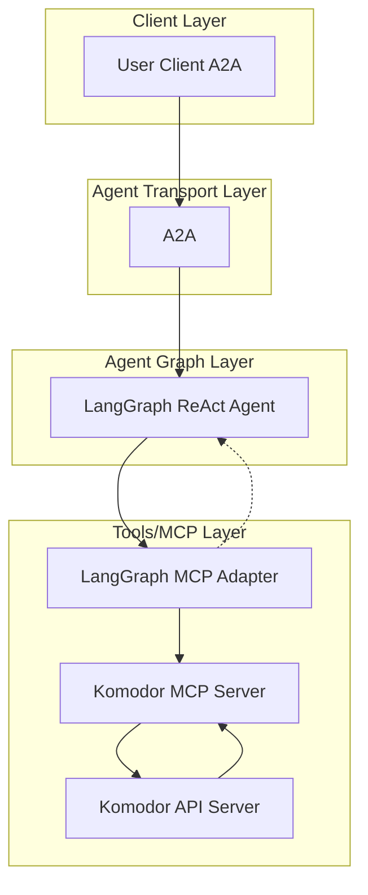

# 🚀 Komodor AI Agent

[](https://www.python.org/)
[](https://python-poetry.org/)
[](LICENSE)

[](https://github.com/cnoe-io/openapi-mcp-codegen/actions/workflows/conventional_commits.yml)
[](https://github.com/cnoe-io/openapi-mcp-codegen/actions/workflows/ruff.yml)
[](https://github.com/cnoe-io/openapi-mcp-codegen/actions/workflows/superlinter.yml)
[](https://github.com/cnoe-io/agent-komodor/actions/workflows/unit-tests.yml)

[](https://github.com/cnoe-io/agent-komodor/actions/workflows/acp-docker-build.yml)
[](https://github.com/cnoe-io/agent-komodor/actions/workflows/a2a-docker-build.yml)
---

## 🧪 Evaluation Badges

| Claude | Gemini | OpenAI | Llama |
|--------|--------|--------|-------|
| [](https://github.com/cnoe-io/agent-komodor/actions/workflows/claude-evals.yml) | [](https://github.com/cnoe-io/agent-komodor/actions/workflows/gemini-evals.yml) | [](https://github.com/cnoe-io/agent-komodor/actions/workflows/openai-evals.yml) | [](https://github.com/cnoe-io/agent-komodor/actions/workflows/openai-evals.yml) |

---

- 🤖 **Komodor Agent** is an LLM-powered agent built using the [LangGraph ReAct Agent](https://langchain-ai.github.io/langgraph/agents/agents/) workflow and [MCP tools](https://modelcontextprotocol.io/introduction).
- 🌐 **Protocol Support:** Compatible with [ACP](https://github.com/agntcy/acp-spec) and [A2A](https://github.com/google/A2A) protocols for integration with external user clients.
- 🛡️ **Secure by Design:** Enforces Komodor API token-based RBAC and supports external authentication for strong access control.
- 🔌 **Integrated Communication:** Uses [langchain-mcp-adapters](https://github.com/langchain-ai/langchain-mcp-adapters) to connect with the Komodor MCP server within the LangGraph ReAct Agent workflow.
- 🏭 **First-Party MCP Server:** The MCP server is generated by our first-party [openapi-mcp-codegen](https://github.com/cnoe-io/openapi-mcp-codegen/tree/main) utility, ensuring version/API compatibility and software supply chain integrity.

---
## Quick Demos

### AGNTCY ACP Demo


### Google A2A Demo


## 🏗️ Architecture



---

## ✨ Features

- 🤖 **LangGraph + LangChain MCP Adapter** for agent orchestration
- 🧠 **Azure OpenAI GPT-4o** as the LLM backend
- 🔗 Connects to Komodor via a dedicated [Komodor MCP agent](https://github.com/cnoe-io/agent-komodor/tree/main/agent_komodor/protocol_bindings/mcp_server)
- 🔄 **Multi-protocol support:** Compatible with both **ACP** and **A2A** protocols for flexible integration and multi-agent orchestration

---

### 1️⃣ Create/Update `.env`

```env
LLM_PROVIDER=<azure-openai|google-gemini>
AGENT_NAME=Komodor

## ACP Agent Configuration
CNOE_AGENT_KOMODOR_API_KEY=
CNOE_AGENT_KOMODOR_ID=
CNOE_AGENT_KOMODOR_PORT=

## A2A Agent Configuration
A2A_AGENT_HOST=localhost
A2A_AGENT_PORT=8000

## MCP Server Configuration
MCP_HOST=localhost
MCP_PORT=9000

## Azure OpenAI Configuration
AZURE_OPENAI_API_KEY=
AZURE_OPENAI_API_VERSION=
AZURE_OPENAI_DEPLOYMENT=
AZURE_OPENAI_ENDPOINT=

## Google Gemini Configuration
GOOGLE_API_KEY=

## Komodor Configuration
KOMODOR_TOKEN=
KOMODOR_API_URL=
KOMODOR_VERIFY_SSL=<true|false>
```

---

### 2️⃣ Start Workflow Server (ACP or A2A)

You can start the workflow server in either ACP or A2A mode:

- **ACP Mode:**
  ```bash
  make run-acp
  ```
- **A2A Mode:**
  ```bash
  make run-a2a
  ```

---

## 🧪 Usage

### 1️⃣ Run the ACP Client

To interact with the agent in **ACP mode**:

```bash
make run-acp-client
```

**Configure Environment Variables**

Create or update a `.env` file in your project root with the following:

```env
AGENT_ID="<YOUR_AGENT_ID>"
API_KEY="<YOUR_API_KEY>"
WFSM_PORT="<YOUR_ACP_SERVER_PORT>"
```

**Example Interaction**

```
> Your Question: how can you help?
Agent: I can assist you with managing applications in Komodor, including tasks such as:
```

- **Listing Applications**: Retrieve a list of applications with filtering options.
- **Getting Application Details**: Fetch detailed information about a specific application.
- **Creating Applications**: Create new applications in Komodor.
- **Updating Applications**: Update existing applications.
- **Deleting Applications**: Remove applications from Komodor.
- **Getting User Info**: Retrieve information about the current user.
- **Getting Komodor Settings**: Access server settings.
- **Getting Plugins**: List available plugins.
- **Getting Version Information**: Retrieve Komodor API server version.

---

### 2️⃣ Run the A2A Client

To interact with the agent in **A2A mode**:

```bash
make run-a2a-client
```

**Sample Streaming Output**

When running in A2A mode, you’ll see streaming responses like:

```
============================================================
RUNNING STREAMING TEST
============================================================

--- Single Turn Streaming Request ---
--- Streaming Chunk ---
The current version of Komodor is **v2.13.3+a25c8a0**. Here are some additional details:

- **Build Date:** 2025-01-03
- **Git Commit:** a25c8a0eef7830be0c2c9074c92dbea8ff23a962
- **Git Tree State:** clean
- **Go Version:** go1.23.1
- **Compiler:** gc
- **Platform:** linux/amd64
- **Kustomize Version:** v5.4.3
- **Helm Version:** v3.15.4+gfa9efb0
- **Kubectl Version:** v0.31.0
- **Jsonnet Version:** v0.20.0
```

---

## 🧬 Internals

- 🛠️ Uses [`create_react_agent`](https://docs.langchain.com/langgraph/agents/react/) for tool-calling
- 🔌 Tools loaded from the **Komodor MCP server** (submodule)
- ⚡ MCP server launched via `uv run` with `stdio` transport
- 🕸️ Single-node LangGraph for inference and action routing

---

## 📁 Project Structure

```text
agent_komodor
├── __main__.py
├── agent.py
├── graph.py
├── llm_factory.py
├── models.py
├── protocol_bindings
│   ├── __init__.py
│   ├── a2a_server
│   │   └── agent_executor.py
│   ├── acp_server
│   │   └── agent.json
│   └── mcp_server
│       ├── __init__.py
│       └── mcp_komodor
│           ├── __init__.py
│           ├── api
│           │   └── client.py
│           ├── models
│           │   └── base.py
│           ├── server.py
│           ├── tools
│           │   └── api_v1_applications.py
│           └── utils
│               └── __init__.py
└── state.py

```

---

## 🧩 MCP Submodule (Komodor Tools)

This project uses a **first-party MCP module** generated from the Komodor OpenAPI specification using our [openapi-mcp-codegen](https://github.com/cnoe-io/openapi-mcp-codegen/tree/main/examples) utility. The generated MCP server is included as a git submodule in `komodor_mcp/`.

All Komodor-related LangChain tools are defined by this MCP server implementation, ensuring up-to-date API compatibility and supply chain integrity.

---

## 🔌 MCP Integration

The agent uses [`MultiServerMCPClient`](https://github.com/langchain-ai/langchain-mcp-adapters) to communicate with MCP-compliant services.

**Example (stdio transport):**

```python
async with MultiServerMCPClient(
  {
    "komodor": {
      "command": "uv",
      "args": ["run", "/abs/path/to/komodor_mcp/server.py"],
      "env": {
        "KOMODOR_TOKEN": komodor_token,
        "KOMODOR_API_URL": komodor_api_url,
        "KOMODOR_VERIFY_SSL": "false"
      },
      "transport": "stdio",
    }
  }
) as client:
  agent = create_react_agent(model, client.get_tools())
```

**Example (SSE transport):**

```python
async with MultiServerMCPClient(
  {
    "komodor": {
      "transport": "sse",
      "url": "http://localhost:8000"
    }
  }
) as client:
  ...
```

---
## Evals

### Running Evals
This evaluation uses [agentevals](https://github.com/langchain-ai/agentevals) to perform strict trajectory match evaluation of the agent's behavior. To run the evaluation suite:


```bash
make evals
```

This will:

- Set up and activate the Python virtual environment
- Install evaluation dependencies (`agentevals`, `tabulate`, `pytest`)
- Run strict trajectory matching tests against the agent

#### Example Output

```
=======================================
 Setting up the Virtual Environment
=======================================
Virtual environment already exists.
=======================================
 Activating virtual environment
=======================================
To activate venv manually, run: source .venv/bin/activate
. .venv/bin/activate
Running Agent Strict Trajectory Matching evals...
Installing agentevals with Poetry...
. .venv/bin/activate && uv add agentevals tabulate pytest
...
set -a && . .env && set +a && uv run evals/strict_match/test_strict_match.py
...
Test ID: komodor_agent_1
Prompt: show komodor version
Reference Trajectories: [['__start__', 'agent_komodor']]
Note: Shows the version of the Komodor Server Version.
...
Results:
{'score': True}
...
```

#### Evaluation Results

[Latest Strict Match Eval Results](evals/strict_match/README.md)

---

## 📜 License

Apache 2.0 (see [LICENSE](./LICENSE))

---

## 👥 Maintainers

See [MAINTAINERS.md](MAINTAINERS.md)

- Contributions welcome via PR or issue!

---

## 🙏 Acknowledgements

- [LangGraph](https://github.com/langchain-ai/langgraph) and [LangChain](https://github.com/langchain-ai/langchain) for agent orchestration frameworks.
- [langchain-mcp-adapters](https://github.com/langchain-ai/langchain-mcp-adapters) for MCP integration.
- [AGNTCY Agent Connect Protocol(ACP)](https://docs.agntcy.org/pages/syntactic_sdk/connect.html)
- [AGNTCY Agent Gateway Protocol(AGP)](https://docs.agntcy.org/pages/messaging_sdk/agp-howto.html)
- [AGNTCY Workflow Server Manager (WFSM)](https://github.com/agntcy/workflow-srv-mgr) for deployment and orchestration.
- [Model Context Protocol (MCP)](https://modelcontextprotocol.io/) for the protocol specification.
- [Google A2A](https://github.com/google/A2A/tree/main)
- The open source community for ongoing support and contributions.
