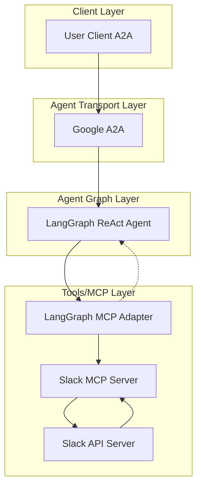

# üöÄ Slack AI Agent

[](https://www.python.org/)
[](https://python-poetry.org/)
[](LICENSE)

[](https://github.com/cnoe-io/openapi-mcp-codegen/actions/workflows/conventional_commits.yml)
[](https://github.com/cnoe-io/openapi-mcp-codegen/actions/workflows/ruff.yml)
[](https://github.com/cnoe-io/openapi-mcp-codegen/actions/workflows/superlinter.yml)
[](https://github.com/cnoe-io/agent-slack/actions/workflows/unit-tests.yml)

[](https://github.com/cnoe-io/agent-slack/actions/workflows/a2a-docker-build.yml)
---

## üß™ Evaluation Badges

| Claude | Gemini | OpenAI | Llama |
|--------|--------|--------|-------|
| [](https://github.com/cnoe-io/agent-slack/actions/workflows/claude-evals.yml) | [](https://github.com/cnoe-io/agent-slack/actions/workflows/gemini-evals.yml) | [](https://github.com/cnoe-io/agent-slack/actions/workflows/openai-evals.yml) | [](https://github.com/cnoe-io/agent-slack/actions/workflows/openai-evals.yml) |

---

- 🤖 **Slack Agent** is an LLM-powered agent built using the [LangGraph ReAct Agent](https://langchain-ai.github.io/langgraph/agents/agents/) workflow and [MCP tools](https://modelcontextprotocol.io/introduction).
- üåê **Protocol Support:** Compatible with [A2A](https://github.com/google/A2A) protocol for integration with external user clients.
- 🛡️ **Secure by Design:** Enforces Slack API token-based authentication and supports external authentication for strong access control.
- üîå **Integrated Communication:** Uses [langchain-mcp-adapters](https://github.com/langchain-ai/langchain-mcp-adapters) to connect with the Slack MCP server within the LangGraph ReAct Agent workflow.
- üè≠ **First-Party MCP Server:** The MCP server is generated by our first-party [openapi-mcp-codegen](https://github.com/cnoe-io/openapi-mcp-codegen/tree/main) utility, ensuring version/API compatibility and software supply chain integrity.

---

## 🏗️ Architecture



## ‚ú® Features

- 🤖 **LangGraph + LangChain MCP Adapter** for agent orchestration
- 🧠 **Azure OpenAI GPT-4** as the LLM backend
- üîó Connects to Slack via a dedicated [Slack MCP agent](https://github.com/cnoe-io/agent-slack/tree/main/agent_slack/protocol_bindings/mcp_server)
- 🔄 **Multi-protocol support:** Compatible with **A2A** protocol for flexible integration and multi-agent orchestration
- üìä **Comprehensive Slack API Support:**
  - Channel Management (list, join, leave)
  - Message Management (send, update, delete)
  - User Management (list, info, status)
  - File Management (upload, list, delete)
  - Reaction Management (add, remove)
  - Thread Management (reply, follow)

---

## üöÄ Getting Started

Running it via Docker:

### 1️⃣ Configure Environment
Ensure your `.env` file is set up as described in the [cnoe-agent-utils usage guide](https://github.com/cnoe-io/cnoe-agent-utils) based on your LLM Provider.

Example `.env` configuration:
```env
############################
# Agent Configuration
############################
LLM_PROVIDER=azure-openai
AGENT_NAME=Slack

## A2A Agent Configuration
A2A_AGENT_HOST=localhost
A2A_AGENT_PORT=8000

## MCP Server Configuration
MCP_HOST=localhost
MCP_PORT=9000

############################
# Azure OpenAI Configuration
############################
AZURE_OPENAI_API_KEY=<your-azure-key>
AZURE_OPENAI_API_VERSION=2025-04-01-preview
AZURE_OPENAI_DEPLOYMENT=gpt-4.1
AZURE_OPENAI_ENDPOINT=<your-azure-endpoint>

############################
# Slack Configuration
############################
SLACK_BOT_TOKEN=<your-bot-token>
SLACK_APP_TOKEN=<your-app-token>
SLACK_SIGNING_SECRET=<your-signing-secret>
SLACK_CLIENT_SECRET=<your-client-secret>
SLACK_TEAM_ID=<your-team-id>
```

### 2️⃣ Start the Agent (A2A Mode)
1. Pull the A2A image:
```bash
docker pull ghcr.io/cnoe-io/agent-slack:a2a-stable
```

2. Run the agent in a Docker container using your `.env` file:
```bash
docker run -p 0.0.0.0:8000:8000 -it \
  -v $(pwd)/.env:/app/.env \
  ghcr.io/cnoe-io/agent-slack:a2a-stable
```

### 3️⃣ Run the Client
Use the [agent-chat-cli](https://github.com/cnoe-io/agent-chat-cli) to interact with the agent:

```bash
uvx https://github.com/cnoe-io/agent-chat-cli.git a2a
```

### Alternative: Running Locally
You can also run the agent locally without Docker:

First clone the repo

```bash
git clone https://github.com/cnoe-io/agent-slack.git
cd agent-slack
```

```bash
make run-a2a
```

In a new terminal, start the A2A client:
```bash
make run-a2a-client
```

## Quick Demos

### ▶️ Test with Slack API

#### 🏃 Quick Start: Set Up Slack Access

1. **Create a Slack App:**
   If you don't have one, create a new app at [Slack API](https://api.slack.com/apps).

2. **Configure Bot Token Scopes:**
   - Go to OAuth & Permissions
   - Add the following scopes:
     - `app_mentions:read`
     - `channels:history`
     - `chat:write`
     - `users:read`
     - `groups:history`
     - `im:history`
     - `mpim:history`

3. **Enable Socket Mode:**
   - Go to Socket Mode in your app settings
   - Enable Socket Mode and generate an app-level token
   - Save the token as `SLACK_APP_TOKEN`

4. **Install the App:**
   - Install the app to your workspace
   - Save the Bot User OAuth Token as `SLACK_BOT_TOKEN`

### Example Interactions

1. **Channel Management**
```
User: list all channels
Agent: Here are all the channels in the workspace:

1. #general - Company-wide announcements
   - Members: 150
   - Purpose: General discussion and updates

2. #dev-team - Development team discussions
   - Members: 45
   - Purpose: Technical discussions and updates

3. #random - Random conversations
   - Members: 120
   - Purpose: Non-work related chats

Would you like to join any of these channels or get more details?
```

2. **Message Management**
```
User: send a message to #general
Agent: I'll help you send a message. What would you like the message to say?

User: Hello team! Just testing our new Slack bot.
Agent: I'll send that message to #general. Here's what I'm going to send:

"Hello team! Just testing our new Slack bot."

Would you like me to:
1. Send it as is
2. Add formatting or emojis
3. Make any changes first?

User: Send it as is
Agent: Message sent successfully to #general!
Message ID: 1234567890.123456
Timestamp: 2024-04-10 14:30:00 UTC

Let me know if you'd like to:
- Add reactions to the message
- Start a thread
- Edit or delete the message
```

## üîç Troubleshooting

### Common Issues

1. **Slack API Issues**
   - Verify bot token scopes are correct
   - Check if app is properly installed to workspace
   - Ensure Socket Mode is enabled if required

2. **Port Conflicts**
   - If port 8000 is in use, modify port in `.env`
   - Check for other services using required ports

3. **Environment Variables**
   - Verify all required variables in `.env`
   - Check API keys and tokens are valid
   - No trailing spaces in values

4. **Client Connection Issues**
   - Server must be running before client
   - Port numbers should match
   - API keys must match between server and client

## üìö Documentation

For more detailed information about the project, please refer to:

- [API Documentation](docs/api.md) - Detailed API reference
- [Architecture Overview](docs/architecture.md) - System design and components
- [Development Guide](docs/development.md) - Setup and development workflow
- [Deployment Guide](docs/deployment.md) - Production deployment instructions
- [Contributing Guide](CONTRIBUTING.md) - How to contribute to the project
- [Security Policy](SECURITY.md) - Security practices and vulnerability reporting
- [License](LICENSE) - Project license details
- [Changelog](CHANGELOG.md) - Version history and changes
- [Code of Conduct](CODE_OF_CONDUCT.md) - Community guidelines

## üîê Security Notes

* Never commit your `.env` file to version control
* Keep your API keys and tokens secure
* Use environment variables or secret managers in production
* Regularly rotate your API keys and tokens

## üë• Maintainers

See [MAINTAINERS.md](MAINTAINERS.md) for the list of maintainers.

## 🤝 Contributing

We welcome contributions! Please see our [Contributing Guide](CONTRIBUTING.md) for details on how to get started.

## 📄 License

Apache 2.0