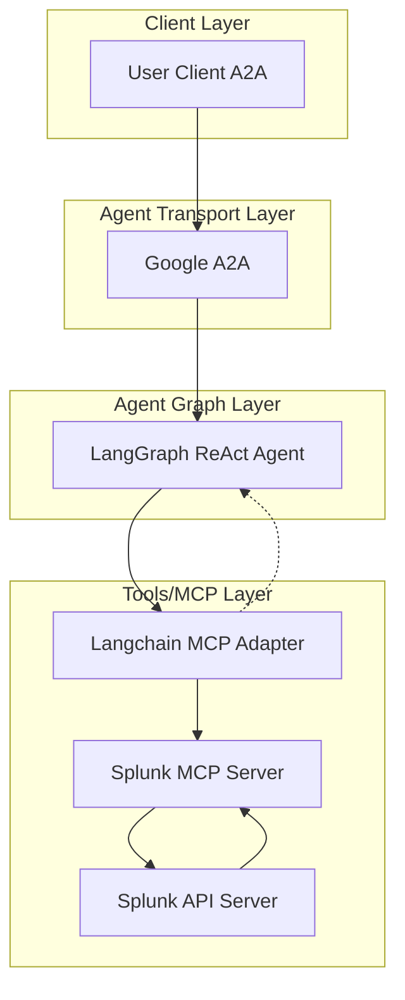

# 🔍 Splunk AI Agent

[](https://www.python.org/)
[](https://python-poetry.org/)
[](LICENSE)

[](https://github.com/cnoe-io/ai-platform-engineering/actions/workflows/conventional_commits.yml)
[](https://github.com/cnoe-io/ai-platform-engineering/actions/workflows/ruff.yml)
[](https://github.com/cnoe-io/ai-platform-engineering/actions/workflows/unit-tests.yml)

## 🧪 Evaluation Badges

| Claude | Gemini | OpenAI | Llama |
|--------|--------|--------|-------|
| [](https://github.com/cnoe-io/ai-platform-engineering/actions/workflows/claude-evals.yml) | [](https://github.com/cnoe-io/ai-platform-engineering/actions/workflows/gemini-evals.yml) | [](https://github.com/cnoe-io/ai-platform-engineering/actions/workflows/openai-evals.yml) | [](https://github.com/cnoe-io/ai-platform-engineering/actions/workflows/llama-evals.yml) |

---

- 🤖 **Splunk Agent** is an LLM-powered agent built using the [LangGraph ReAct Agent](https://langchain-ai.github.io/langgraph/agents/agents/) workflow and [MCP tools](https://modelcontextprotocol.io/introduction).
- 🌐 **Protocol Support:** Compatible with [A2A](https://github.com/google/A2A) protocol for integration with external user clients.
- 🛡️ **Secure by Design:** Enforces Splunk API token-based authentication and supports external authentication for strong access control.
- 🔌 **Integrated Communication:** Uses [langchain-mcp-adapters](https://github.com/langchain-ai/langchain-mcp-adapters) to connect with the Splunk MCP server within the LangGraph ReAct Agent workflow.
- 🏭 **First-Party MCP Server:** The MCP server is generated by our first-party [openapi-mcp-codegen](https://github.com/cnoe-io/openapi-mcp-codegen/tree/main) utility, ensuring version/API compatibility and software supply chain integrity.

---
## 🚀 Getting Started

Running it via Docker:

### 1️⃣ Configure Environment
Ensure your `.env` file is set up as described in the [cnoe-agent-utils usage guide](https://github.com/cnoe-io/cnoe-agent-utils) based on your LLM Provider.

Example `.env` configuration:
```env
############################
# Agent Configuration
############################
LLM_PROVIDER=azure-openai
AGENT_NAME=splunk

############################
# Azure OpenAI Configuration
############################
AZURE_OPENAI_API_KEY=<your-azure-key>
AZURE_OPENAI_API_VERSION=2025-04-01-preview
AZURE_OPENAI_DEPLOYMENT=gpt-4.1
AZURE_OPENAI_ENDPOINT=<your-azure-endpoint>

############################
# Splunk Configuration
############################
SPLUNK_TOKEN=<your-splunk-token>
SPLUNK_API_URL=https://your-splunk-instance.com/api
```

### 2️⃣ Start the Agent (A2A Mode)

1. Pull the A2A image:

```bash
docker pull ghcr.io/cnoe-io/agent-splunk:a2a-stable
```

2. Run the agent in a Docker container using your `.env` file:

```bash
docker pull ghcr.io/cnoe-io/agent-splunk:a2a-stable && \
docker run --rm -p 0.0.0.0:8000:8000 -it \
  -v $(pwd)/.env:/app/.env \
  ghcr.io/cnoe-io/agent-splunk:a2a-stable
```

### 3️⃣ Run the Client

Use the [agent-chat-cli](https://github.com/cnoe-io/agent-chat-cli) to interact with the agent:

```bash
uvx https://github.com/cnoe-io/agent-chat-cli.git a2a
```

---

## 🏗️ Architecture



## ✨ Features

- 🤖 **LangGraph + LangChain MCP Adapter** for agent orchestration
- 🧠 **Azure OpenAI GPT-4** as the LLM backend
- 🔗 Connects to Splunk via a dedicated [Splunk MCP agent](https://github.com/cnoe-io/ai-platform-engineering/tree/main/ai_platform_engineering/mcp/mcp_splunk)
- 🔄 **A2A protocol support:** Compatible with **A2A** protocol for flexible integration and multi-agent orchestration
- 📊 **Comprehensive Splunk API Support:**
  - **Log Search & Analytics:** Search logs, run queries, and analyze data
  - **Alert Management:** Create, update, and manage alerts and detectors
  - **Incident Management:** Handle incidents and track their status
  - **Team Management:** Manage teams and team members
  - **System Monitoring:** Monitor system health and performance metrics
  - **Data Ingestion:** Manage data sources and ingestion pipelines

---

## 🛠️ Development

### Prerequisites

- Python 3.11+
- [uv](https://docs.astral.sh/uv/) for dependency management
- Docker (for containerized deployment)
- Splunk instance with API access

### Local Development Setup

1. **Clone and Navigate:**
   ```bash
   git clone https://github.com/cnoe-io/ai-platform-engineering.git
   cd ai_platform_engineering/agents/splunk
   ```

2. **Install Dependencies:**
   ```bash
   make setup-venv
   ```

3. **Configure Environment:**
   ```bash
   cp .env.example .env
   # Edit .env with your configuration
   ```

4. **Run the Agent:**
   ```bash
   make run-a2a
   ```

### Available Make Targets

- `make setup-venv` - Set up Python virtual environment
- `make run-a2a` - Run the A2A server
- `make run-mcp` - Run the MCP server standalone
- `make lint` - Run code linting
- `make test` - Run tests
- `make build-docker-a2a` - Build Docker image
- `make clean` - Clean build artifacts

---

## 📋 Usage Examples

### Log Search
```
Search for error logs in the last 24 hours from the web application
```

### Alert Management  
```
Create an alert for when CPU usage exceeds 80% for more than 5 minutes
```

### System Health Check
```
Show me the current system health and any active alerts
```

### Incident Response
```
List all open incidents and their current status
```

## 🔍 Troubleshooting

### Common Issues

1. **Docker Issues**
   - Ensure Docker daemon is running
   - Check if you have sufficient permissions
   - Verify the required images are available

2. **Port Conflicts**
   - If port 8000 is in use, modify `A2A_AGENT_PORT` in `.env`
   - Check for other services using required ports

3. **Environment Variables**
   - Verify all required variables in `.env`
   - Check API keys and tokens are valid
   - No trailing spaces in values

4. **Client Connection Issues**
   - Server must be running before client
   - Port numbers should match
   - API keys must match between server and client

### Logs

- Docker: Use `docker logs <container-id>`
- Local: Check terminal output
- Debug mode: Set `DEBUG=true` in `.env`

## 📚 Documentation

For more detailed information about the project, please refer to:

- [API Documentation](docs/api.md) - Detailed API reference
- [Architecture Overview](docs/architecture.md) - System design and components
- [Development Guide](docs/development.md) - Setup and development workflow
- [Deployment Guide](docs/deployment.md) - Production deployment instructions
- [Contributing Guide](CONTRIBUTING.md) - How to contribute to the project
- [Security Policy](SECURITY.md) - Security practices and vulnerability reporting
- [License](LICENSE) - Project license details
- [Changelog](CHANGELOG.md) - Version history and changes
- [Code of Conduct](CODE_OF_CONDUCT.md) - Community guidelines

## 🔐 Security Notes

* Never commit your `.env` file to version control
* Keep your API keys and tokens secure
* Use environment variables or secret managers in production
* Regularly rotate your API keys and tokens

## 👥 Maintainers

See [MAINTAINERS.md](MAINTAINERS.md) for the list of maintainers.

## 🤝 Contributing

We welcome contributions! Please see our [Contributing Guide](CONTRIBUTING.md) for details on how to get started.

## 📄 License

Apache 2.0 