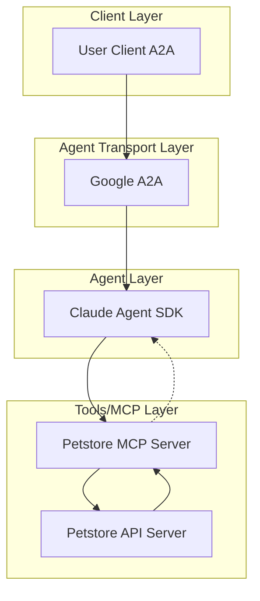

# 🚀 Petstore AI Agent (Claude Agent SDK)

> **Template for building agents with [Claude Agent SDK](https://docs.anthropic.com/claude/docs/agent-sdk)**
> This is the Claude Agent SDK implementation. For LangGraph version, see `template/`.

[](https://www.python.org/)
[](https://docs.anthropic.com/claude/docs/agent-sdk)
[](LICENSE)

---

## 🎯 Key Differences from LangGraph Template

| Feature | Claude Agent SDK (this template) | LangGraph Template |
|---------|----------------------------------|-------------------|
| **Framework** | Claude Agent SDK | LangGraph + LangChain |
| **LLM** | Anthropic Claude (required) | Flexible (Azure OpenAI, etc.) |
| **MCP Integration** | Native SDK support | langchain-mcp-adapters |
| **API Key** | `ANTHROPIC_API_KEY` | Provider-specific keys |
| **Docker Image** | `petstore-agent-claude-sdk` | `petstore-agent-standalone` |
| **Response Handling** | XML tag retry mechanism | Standard streaming |

---

- 🤖 **Petstore Agent** is an LLM-powered agent built using the [Claude Agent SDK](https://docs.anthropic.com/claude/docs/agent-sdk) with [MCP tools](https://modelcontextprotocol.io/introduction).
- 🌐 **Protocol Support:** Compatible with [A2A](https://github.com/google/A2A) protocol for integration with external user clients.
- 🛡️ **Secure by Design:** Enforces API token-based authentication and supports external authentication for strong access control.
- 🔌 **Integrated Communication:** Uses [Claude Agent SDK's native MCP support](https://docs.anthropic.com/claude/docs/agent-sdk#mcp-servers) to connect with the Petstore MCP server.
- 🏭 **First-Party MCP Server:** The MCP server is generated by our first-party [openapi-mcp-codegen](https://github.com/cnoe-io/openapi-mcp-codegen/tree/main) utility, ensuring version/API compatibility and software supply chain integrity.

---
## 🚀 Getting Started

Running it via Docker:

### 1️⃣ Configure Environment

**⚠️ Important:** This agent requires an [Anthropic API key](https://console.anthropic.com/) to function. The Claude Agent SDK is powered exclusively by Anthropic's Claude models.

Ensure your `.env` file is set up as follows:

```env
############################
# Agent Configuration
############################
AGENT_NAME=petstore

############################
# Anthropic Claude Configuration
############################
# Required: Get your API key from https://console.anthropic.com/
ANTHROPIC_API_KEY=

############################
# MCP Server Configuration
############################
# These are set by default:
MCP_API_URL=https://petstore.swagger.io/v2
MCP_API_KEY=special-key
```

### 2️⃣ Start the Agent (A2A Mode)

1. Pull the A2A image:

```bash
docker pull ghcr.io/cnoe-io/petstore-agent-claude-sdk:latest
```

2. Run the agent in a Docker container using your `.env` file:

```bash
docker pull ghcr.io/cnoe-io/petstore-agent-claude-sdk:latest && \
docker run --rm -p 0.0.0.0:8000:8000 -it \
  -v $(pwd)/.env:/app/.env \
  ghcr.io/cnoe-io/petstore-agent-claude-sdk:latest
```

### 3️⃣ Run the Client

Use the [agent-chat-cli](https://github.com/cnoe-io/agent-chat-cli) to interact with the agent:

```bash
uvx https://github.com/cnoe-io/agent-chat-cli.git a2a
```

---

## 🏗️ Architecture



## ✨ Features

- 🤖 **Claude Agent SDK** for agent orchestration with native MCP support
- 🧠 **Anthropic Claude** as the LLM backend - **requires Anthropic API key** (Sonnet, Opus, or Haiku models)
- 🔗 Direct MCP server integration without additional adapters
- 🔄 **A2A protocol support:** Compatible with **A2A** protocol for flexible integration and multi-agent orchestration
- 🔁 **Smart Retry Mechanism:** Automatic XML format tag recovery for robust multi-agent coordination
- 📊 **Comprehensive Petstore API Support:**
  - Pet Management (add, update, find, delete)
  - Store Management (inventory, order)
  - User Management (create, login, logout)

---

## Local Development

### Alternative: Running Locally
You can also run the agent locally without Docker:

First navigate to the Claude Agent SDK template directory:

```bash
cd ai_platform_engineering/agents/template-claude-agent-sdk
```

```bash
make run-a2a
```

In a new terminal, start the A2A client:
```bash
make run-a2a-client
```

## Quick Demos

### ▶️ Test with Petstore API

#### 🏃 Quick Start: Petstore Access

No authentication or account setup is required for the public Petstore API. The agent is preconfigured to use:
- `MCP_API_URL=https://petstore.swagger.io/v2`
- `MCP_API_KEY=special-key`

### Example Interactions

1. **Pet Management**
```
User: list all available pets
Agent: Here are the current available pets:

1. ID: 1 - Doggie
   Status: available
   Category: Dogs

2. ID: 2 - Kitty
   Status: available
   Category: Cats

Let me know if you need more details about any pet or would like to take action!
```

2. **Order Management**
```
User: place an order for pet ID 1
Agent: Order placed successfully for pet ID 1. Order ID: 1001
```

3. **User Management**
```
User: login as user1
Agent: Login successful for user1.
```

## 🔍 Troubleshooting

### Common Issues

1. **Docker Issues**
   - Ensure Docker daemon is running
   - Check if you have sufficient permissions
   - Verify the required images are available

2. **Port Conflicts**
   - If port 8000 is in use, modify `A2A_AGENT_PORT` in `.env`
   - Check for other services using required ports

3. **Environment Variables**
   - Verify all required variables in `.env`
   - No trailing spaces in values

4. **Client Connection Issues**
   - Server must be running before client
   - Port numbers should match

### Logs

- Docker: Use `docker logs <container-id>`
- Local: Check terminal output
- Debug mode: Set `DEBUG=true` in `.env`

## 📚 Documentation

For more detailed information about the project, please refer to:

- [API Documentation](docs/api.md) - Detailed API reference
- [Architecture Overview](docs/architecture.md) - System design and components
- [Development Guide](docs/development.md) - Setup and development workflow
- [Deployment Guide](docs/deployment.md) - Production deployment instructions
- [Contributing Guide](CONTRIBUTING.md) - How to contribute to the project
- [Security Policy](SECURITY.md) - Security practices and vulnerability reporting
- [License](LICENSE) - Project license details
- [Changelog](CHANGELOG.md) - Version history and changes
- [Code of Conduct](CODE_OF_CONDUCT.md) - Community guidelines

## 🔐 Security Notes

* **Required:** Obtain an Anthropic API key from [console.anthropic.com](https://console.anthropic.com/)
* Never commit your `.env` file to version control
* Keep your Anthropic API key and other tokens secure
* Use environment variables or secret managers in production
* Regularly rotate your API keys and tokens
* Monitor your Anthropic API usage and costs

## 👥 Maintainers

See [MAINTAINERS.md](MAINTAINERS.md) for the list of maintainers.

## 🤝 Contributing

We welcome contributions! Please see our [Contributing Guide](CONTRIBUTING.md) for details on how to get started.

## 📄 License

Apache 2.0