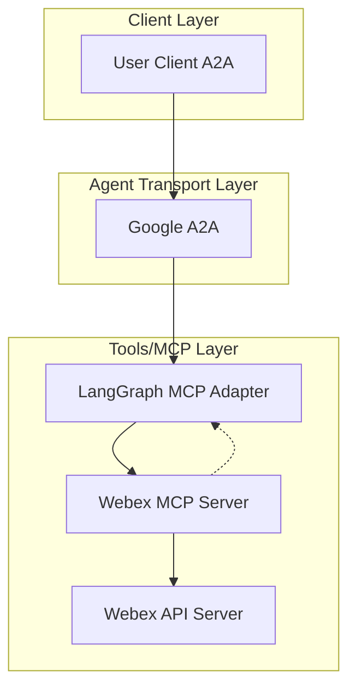

# 🚀 Webex AI Agent

[](https://www.python.org/)
[](https://python-poetry.org/)
[](LICENSE)

---

- 🤖 **Webex Agent** is an LLM-powered agent built using the [LangGraph ReAct Agent](https://langchain-ai.github.io/langgraph/agents/agents/) workflow and [MCP tools](https://modelcontextprotocol.io/introduction).
- 🌐 **Protocol Support:** Compatible with [A2A](https://github.com/google/A2A) protocol for integration with external user clients.
- 🔌 **Integrated Communication:** Uses [langchain-mcp-adapters](https://github.com/langchain-ai/langchain-mcp-adapters) to connect with the Webex MCP server within the LangGraph ReAct Agent workflow.
- 🏭 **Included MCP Server:** The MCP server can be used on its own or as part of the agent.

---
## 🚦 Getting Started

### 1️⃣ Configure Environment

- Ensure your `.env` file is set up as described in the [cnoe-agent-utils usage guide](https://github.com/cnoe-io/cnoe-agent-utils#-usage) based on your LLM Provider.
- Refer to [.env.example](.env.example) as an example.

**Example .env file:**
### 1️⃣ Create/Update `.env`

```env
LLM_PROVIDER=

AGENT_NAME=webex

WEBEX_TOKEN=

########### LLM Configuration ###########
# Refer to: https://github.com/cnoe-io/cnoe-agent-utils#-usage
```

**Use the following link to get your own Webex API Token:**

https://developer.webex.com/messaging/docs/bots

### 2️⃣ Start the Agent (A2A Mode)

Run the agent in a Docker container using your `.env` file:

```bash
docker run -p 0.0.0.0:8000:8000 -it\
   -v "$(pwd)/.env:/app/.env"\
   ghcr.io/cnoe-io/agent-webex:a2a-stable
```

### 3️⃣ Run the Client

Use the [agent-chat-cli](https://github.com/cnoe-io/agent-chat-cli) to interact with the agent:

```bash
uvx https://github.com/cnoe-io/agent-chat-cli.git a2a
```

## 🏗️ Architecture



---

## ✨ Features

- 🤖 **LangGraph MCP Adapter** for agent orchestration
- 🧠 **Azure OpenAI GPT-4o** as the LLM backend
- 🔗 Connects to Webex via a dedicated [Webex MCP agent](agent_webex/protocol_bindings/mcp_server_webex)

---


## 🧪 Usage

### Start Server (A2A)

You can start the server in A2A mode:

- **A2A Mode:**
  ```bash
  make run-a2a
  ```

---

### Run the A2A Client

To interact with the agent in **A2A mode**:

```bash
make run-a2a-client
```

**Configure Environment Variables**

Create or update a `.env` file in your project root with the following:

```env
WEBEX_TOKEN="<YOUR_WEBEX_API_TOKEN>"
```

**Example Interaction**

```
> Your Question: how can you help?
Agent: I can help you with Webex tasks such as:
```

- Sending messages to users or rooms
- Creating new rooms
- Adding users to rooms
- Listing messages in rooms or direct messages
- Listing users in a room
- Listing rooms you are a member of
- Listing messages in a thread        

---

## 🧬 Internals

- 🛠️ Uses [`create_react_agent`](https://python.langchain.com/api_reference/langchain/agents/langchain.agents.react.agent.create_react_agent.html) for tool-calling
- 🔌 Tools loaded from the **Webx MCP server**
- ⚡ MCP server launched via `uv run` with `stdio` transport

---

## 🧩 MCP Server (Webex Tools)

This project uses a **custom MCP module**.

All Webex-related LangChain tools are defined by this MCP server implementation.

---

## 🔌 MCP Integration

The agent uses [`MultiServerMCPClient`](https://github.com/langchain-ai/langchain-mcp-adapters) to communicate with MCP-compliant services.

**Example (stdio transport):**

```python
async with MultiServerMCPClient(
  {
    "webex": {
      "command": "uv",
      "args": ["run", "--directory", "/abs/path/to/mcp_server_webex", "mcp-server-webex"],
      "env": {
        "WEBEX_TOKEN": webex_token,
      },
      "transport": "stdio",
    }
  }
) as client:
  agent = create_react_agent(model, client.get_tools())
```

**Example (SSE transport):**

```python
async with MultiServerMCPClient(
  {
    "webex": {
      "transport": "sse",
      "env": {
        "WEBEX_TOKEN": webex_token,
      },
      "url": "http://localhost:8000"
    }
  }
) as client:
  ...
```

---

## 📜 License

Apache 2.0 (see [LICENSE](./LICENSE))

---

## 👥 Maintainers

See [MAINTAINERS.md](MAINTAINERS.md)

- Contributions welcome via PR or issue!

---

## 🙏 Acknowledgements

- [LangGraph](https://github.com/langchain-ai/langgraph) and [LangChain](https://github.com/langchain-ai/langchain) for agent orchestration frameworks.
- [langchain-mcp-adapters](https://github.com/langchain-ai/langchain-mcp-adapters) for MCP integration.
- [Model Context Protocol (MCP)](https://modelcontextprotocol.io/) for the protocol specification.
- [Google A2A](https://github.com/google/A2A/tree/main)
- The open source community for ongoing support and contributions.
