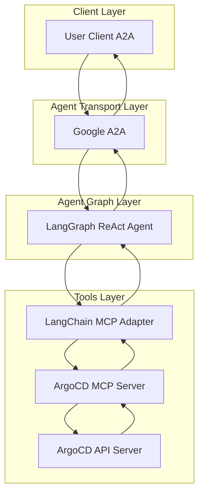

## Introduction

Agentic Systems landscape is evolving rapidly, understanding the distinction between AI Agents and MCP Servers is crucial for building scalable agentic systems. While MCP Servers provide a standardized interface for tools and data sources, AI Agents leverage these capabilities to perform complex reasoning, planning, and execution tasks.

## MCP

[MCP (Model Context Protocol)](https://modelcontextprotocol.io/introduction) provides a **standardized interface for LLMs to access tools and data sources**.

---

## Agent

- Agents are systems that use LLM-based reasoning to plan and take actions—including invoking MCP tools when needed.
- Agents can handle complex tasks that could require multiple MCP tools and are capable of maintaining both short-term and long-term memory.
- *Agents encapsulate more than simple tool calls to MCP servers, providing an additional abstraction layer.*

---

### Agent Composition & Capabilities

- **Tool Pruning:** Optimizes the toolset for efficiency and relevance, including filtering tools from large MCP servers (with optional RAG for selection).
- **Long-term and short-term memory management:** Agents utilize short-term memory for session-specific context and long-term memory for cross-session data recall.
- **Agent Registry:** Manages agent versions and configurations.
- **Prompty Library:** Provides a versioned repository for managing and evaluating prompts.
- **MCP Registry:** Handles MCP server versions and configurations.
- **Maintain Conversation Context:** Preserves conversation history within a thread for more effective LLM reasoning and action.
- **Prompt Engineering:** Shapes agent behavior with well-designed system prompts.
- **Evaluation:** Validates agent actions using standardized rubrics and tool trajectory audits.
- **Flexible LLM Bindings:** Supports various LLM providers (e.g., GPT, Claude, Mistral).

This architecture makes agents **composable, validated black-box units** that can be reused across multi-agent systems and different personas.

> **Note:** *Agents built in CAIPE (Community AI Platform Engineering) project are exposed via the A2A protocol*, standardizing external I/O and providing authentication and authorization support.

---

### System Diagram

---

### Sequence Diagram

```mermaid
sequenceDiagram
  participant User
  participant A2A
  participant Agent as LangGraph ReAct Agent
  participant LLM
  participant MCP as ArgoCD MCP Server
  participant APIServer as ArgoCD API Server

  note over Agent,MCP: 🛠️ Agent Setup Phase
  rect rgb(245, 245, 220)
    Agent->>MCP: Get Tools
    Agent->>LLM: Bind Tools
  end

  rect rgb(220, 232, 243)
    note over User,A2A: 🧑‍💻 User Input Phase
    User->>A2A: Send request
    A2A->>Agent: Forward to LangGraph Agent

    note over Agent,LLM: 🧠 Agent Reasoning & Tool Selection
    Agent->>LLM: [Reason] User Input
    LLM-->>Agent: [Act] Execute MCP Tool

    note over MCP,APIServer: 🛠️ API Invocation Phase
    Agent->>MCP: Invoke tool
    MCP->>APIServer: Call API
    APIServer-->>MCP: Return data
    MCP-->>Agent: Return data

    note over Agent,LLM: 🧠 Agent Reasoning & Output Structuring
    Agent->>LLM: Input API result data for further ReAct loop
    LLM-->>Agent: Return Structured Output

    note over User,A2A: 📤 User Output Phase
    Agent-->>A2A: Respond with Structured Output
    A2A-->>User: Respond to user (Non-stream or streaming)
  end
```

<!-- truncate -->