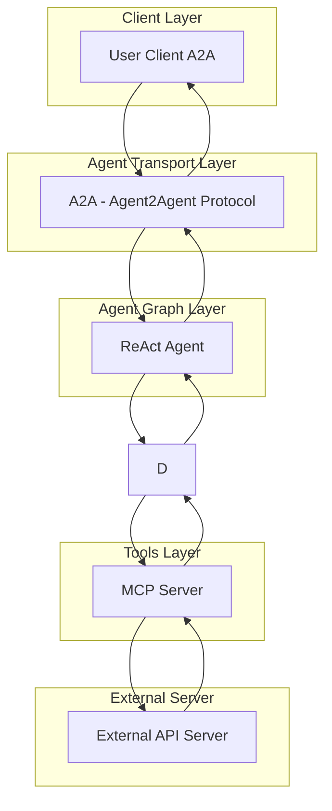

# Agents

## Platform and DevOps Tools Agents

The CAIPE (Community AI Platform Engineering) agents are built using any agentic framework like (LangGraph, Strands, etc) and [MCP Server](https://modelcontextprotocol.io/introduction).

### 🤖 Available Agents

| Agent | Description |
|-------|-------------|
| [ArgoCD](argocd.md) | GitOps continuous delivery for Kubernetes |
| [Backstage](backstage.md) | Developer portal and service catalog |
| [Confluence](confluence.md) | Team collaboration and documentation |
| [GitHub](github.md) | Source code management and collaboration |
| [Jira](jira.md) | Project management and issue tracking |
| [Komodor](komodor.md) | Kubernetes troubleshooting and monitoring |
| [AWS](aws.md) | Cloud infrastructure and EKS management |
| [PagerDuty](pagerduty.md) | Incident management and on-call scheduling |
| [Slack](slack.md) | Team communication and collaboration |
| [Splunk](splunk.md) | Log analytics and monitoring |
| [Webex](webex.md) | Team communication and collaboration |
| [Weather](weather.md) | Weather information and forecasting |

### 🏗️ Architecture Overview

All agents follow a consistent architecture pattern:

### 🔧 Development

#### Creating New Agents

Use the [Petstore/Template Agent](template.md) as a starting point for creating new agents:

1. Clone the template repository
2. Configure your API integration
3. Generate MCP server using [openapi-mcp-codegen](https://github.com/cnoe-io/openapi-mcp-codegen)
4. Customize prompts and functionality
5. Test and deploy