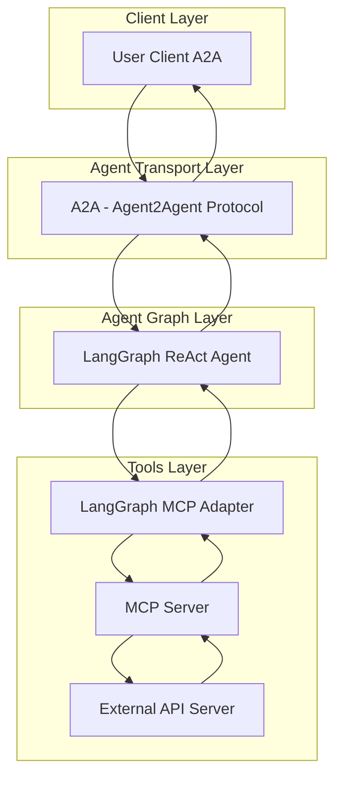

# ArgoCD Agent

- 🤖 **ArgoCD Agent** is an LLM-powered agent built using the [LangGraph ReAct Agent](https://langchain-ai.github.io/langgraph/agents/agents/) workflow and ArgoCD [MCP Server](https://modelcontextprotocol.io/introduction).
- 🌐 **Protocol Support:** Compatible with [A2A](https://github.com/google/A2A) protocol for integration with external user clients.
- 🛡️ **Secure by Design:** Enforces ArgoCD API token-based RBAC and supports secondary external authentication for strong access control.
- 🏭 **MCP Server:** The MCP server is generated by our first-party [openapi-mcp-codegen](https://github.com/cnoe-io/openapi-mcp-codegen/tree/main) utility, ensuring version/API compatibility and software supply chain integrity.
- 🔌 **MCP Tools:** Uses [langchain-mcp-adapters](https://github.com/langchain-ai/langchain-mcp-adapters) to glue the tools from ArgoCD MCP server to LangGraph ReAct Agent Graph.

## 🏗️ Architecture

**[Detailed Sequence Diagram with Agentgateway](../architecture/gateway.md)**

### System Diagram



### Sequence Diagram

```mermaid
sequenceDiagram
  participant User
  participant A2A
  participant Agent as LangGraph ReAct Agent
  participant LLM
  participant MCP as ArgoCD MCP Server
  participant APIServer as ArgoCD API Server

  note over Agent,MCP: 🛠️ Agent Setup Phase
  rect rgb(245, 245, 220)
    Agent->>MCP: Get Tools
    Agent->>LLM: Bind Tools
  end

  rect rgb(220, 232, 243)
    note over User,A2A: 🧑‍💻 User Input Phase
    User->>A2A: Send request
    A2A->>Agent: Forward to LangGraph Agent

    note over Agent,LLM: 🧠 Agent Reasoning & Tool Selection
    Agent->>LLM: [Reason] User Input
    LLM-->>Agent: [Act] Excecute MCP Tool

    note over MCP,APIServer: 🛠️ API Invocation Phase
    Agent->>MCP: Invoke tool
    MCP->>APIServer: Call API
    APIServer-->>MCP: Return data
    MCP-->>Agent: Return data

    note over Agent,LLM: 🧠 Agent Reasoning & Output Structuring
    Agent->>LLM: Input API result data for further ReAct loop
    LLM-->>Agent: Return Structured Output

    note over User,A2A: 📤 User Output Phase
    Agent-->>A2A: Respond with Structured Output
    A2A-->>User: Respond to user (Non-stream or streaming)
  end
```



---

## ⚙️ Local Development Setup

Use this setup to test the agent against a local ArgoCD instance.

### ▶️ Start ArgoCD with kind cluster

> **Note:** KinD (Kubernetes in Docker) is a tool for running local Kubernetes clusters using Docker.
For detailed setup instructions, refer to the [KinD documentation](https://kind.sigs.k8s.io/). Below is a quickstart to launch a local cluster and install ArgoCD:

```bash
kind create cluster --name cnoe-argocd-agent
kubectl create namespace argocd
kubectl apply -n argocd -f https://raw.githubusercontent.com/argoproj/argo-cd/stable/manifests/install.yaml
kubectl port-forward svc/argocd-server -n argocd 8080:443
```

### 🛂 Retrieve Admin Credentials

```bash
kubectl -n argocd get secret argocd-initial-admin-secret \
  -o jsonpath="{.data.password}" | base64 -d && echo
```

### 📦 Install CLI (Optional)

```bash
brew install argocd
```

### 🚀 Deploy Guestbook Example

```bash
argocd login localhost:8080 --username admin --password <password> --insecure
argocd app create guestbook \
  --repo https://github.com/argoproj/argocd-example-apps.git \
  --path guestbook \
  --dest-server https://kubernetes.default.svc \
  --dest-namespace default
argocd app sync guestbook
```

### 🔑 Get API Token

```bash
kubectl -n argocd patch configmap argocd-cm --type merge -p '{"data":{"accounts.admin":"login,apiKey"}}'
kubectl -n argocd rollout restart deployment argocd-server
kubectl config set-context --current --namespace=argocd
argocd account generate-token --account admin --server-namespace argocd
```

Add to your `.env`:

```env
ARGOCD_TOKEN=<your_token>
ARGOCD_API_URL=https://localhost:8080
ARGOCD_VERIFY_SSL=false
```

### Local Development

```bash
# Navigate to the ArgoCD agent directory
cd ai_platform_engineering/agents/argocd

# Run the MCP server in stdio mode
make run-a2a
```