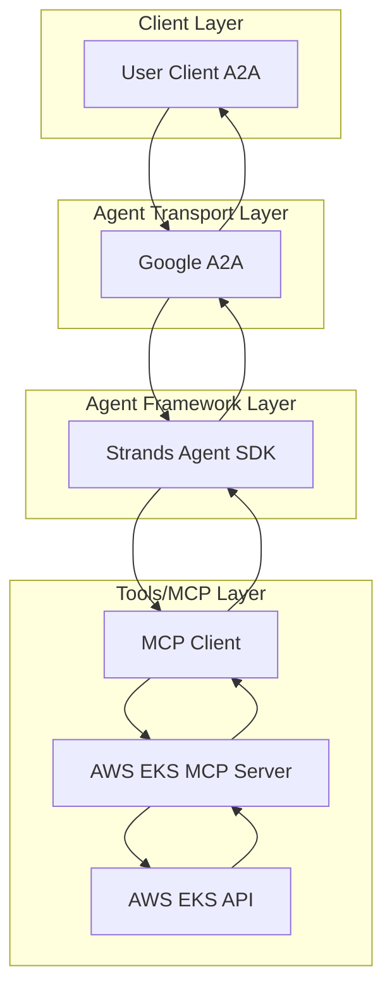

# AWS Agent

- 🤖 **AWS Agent** is an LLM-powered agent built using the [Strands Agents SDK](https://strandsagents.com/) and the official [AWS EKS MCP Server](https://awslabs.github.io/mcp/servers/eks-mcp-server).
- 🌐 **Protocol Support:** Compatible with [A2A](https://github.com/google/A2A) protocol for integration with external user clients.
- 🛡️ **Secure by Design:** Enforces AWS IAM token-based RBAC and supports secondary external authentication for strong access control.
- 🏭 **MCP Server:** Uses the official AWS EKS MCP Server for comprehensive Amazon EKS cluster management and Kubernetes operations.
- 💰 **Cost Management (Optional):** Integrate the AWS Cost Explorer MCP Server for FinOps insights, cost breakdowns, comparisons, forecasting, and optimization recommendations.
- 🔐 **IAM Security (Optional):** Integrate the AWS IAM MCP Server for comprehensive Identity and Access Management operations with read-only mode for safety.

> **Many more AWS MCP servers planned:** Additional AWS MCP Servers and integrations will be supported in future releases.

## 🏗️ Architecture

### System Diagram



### Sequence Diagram

```mermaid
sequenceDiagram
  participant User
  participant A2A
  participant Agent as Strands Agent SDK
  participant LLM
  participant MCP as AWS EKS MCP Server
  participant APIServer as AWS EKS API

  note over Agent,MCP: 🛠️ Agent Setup Phase
  rect rgb(245, 245, 220)
    Agent->>MCP: Get Tools
    Agent->>LLM: Bind Tools
  end

  rect rgb(220, 232, 243)
    note over User,A2A: 🧑‍💻 User Input Phase
    User->>A2A: Send request
    A2A->>Agent: Forward to Strands Agent

    note over Agent,LLM: 🧠 Agent Reasoning & Tool Selection
    Agent->>LLM: [Reason] User Input
    LLM-->>Agent: [Act] Execute MCP Tool

    note over MCP,APIServer: 🛠️ API Invocation Phase
    Agent->>MCP: Invoke tool
    MCP->>APIServer: Call API
    APIServer-->>MCP: Return data
    MCP-->>Agent: Return data

    note over Agent,LLM: 🧠 Agent Reasoning & Output Structuring
    Agent->>LLM: Input API result data for further processing
    LLM-->>Agent: Return Structured Output

    note over User,A2A: 📤 User Output Phase
    Agent-->>A2A: Respond with Structured Output
    A2A-->>User: Respond to user (Non-stream or streaming)
  end
```



---

## ⚙️ Local Development Setup

Use this setup to test the agent against AWS services.

### 🔑 Get AWS Credentials

1. **AWS CLI Configuration:**
   ```bash
   aws configure
   # Enter your AWS Access Key ID, Secret Access Key, and region
   ```

2. **IAM Permissions:**
   Ensure your AWS credentials have the following permissions:

   > **Note:** For production systems, always follow the principle of least privilege. Avoid using wildcard permissions (e.g., `eks:*`) and instead grant only the specific actions required for your use case. Wildcard permissions are shown here for development and testing convenience.

   - `eks:*` (for EKS cluster management)
   - `cloudformation:*` (for CloudFormation operations)
   - `iam:*` (for IAM role and policy management)
   - `ec2:*` (for VPC and security group management)
   - `ce:*` (for Cost Explorer, if enabled)
   - `logs:*` (for CloudWatch logs access)

3. **Environment Variables:**
   Add to your `.env`:
   ```env
   AWS_ACCESS_KEY_ID=<your-access-key>
   AWS_SECRET_ACCESS_KEY=<your-secret-key>
   AWS_DEFAULT_REGION=us-east-1
   ENABLE_EKS_MCP=true
   ENABLE_COST_EXPLORER_MCP=false
   ```

### Local Development

```bash
# Navigate to the AWS agent directory
cd ai_platform_engineering/agents/aws

# Run the MCP server in stdio mode
make run-a2a
```

## ✨ Features

### EKS Cluster Management
- **Cluster Operations**: Create, describe, and delete EKS clusters using CloudFormation
- **Template Generation**: Generate CloudFormation templates with best practices
- **Lifecycle Management**: Manage cluster lifecycle and configuration
- **Networking**: Handle VPC, networking, and security group setup

### Security & IAM
- **IAM Management**: Manage IAM roles and policies for EKS
- **RBAC Configuration**: Configure Kubernetes RBAC
- **Service Accounts**: Handle service account permissions
- **Security Best Practices**: Implement security best practices

### Cost Management & FinOps
- **Cost Analysis**: Analyze AWS costs by service, region, and time period
- **Reporting**: Generate detailed cost reports and breakdowns
- **Optimization**: Identify cost optimization opportunities
- **Trend Analysis**: Track cost trends and forecasts
- **Budget Monitoring**: Monitor budget alerts and cost anomalies

## 🎯 Example Use Cases

Ask the agent natural language questions like:

### EKS Operations
- **Cluster Management**: "Create a new EKS cluster called 'production-cluster' in us-west-2"
- **Template Generation**: "Generate a CloudFormation template for a 3-node EKS cluster"
- **Cluster Status**: "Show me the status of all EKS clusters in my account"

### Security Operations
- **IAM Setup**: "Create an IAM role for EKS cluster access"
- **RBAC Configuration**: "Set up RBAC for the development team"
- **Security Audit**: "Check the security groups for my EKS cluster"

### Cost Management
- **Cost Analysis**: "Show me the AWS costs for the last 30 days"
- **Service Breakdown**: "Break down costs by AWS service"
- **Optimization**: "Identify opportunities to reduce EKS costs"
