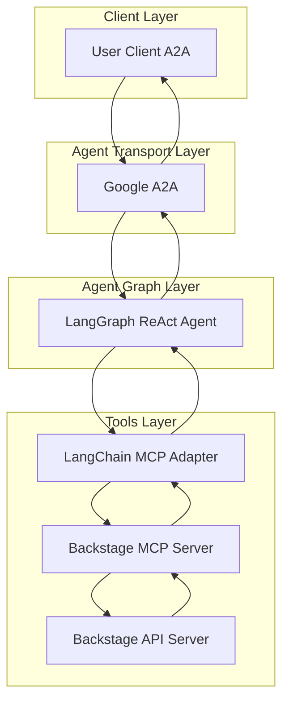

# Backstage Agent

- 🤖 **Backstage Agent** is an LLM-powered agent built using the [LangGraph ReAct Agent](https://langchain-ai.github.io/langgraph/agents/agents/) workflow and Backstage [MCP Server](https://modelcontextprotocol.io/introduction).
- 🌐 **Protocol Support:** Compatible with [A2A](https://github.com/google/A2A) protocol for integration with external user clients.
- 🛡️ **Secure by Design:** Enforces Backstage API token-based RBAC and supports secondary external authentication for strong access control.
- 🏭 **MCP Server:** The MCP server is generated by our first-party [openapi-mcp-codegen](https://github.com/cnoe-io/openapi-mcp-codegen/tree/main) utility, ensuring version/API compatibility and software supply chain integrity.
- 🔌 **MCP Tools:** Uses [langchain-mcp-adapters](https://github.com/langchain-ai/langchain-mcp-adapters) to glue the tools from Backstage MCP server to LangGraph ReAct Agent Graph.

## 🏗️ Architecture

### System Diagram



### Sequence Diagram

```mermaid
sequenceDiagram
  participant User
  participant A2A
  participant Agent as LangGraph ReAct Agent
  participant LLM
  participant MCP as Backstage MCP Server
  participant APIServer as Backstage API Server

  note over Agent,MCP: 🛠️ Agent Setup Phase
  rect rgb(245, 245, 220)
    Agent->>MCP: Get Tools
    Agent->>LLM: Bind Tools
  end

  rect rgb(220, 232, 243)
    note over User,A2A: 🧑‍💻 User Input Phase
    User->>A2A: Send request
    A2A->>Agent: Forward to LangGraph Agent

    note over Agent,LLM: 🧠 Agent Reasoning & Tool Selection
    Agent->>LLM: [Reason] User Input
    LLM-->>Agent: [Act] Execute MCP Tool

    note over MCP,APIServer: 🛠️ API Invocation Phase
    Agent->>MCP: Invoke tool
    MCP->>APIServer: Call API
    APIServer-->>MCP: Return data
    MCP-->>Agent: Return data

    note over Agent,LLM: 🧠 Agent Reasoning & Output Structuring
    Agent->>LLM: Input API result data for further ReAct loop
    LLM-->>Agent: Return Structured Output

    note over User,A2A: 📤 User Output Phase
    Agent-->>A2A: Respond with Structured Output
    A2A-->>User: Respond to user (Non-stream or streaming)
  end
```



---

## ⚙️ Local Development Setup

Use this setup to test the agent against a local Backstage instance.

### ▶️ Start Backstage with Docker

> **Note:** Backstage can be run locally using Docker for development and testing.

```bash
# Clone Backstage
git clone https://github.com/backstage/backstage.git
cd backstage

# Start Backstage with Docker Compose
docker-compose up -d
```

### 🛂 Retrieve Admin Credentials

```bash
# Get the admin user token from Backstage logs
docker-compose logs backstage | grep "admin user token"
```

### 📦 Install CLI (Optional)

```bash
# Install Backstage CLI
npm install -g @backstage/cli
```

### 🚀 Deploy Example Service

```bash
# Create a new service using Backstage CLI
npx @backstage/cli create
# Follow the prompts to create a service
```

### 🔑 Get API Token

1. Log in to your Backstage instance
2. Go to Settings → API Access
3. Create a new API token with appropriate permissions
4. Save the token for your `.env` file

Add to your `.env`:

```env
BACKSTAGE_API_KEY=<your_token>
BACKSTAGE_API_URL=http://localhost:7007
```

### Local Development

```bash
# Navigate to the Backstage agent directory
cd ai_platform_engineering/agents/backstage

# Run the MCP server in stdio mode
make run-a2a
```