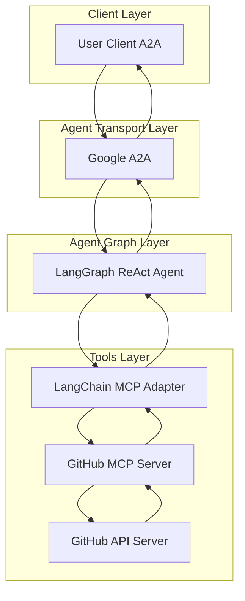

# GitHub Agent

- 🤖 **GitHub Agent** is an LLM-powered agent built using the [LangGraph ReAct Agent](https://langchain-ai.github.io/langgraph/agents/agents/) workflow and GitHub [MCP Server](https://modelcontextprotocol.io/introduction).
- 🌐 **Protocol Support:** Compatible with [A2A](https://github.com/google/A2A) protocol for integration with external user clients.
- 🛡️ **Secure by Design:** Enforces GitHub API token-based RBAC and supports secondary external authentication for strong access control.
- 🏭 **MCP Server:** The MCP server is generated by our first-party [openapi-mcp-codegen](https://github.com/cnoe-io/openapi-mcp-codegen/tree/main) utility, ensuring version/API compatibility and software supply chain integrity.
- 🔌 **MCP Tools:** Uses [langchain-mcp-adapters](https://github.com/langchain-ai/langchain-mcp-adapters) to glue the tools from GitHub MCP server to LangGraph ReAct Agent Graph.

## 🏗️ Architecture

**[Detailed Sequence Diagram with Agentgateway](../architecture/gateway.md)**

### System Diagram



### Sequence Diagram

```mermaid
sequenceDiagram
  participant User
  participant A2A
  participant Agent as LangGraph ReAct Agent
  participant LLM
  participant MCP as GitHub MCP Server
  participant APIServer as GitHub API Server

  note over Agent,MCP: 🛠️ Agent Setup Phase
  rect rgb(245, 245, 220)
    Agent->>MCP: Get Tools
    Agent->>LLM: Bind Tools
  end

  rect rgb(220, 232, 243)
    note over User,A2A: 🧑‍💻 User Input Phase
    User->>A2A: Send request
    A2A->>Agent: Forward to LangGraph Agent

    note over Agent,LLM: 🧠 Agent Reasoning & Tool Selection
    Agent->>LLM: [Reason] User Input
    LLM-->>Agent: [Act] Execute MCP Tool

    note over MCP,APIServer: 🛠️ API Invocation Phase
    Agent->>MCP: Invoke tool
    MCP->>APIServer: Call API
    APIServer-->>MCP: Return data
    MCP-->>Agent: Return data

    note over Agent,LLM: 🧠 Agent Reasoning & Output Structuring
    Agent->>LLM: Input API result data for further ReAct loop
    LLM-->>Agent: Return Structured Output

    note over User,A2A: 📤 User Output Phase
    Agent-->>A2A: Respond with Structured Output
    A2A-->>User: Respond to user (Non-stream or streaming)
  end
```



---

## ⚙️ Local Development Setup

Use this setup to test the agent against GitHub.

### 🔑 Get GitHub API Token

1. Go to GitHub.com → Settings → Developer Settings → Personal Access Tokens → Tokens (classic)
2. Click "Generate new token (classic)"
3. Give your token a descriptive name
4. Set an expiration date (recommended: 90 days)
5. Select the required permissions:
   > **⚠️ Note:** Always grant the minimum required permissions (principle of least privilege) when generating your GitHub API token. Only select the scopes necessary for your use case to enhance security.
   - `repo` (Full control of private repositories)
   - `workflow` (Update GitHub Action workflows)
   - `admin:org` (Full control of orgs and teams)
   - `admin:public_key` (Full control of public keys)
   - `admin:repo_hook` (Full control of repository hooks)
   - `admin:org_hook` (Full control of organization hooks)
   - `gist` (Create gists)
   - `notifications` (Access notifications)
   - `user` (Update ALL user data)
   - `delete_repo` (Delete repositories)
   - `write:packages` (Upload packages to GitHub Package Registry)
   - `delete:packages` (Delete packages from GitHub Package Registry)
   - `admin:gpg_key` (Full control of GPG keys)
   - `admin:ssh_signing_key` (Full control of SSH signing keys)
6. Click "Generate token"
7. Copy the token immediately (you won't be able to see it again)

Add to your `.env`:

```env
GITHUB_PERSONAL_ACCESS_TOKEN=<your_token>
GITHUB_API_URL=https://api.github.com
```

### Local Development

```bash
# Navigate to the GitHub agent directory
cd ai_platform_engineering/agents/github

# Run the MCP server in stdio mode
make run-a2a
```