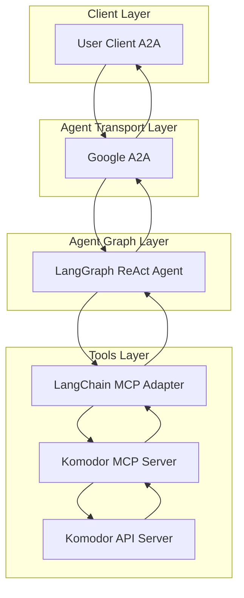

# Komodor Agent

- 🤖 **Komodor Agent** is an LLM-powered agent built using the [LangGraph ReAct Agent](https://langchain-ai.github.io/langgraph/agents/agents/) workflow and Komodor [MCP Server](https://modelcontextprotocol.io/introduction).
- 🌐 **Protocol Support:** Compatible with [A2A](https://github.com/google/A2A) protocol for integration with external user clients.
- 🛡️ **Secure by Design:** Enforces Komodor API token-based RBAC and supports secondary external authentication for strong access control.
- 🏭 **MCP Server:** The MCP server is generated by our first-party [openapi-mcp-codegen](https://github.com/cnoe-io/openapi-mcp-codegen/tree/main) utility, ensuring version/API compatibility and software supply chain integrity.
- 🔌 **MCP Tools:** Uses [langchain-mcp-adapters](https://github.com/langchain-ai/langchain-mcp-adapters) to glue the tools from Komodor MCP server to LangGraph ReAct Agent Graph.

## 🏗️ Architecture

**[Detailed Sequence Diagram with Agentgateway](../architecture/gateway.md)**

### System Diagram



### Sequence Diagram

```mermaid
sequenceDiagram
  participant User
  participant A2A
  participant Agent as LangGraph ReAct Agent
  participant LLM
  participant MCP as Komodor MCP Server
  participant APIServer as Komodor API Server

  note over Agent,MCP: 🛠️ Agent Setup Phase
  rect rgb(245, 245, 220)
    Agent->>MCP: Get Tools
    Agent->>LLM: Bind Tools
  end

  rect rgb(220, 232, 243)
    note over User,A2A: 🧑‍💻 User Input Phase
    User->>A2A: Send request
    A2A->>Agent: Forward to LangGraph Agent

    note over Agent,LLM: 🧠 Agent Reasoning & Tool Selection
    Agent->>LLM: [Reason] User Input
    LLM-->>Agent: [Act] Execute MCP Tool

    note over MCP,APIServer: 🛠️ API Invocation Phase
    Agent->>MCP: Invoke tool
    MCP->>APIServer: Call API
    APIServer-->>MCP: Return data
    MCP-->>Agent: Return data

    note over Agent,LLM: 🧠 Agent Reasoning & Output Structuring
    Agent->>LLM: Input API result data for further ReAct loop
    LLM-->>Agent: Return Structured Output

    note over User,A2A: 📤 User Output Phase
    Agent-->>A2A: Respond with Structured Output
    A2A-->>User: Respond to user (Non-stream or streaming)
  end
```



---

## ⚙️ Local Development Setup

Use this setup to test the agent against Komodor.

### 🔑 Get Komodor API Token

1. Log in to your Komodor account
2. Go to Settings → API Access
3. Create a new API token with appropriate permissions
4. Save the token for your `.env` file

Add to your `.env`:

```env
KOMODOR_TOKEN=<your_token>
KOMODOR_API_URL=https://api.komodor.io
KOMODOR_VERIFY_SSL=true
```

### Local Development

```bash
# Navigate to the Komodor agent directory
cd ai_platform_engineering/agents/komodor

# Run the MCP server in stdio mode
make run-a2a
```
make komodor-sanity
```

## ✨ Features

- **Kubernetes Troubleshooting**: Automatically detect, diagnose, and resolve issues across your Kubernetes clusters.
- **Unified Cluster Visibility**: Get a real-time, centralized view of all your Kubernetes clusters, workloads, and resources.
- **Automated Incident Detection**: Instantly surface incidents, anomalies, and unhealthy workloads with actionable context.
- **Root Cause Analysis**: Correlate events, changes, and alerts to quickly identify the root cause of issues.
- **Change Tracking**: Visualize and audit all changes (deployments, config updates, rollbacks) across clusters and namespaces.
- **Workload & Pod Management**: Investigate, restart, or roll back workloads and pods directly from the agent.
- **Helm & ArgoCD Integration**: Track and troubleshoot changes from GitOps and Helm deployments.
- **Kubernetes Health Monitoring**: Monitor cluster health, node status, and resource utilization.
- **Alerting & Notifications**: Configure alerts and receive notifications via Slack, email, or other integrations.
- **RBAC & Audit**: Manage user access and audit activity for compliance and security.
- **API Integration**: Full Komodor API coverage through MCP tools for automation and custom workflows.

## 🎯 Example Use Cases

Ask the agent natural language questions like:

- **Cluster Troubleshooting**: "Diagnose why pods in the 'payments' namespace are crashing"
- **Incident Response**: "Show me all recent incidents in the production cluster"
- **Change Tracking**: "What changes were made to the 'frontend' deployment in the last 24 hours?"
- **Root Cause Analysis**: "Why did the 'orders' service go down yesterday?"
- **Pod Management**: "Restart the 'checkout' pod in the staging environment"
- **Resource Monitoring**: "Show me nodes with high CPU or memory usage"
- **Helm/ArgoCD Deployments**: "List all recent Helm releases and their status"
- **Alerting**: "Set up an alert for failed deployments in the 'dev' cluster"
- **User & Access Management**: "Add user 'jane.doe' with read-only access to the 'dev' cluster"
- **Integration Setup**: "Configure Slack notifications for critical incidents"