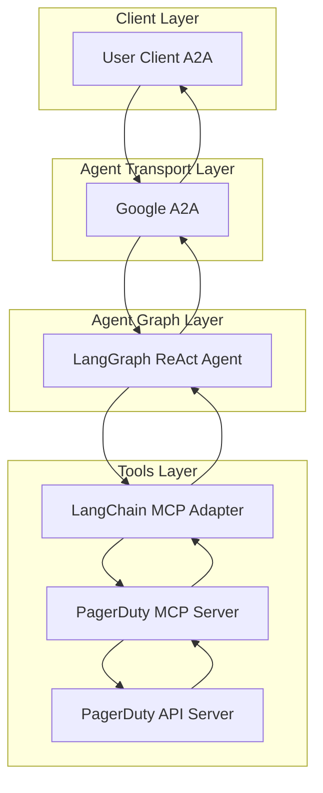

# PagerDuty Agent

- 🤖 **PagerDuty Agent** is an LLM-powered agent built using the [LangGraph ReAct Agent](https://langchain-ai.github.io/langgraph/agents/agents/) workflow and PagerDuty [MCP Server](https://modelcontextprotocol.io/introduction).
- 🌐 **Protocol Support:** Compatible with [A2A](https://github.com/google/A2A) protocol for integration with external user clients.
- 🛡️ **Secure by Design:** Enforces PagerDuty API token-based RBAC and supports secondary external authentication for strong access control.
- 🏭 **MCP Server:** The MCP server is generated by our first-party [openapi-mcp-codegen](https://github.com/cnoe-io/openapi-mcp-codegen/tree/main) utility, ensuring version/API compatibility and software supply chain integrity.
- 🔌 **MCP Tools:** Uses [langchain-mcp-adapters](https://github.com/langchain-ai/langchain-mcp-adapters) to glue the tools from PagerDuty MCP server to LangGraph ReAct Agent Graph.

---

## Architecture

**[Detailed Sequence Diagram with Agentgateway](../architecture/gateway.md)**



---

## ⚙️ Local Development Setup

### 🔑 Get PagerDuty API Token

- Retrieve PagerDuty API token from pagerduty.com

Add to your `.env`:

```env
PAGERDUTY_API_KEY=<your_token>
PAGERDUTY_API_URL=https://api.pagerduty.com
```

### Local Development

```bash
# Navigate to the PagerDuty agent directory
cd ai_platform_engineering/agents/pagerduty

# Run the MCP server in stdio mode
make run-a2a
```

## ✨ Features

- **Incident Management**: Create, update, resolve, and track incidents
- **Service Management**: Create and manage services and integrations
- **Schedule Management**: Plan and manage on-call schedules
- **Team Management**: Manage teams, members, and permissions
- **User Management**: Manage users, contact methods, and notifications
- **Escalation Policy Management**: Configure escalation policies and rules
- **Alert Management**: Handle alerts and incident creation

## 🎯 Example Use Cases

Ask the agent natural language questions like:

### Incident Operations
- **Incident Creation**: "Create a new incident for the database service that's down"
- **Incident Management**: "List all open incidents and their current status"
- **Incident Resolution**: "Resolve incident INC-123 and add a note about the fix"

### Service Management
- **Service Creation**: "Create a new service for the payment gateway"
- **Service Monitoring**: "Show me the status of all services"
- **Integration Setup**: "Set up email integration for the web application service"

### Schedule Management
- **Schedule Creation**: "Create a new on-call schedule for the DevOps team"
- **Schedule Assignment**: "Assign John to the weekend on-call schedule"
- **Schedule Overview**: "Show me who's on call this week"

### Team Operations
- **Team Management**: "Add user 'jane.doe' to the 'Platform' team"
- **Team Overview**: "List all teams and their members"
- **Permission Management**: "Update permissions for the 'Support' team"

### Alert & Notification Management
- **Alert Configuration**: "Configure alerts for when CPU usage exceeds 90%"
- **Notification Setup**: "Set up SMS notifications for critical incidents"
- **Alert Monitoring**: "Show me all active alerts and their status"
