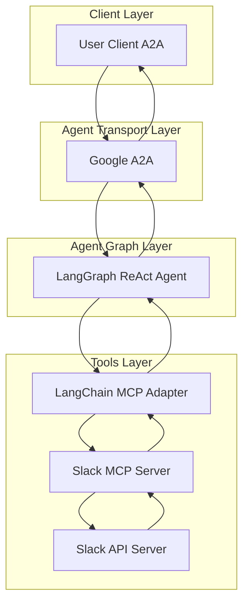

# Slack Agent

- 🤖 **Slack Agent** is an LLM-powered agent built using the [LangGraph ReAct Agent](https://langchain-ai.github.io/langgraph/agents/agents/) workflow and Slack [MCP Server](https://modelcontextprotocol.io/introduction).
- 🌐 **Protocol Support:** Compatible with [A2A](https://github.com/google/A2A) protocol for integration with external user clients.
- 🛡️ **Secure by Design:** Enforces Slack API token-based RBAC and supports secondary external authentication for strong access control.
- 🏭 **MCP Server:** The MCP server is generated by our first-party [openapi-mcp-codegen](https://github.com/cnoe-io/openapi-mcp-codegen/tree/main) utility, ensuring version/API compatibility and software supply chain integrity.
- 🔌 **MCP Tools:** Uses [langchain-mcp-adapters](https://github.com/langchain-ai/langchain-mcp-adapters) to glue the tools from Slack MCP server to LangGraph ReAct Agent Graph.

## 🏗️ Architecture

**[Detailed Sequence Diagram with Agentgateway](../architecture/gateway.md)**

### System Diagram



### Sequence Diagram

```mermaid
sequenceDiagram
  participant User
  participant A2A
  participant Agent as LangGraph ReAct Agent
  participant LLM
  participant MCP as Slack MCP Server
  participant APIServer as Slack API Server

  note over Agent,MCP: 🛠️ Agent Setup Phase
  rect rgb(245, 245, 220)
    Agent->>MCP: Get Tools
    Agent->>LLM: Bind Tools
  end

  rect rgb(220, 232, 243)
    note over User,A2A: 🧑‍💻 User Input Phase
    User->>A2A: Send request
    A2A->>Agent: Forward to LangGraph Agent

    note over Agent,LLM: 🧠 Agent Reasoning & Tool Selection
    Agent->>LLM: [Reason] User Input
    LLM-->>Agent: [Act] Execute MCP Tool

    note over MCP,APIServer: 🛠️ API Invocation Phase
    Agent->>MCP: Invoke tool
    MCP->>APIServer: Call API
    APIServer-->>MCP: Return data
    MCP-->>Agent: Return data

    note over Agent,LLM: 🧠 Agent Reasoning & Output Structuring
    Agent->>LLM: Input API result data for further ReAct loop
    LLM-->>Agent: Return Structured Output

    note over User,A2A: 📤 User Output Phase
    Agent-->>A2A: Respond with Structured Output
    A2A-->>User: Respond to user (Non-stream or streaming)
  end
```



---

## ⚙️ Local Development Setup

Use this setup to test the agent against Slack.

### 🔑 Get Slack API Credentials

1. Go to [Slack API](https://api.slack.com/apps)
2. Create a new Slack app
3. Configure Bot Token Scopes:
   - `app_mentions:read`
   - `channels:history`
   - `chat:write`
   - `users:read`
   - `groups:history`
   - `im:history`
   - `mpim:history`
4. Enable Socket Mode and generate an app-level token
5. Install the app to your workspace
6. Save the Bot User OAuth Token

Add to your `.env`:

```env
SLACK_BOT_TOKEN=<your-bot-token>
SLACK_APP_TOKEN=<your-app-token>
SLACK_SIGNING_SECRET=<your-signing-secret>
SLACK_CLIENT_SECRET=<your-client-secret>
SLACK_TEAM_ID=<your-team-id>
```

### Local Development

```bash
# Navigate to the Slack agent directory
cd ai_platform_engineering/agents/slack

# Run the MCP server in stdio mode
make run-a2a
```

## ✨ Features

- **Channel Management**: List, join, leave, and manage channels
- **Message Management**: Send, update, delete, and search messages
- **User Management**: List users, get user info, and manage status
- **File Management**: Upload, list, and delete files
- **Reaction Management**: Add and remove reactions from messages
- **Thread Management**: Reply to messages and follow threads
- **Webhook Management**: Configure and manage webhooks
- **API Integration**: Full Slack API coverage through MCP tools

## 🎯 Example Use Cases

Ask the agent natural language questions like:

- **Channel Operations**: "List all channels in the workspace"
- **Message Management**: "Send a message to #general saying 'Hello team!'"
- **User Management**: "Show me information about user 'john.doe'"
- **File Operations**: "Upload the 'project-plan.pdf' file to #project-updates"
- **Reaction Management**: "Add a thumbs up reaction to the latest message in #announcements"
- **Thread Management**: "Reply to the message in #bug-reports about the login issue"
- **Search Operations**: "Find all messages containing 'deployment' in the last week"