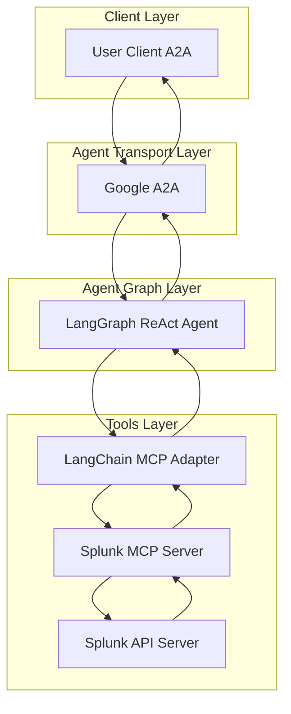

# Splunk Agent

- 🤖 **Splunk Agent** is an LLM-powered agent built using the [LangGraph ReAct Agent](https://langchain-ai.github.io/langgraph/agents/agents/) workflow and Splunk [MCP Server](https://modelcontextprotocol.io/introduction).
- 🌐 **Protocol Support:** Compatible with [A2A](https://github.com/google/A2A) protocol for integration with external user clients.
- 🛡️ **Secure by Design:** Enforces Splunk API token-based RBAC and supports secondary external authentication for strong access control.
- 🏭 **MCP Server:** The MCP server is generated by our first-party [openapi-mcp-codegen](https://github.com/cnoe-io/openapi-mcp-codegen/tree/main) utility, ensuring version/API compatibility and software supply chain integrity.
- 🔌 **MCP Tools:** Uses [langchain-mcp-adapters](https://github.com/langchain-ai/langchain-mcp-adapters) to glue the tools from Splunk MCP server to LangGraph ReAct Agent Graph.

## 🏗️ Architecture

**[Detailed Sequence Diagram with Agentgateway](../architecture/gateway.md)**

### System Diagram



### Sequence Diagram

```mermaid
sequenceDiagram
  participant User
  participant A2A
  participant Agent as LangGraph ReAct Agent
  participant LLM
  participant MCP as Splunk MCP Server
  participant APIServer as Splunk API Server

  note over Agent,MCP: 🛠️ Agent Setup Phase
  rect rgb(245, 245, 220)
    Agent->>MCP: Get Tools
    Agent->>LLM: Bind Tools
  end

  rect rgb(220, 232, 243)
    note over User,A2A: 🧑‍💻 User Input Phase
    User->>A2A: Send request
    A2A->>Agent: Forward to LangGraph Agent

    note over Agent,LLM: 🧠 Agent Reasoning & Tool Selection
    Agent->>LLM: [Reason] User Input
    LLM-->>Agent: [Act] Execute MCP Tool

    note over MCP,APIServer: 🛠️ API Invocation Phase
    Agent->>MCP: Invoke tool
    MCP->>APIServer: Call API
    APIServer-->>MCP: Return data
    MCP-->>Agent: Return data

    note over Agent,LLM: 🧠 Agent Reasoning & Output Structuring
    Agent->>LLM: Input API result data for further ReAct loop
    LLM-->>Agent: Return Structured Output

    note over User,A2A: 📤 User Output Phase
    Agent-->>A2A: Respond with Structured Output
    A2A-->>User: Respond to user (Non-stream or streaming)
  end
```



---

## ⚙️ Local Development Setup

Use this setup to test the agent against a Splunk instance.

### 🔑 Get Splunk API Token

1. Log in to your Splunk instance
2. Go to Settings → Data Inputs → HTTP Event Collector
3. Create a new token with appropriate permissions
4. Save the token for your `.env` file

Add to your `.env`:

```env
SPLUNK_TOKEN=<your_token>
SPLUNK_API_URL=https://your-splunk-instance.com/api
SPLUNK_VERIFY_SSL=true
```

### Local Development

```bash
# Navigate to the Splunk agent directory
cd ai_platform_engineering/agents/splunk

# Run the MCP server in stdio mode
make run-a2a
```

## ✨ Features

- **Log Search & Analytics**: Search logs, run queries, and analyze data
- **Alert Management**: Create, update, and manage alerts and detectors
- **Incident Management**: Handle incidents and track their status
- **Team Management**: Manage teams and team members
- **System Monitoring**: Monitor system health and performance metrics
- **Data Ingestion**: Manage data sources and ingestion pipelines
- **API Integration**: Full Splunk API coverage through MCP tools

## 🎯 Example Use Cases

Ask the agent natural language questions like:

### Log Analysis
- **Error Investigation**: "Search for error logs in the last 24 hours from the web application"
- **Performance Analysis**: "Show me the top 10 slowest API calls from yesterday"
- **Security Monitoring**: "Find all failed login attempts in the last hour"

### Alert Management
- **Alert Creation**: "Create an alert for when CPU usage exceeds 80% for more than 5 minutes"
- **Alert Monitoring**: "Show me all active alerts and their current status"
- **Alert Configuration**: "Update the threshold for the database connection alert"

### System Health
- **Health Check**: "Show me the current system health and any active alerts"
- **Performance Metrics**: "Display the average response time for the last 7 days"
- **Resource Usage**: "What's the current memory and CPU utilization?"

### Incident Response
- **Incident Management**: "List all open incidents and their current status"
- **Incident Investigation**: "Help me investigate the cause of the recent service outage"
- **Incident Resolution**: "Update the status of incident INC-123 to resolved"

### Data Management
- **Data Sources**: "List all configured data sources and their status"
- **Data Ingestion**: "Check the health of the log ingestion pipeline"
- **Data Retention**: "Show me the data retention policies for different log types"
