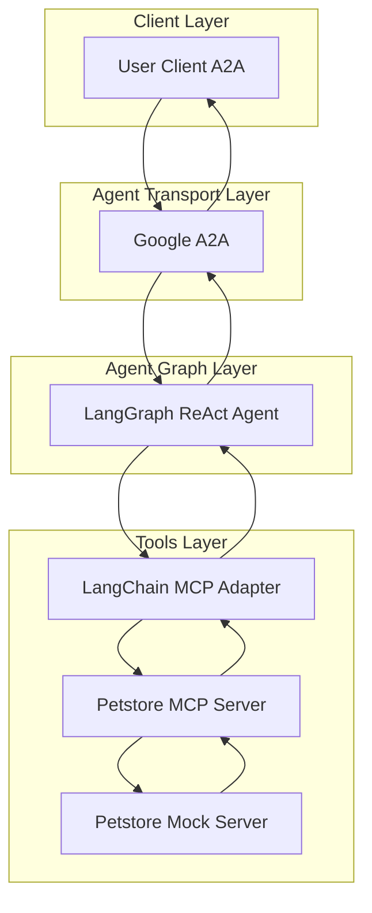

# Petstore/Template Agent

- 🤖 **Petstore Agent** is an LLM-powered agent built using the [LangGraph ReAct Agent](https://langchain-ai.github.io/langgraph/agents/agents/) workflow and Petstore [MCP Server](https://modelcontextprotocol.io/introduction).
- 🌐 **Protocol Support:** Compatible with [A2A](https://github.com/google/A2A) protocol for integration with external user clients.
- 🛡️ **Secure by Design:** Enforces API token-based RBAC and supports secondary external authentication for strong access control.
- 🏭 **MCP Server:** The MCP server is generated by our first-party [openapi-mcp-codegen](https://github.com/cnoe-io/openapi-mcp-codegen/tree/main) utility, ensuring version/API compatibility and software supply chain integrity.
- 🔌 **MCP Tools:** Uses [langchain-mcp-adapters](https://github.com/langchain-ai/langchain-mcp-adapters) to glue the tools from Petstore MCP server to LangGraph ReAct Agent Graph.
- 🧪 **Mock Server:** Includes a built-in mock server for testing and development purposes.

## 🏗️ Architecture

**[Detailed Sequence Diagram with Agentgateway](../architecture/gateway.md)**

### System Diagram



### Sequence Diagram

```mermaid
sequenceDiagram
  participant User
  participant A2A
  participant Agent as LangGraph ReAct Agent
  participant LLM
  participant MCP as Petstore MCP Server
  participant APIServer as Petstore Mock Server

  note over Agent,MCP: 🛠️ Agent Setup Phase
  rect rgb(245, 245, 220)
    Agent->>MCP: Get Tools
    Agent->>LLM: Bind Tools
  end

  rect rgb(220, 232, 243)
    note over User,A2A: 🧑‍💻 User Input Phase
    User->>A2A: Send request
    A2A->>Agent: Forward to LangGraph Agent

    note over Agent,LLM: 🧠 Agent Reasoning & Tool Selection
    Agent->>LLM: [Reason] User Input
    LLM-->>Agent: [Act] Execute MCP Tool

    note over MCP,APIServer: 🛠️ API Invocation Phase
    Agent->>MCP: Invoke tool
    MCP->>APIServer: Call API
    APIServer-->>MCP: Return data
    MCP-->>Agent: Return data

    note over Agent,LLM: 🧠 Agent Reasoning & Output Structuring
    Agent->>LLM: Input API result data for further ReAct loop
    LLM-->>Agent: Return Structured Output

    note over User,A2A: 📤 User Output Phase
    Agent-->>A2A: Respond with Structured Output
    A2A-->>User: Respond to user (Non-stream or streaming)
  end
```



---

## ⚙️ Local Development Setup

Use this setup to test the agent against the Petstore mock server.

### ▶️ Start Petstore Mock Server

The Petstore agent includes a built-in mock server for testing:

```bash
# Start the mock server
docker run -d -p 8080:8080 swaggerapi/petstore3
```

### 🔑 Configure Environment

Create a `.env` file with your configuration:

```env
# Agent Configuration
AGENT_NAME=petstore_agent
LLM_PROVIDER=azure-openai

# Petstore API Configuration
PETSTORE_API_URL=http://localhost:8080
PETSTORE_API_KEY=test-key

# A2A Configuration
A2A_AGENT_HOST=localhost
A2A_AGENT_PORT=8000

# MCP Configuration
MCP_HOST=localhost
MCP_PORT=9000
```

### Local Development

```bash
# Navigate to the Template agent directory
cd ai_platform_engineering/agents/template

# Run the MCP server in stdio mode
make run-a2a
```

### 🚀 Test Petstore Operations

```bash
# Test basic pet operations
curl -X GET "http://localhost:8080/api/v3/pet/findByStatus?status=available"
curl -X GET "http://localhost:8080/api/v3/pet/1"
```

### Run Petstore Sanity tests

```
make petstore-sanity
```

## ✨ Features

- **Pet Management**: Create, read, update, and delete pet records
- **Pet Search**: Find pets by status, tags, or other criteria
- **Pet Store Operations**: Manage pet store inventory and operations
- **Mock Server Integration**: Built-in mock server for testing and development
- **API Testing**: Test REST API operations with sample data
- **Development Template**: Use as a template for creating new agents
- **MCP Server**: Full Petstore API coverage through MCP tools

## 🎯 Example Use Cases

Ask the agent natural language questions like:

- **Pet Operations**: "Add a new dog named 'Buddy' to the pet store"
- **Pet Search**: "Find all available cats in the store"
- **Pet Management**: "Update the status of pet ID 123 to 'sold'"
- **Inventory Management**: "Show me all pets with the tag 'premium'"
- **Store Operations**: "List all pets that need to be fed today"
- **API Testing**: "Test the pet creation endpoint with sample data"

## 🎯 Customization Guide

### Agent-Specific Configuration

1. **Update Agent Name**: Replace "template" with your agent name
2. **Configure API Integration**: Add your specific API endpoints and authentication
3. **Customize Prompts**: Modify system prompts and user interactions
4. **Add Tools**: Implement agent-specific tools and utilities
5. **Update Documentation**: Customize README and documentation

### MCP Server Customization

1. **API Specification**: Provide your OpenAPI specification
2. **Tool Selection**: Choose which API endpoints to expose as tools
3. **Authentication**: Configure authentication methods
4. **Error Handling**: Implement custom error handling logic

### Testing and Evaluation

1. **Unit Tests**: Add tests for your specific functionality
2. **Integration Tests**: Test against your API endpoints
3. **Evaluation Suite**: Create evaluation prompts and expected outputs
4. **Performance Testing**: Test agent performance and response times

## 📚 Documentation

For more detailed information about creating agents, please refer to:

- [MCP Server Creation](../tools-utils/openapi-mcp-codegen.md)
https://github.com/cnoe-io/ai-platform-engineering/actions/runs/17541146553/job/4981293289 o- [Architecture Documentation](../architecture/index.md)
- [Testing and Evaluation](../evaluations/index.md)