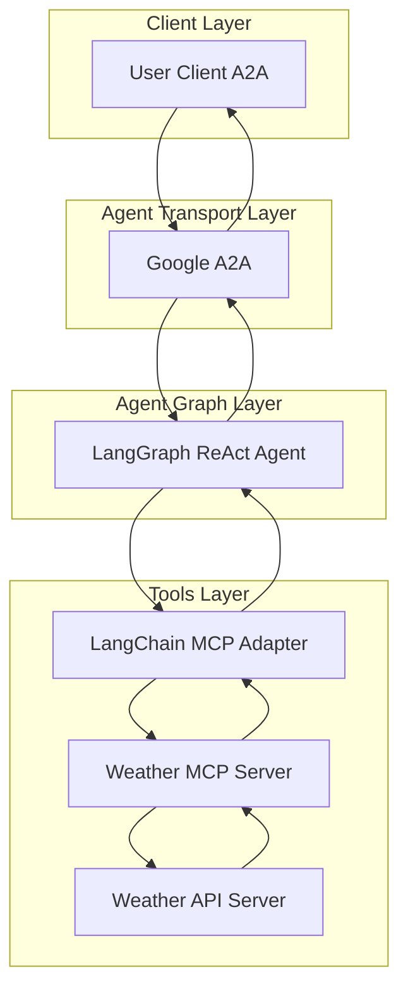

# Weather Agent

- 🤖 **Weather Agent** is an LLM-powered agent built using the [LangGraph ReAct Agent](https://langchain-ai.github.io/langgraph/agents/agents/) workflow and Weather [MCP Server](https://modelcontextprotocol.io/introduction).
- 🌐 **Protocol Support:** Compatible with [A2A](https://github.com/google/A2A) protocol for integration with external user clients.
- 🛡️ **Secure by Design:** Enforces API token-based RBAC and supports secondary external authentication for strong access control.
- 🏭 **MCP Server:** The MCP server is generated by our first-party [openapi-mcp-codegen](https://github.com/cnoe-io/openapi-mcp-codegen/tree/main) utility, ensuring version/API compatibility and software supply chain integrity.
- 🔌 **MCP Tools:** Uses [langchain-mcp-adapters](https://github.com/langchain-ai/langchain-mcp-adapters) to glue the tools from Weather MCP server to LangGraph ReAct Agent Graph.

## 🏗️ Architecture

**[Detailed Sequence Diagram with Agentgateway](../architecture/gateway.md)**

### System Diagram



### Sequence Diagram

```mermaid
sequenceDiagram
  participant User
  participant A2A
  participant Agent as LangGraph ReAct Agent
  participant LLM
  participant MCP as Weather MCP Server
  participant APIServer as Weather API Server

  note over Agent,MCP: 🛠️ Agent Setup Phase
  rect rgb(245, 245, 220)
    Agent->>MCP: Get Tools
    Agent->>LLM: Bind Tools
  end

  rect rgb(220, 232, 243)
    note over User,A2A: 🧑‍💻 User Input Phase
    User->>A2A: Send request
    A2A->>Agent: Forward to LangGraph Agent

    note over Agent,LLM: 🧠 Agent Reasoning & Tool Selection
    Agent->>LLM: [Reason] User Input
    LLM-->>Agent: [Act] Execute MCP Tool

    note over MCP,APIServer: 🛠️ API Invocation Phase
    Agent->>MCP: Invoke tool
    MCP->>APIServer: Call API
    APIServer-->>MCP: Return data
    MCP-->>Agent: Return data

    note over Agent,LLM: 🧠 Agent Reasoning & Output Structuring
    Agent->>LLM: Input API result data for further ReAct loop
    LLM-->>Agent: Return Structured Output

    note over User,A2A: 📤 User Output Phase
    Agent-->>A2A: Respond with Structured Output
    A2A-->>User: Respond to user (Non-stream or streaming)
  end
```



---

## ⚙️ Local Development Setup

Use this setup to test the agent against weather APIs.

### 🔑 Get Weather API Key

1. **OpenWeatherMap API:**
   - Go to [OpenWeatherMap](https://openweathermap.org/api)
   - Sign up for a free account
   - Generate an API key

2. **Alternative APIs:**
   - **WeatherAPI**: [weatherapi.com](https://www.weatherapi.com/)
   - **AccuWeather**: [developer.accuweather.com](https://developer.accuweather.com/)
   - **Weatherbit**: [weatherbit.io](https://www.weatherbit.io/)

3. **Environment Variables:**
   Add to your `.env`:
   ```env
   WEATHER_API_KEY=<your-api-key>
   WEATHER_API_URL=https://api.openweathermap.org/data/2.5
   WEATHER_API_PROVIDER=openweathermap
   ```

### Local Development

```bash
# Navigate to the Weather agent directory
cd ai_platform_engineering/agents/weather

# Run the MCP server in stdio mode
make run-a2a
```

### 🚀 Test Weather API

```bash
# Test current weather
curl "http://api.openweathermap.org/data/2.5/weather?q=London&appid=YOUR_API_KEY"

# Test forecast
curl "http://api.openweathermap.org/data/2.5/forecast?q=London&appid=YOUR_API_KEY"
```

## ✨ Features

- **Current Weather**: Get real-time weather conditions for any location
- **Weather Forecasts**: Retrieve short-term and long-term weather forecasts
- **Location Search**: Find weather by city name, coordinates, or ZIP code
- **Weather Alerts**: Get severe weather alerts and warnings
- **Historical Data**: Access historical weather data for analysis
- **Multiple Units**: Support for metric, imperial, and scientific units
- **Weather Maps**: Generate weather maps and visualizations
- **API Integration**: Full weather API coverage through MCP tools

## 🎯 Example Use Cases

Ask the agent natural language questions like:

### Current Weather
- **Basic Weather**: "What's the weather like in New York City?"
- **Detailed Conditions**: "Show me the current temperature, humidity, and wind speed in London"
- **Weather Comparison**: "Compare the weather in San Francisco and Seattle"

### Weather Forecasts
- **Short-term Forecast**: "What's the weather forecast for tomorrow in Paris?"
- **Weekly Forecast**: "Show me the 7-day weather forecast for Tokyo"
- **Hourly Forecast**: "What will the weather be like in 3 hours in Miami?"

### Location-based Queries
- **City Weather**: "What's the weather in Berlin, Germany?"
- **Coordinate Weather**: "Get weather for coordinates 40.7128, -74.0060"
- **ZIP Code Weather**: "Show me weather for ZIP code 10001"

### Weather Alerts and Warnings
- **Severe Weather**: "Are there any weather warnings for Texas?"
- **Storm Tracking**: "Track the hurricane approaching Florida"
- **Alert Notifications**: "Set up weather alerts for my location"

### Historical and Analysis
- **Historical Data**: "What was the weather like last week in Chicago?"
- **Weather Trends**: "Show me temperature trends for the past month in Denver"
- **Climate Analysis**: "Compare this year's rainfall to last year's in Seattle"

### Specialized Queries
- **Travel Weather**: "What's the weather like for my trip to Barcelona next week?"
- **Outdoor Activities**: "Is it good weather for hiking in Colorado today?"
- **Agricultural Weather**: "What are the growing conditions in Iowa this week?"
