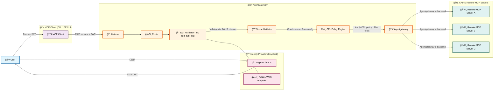
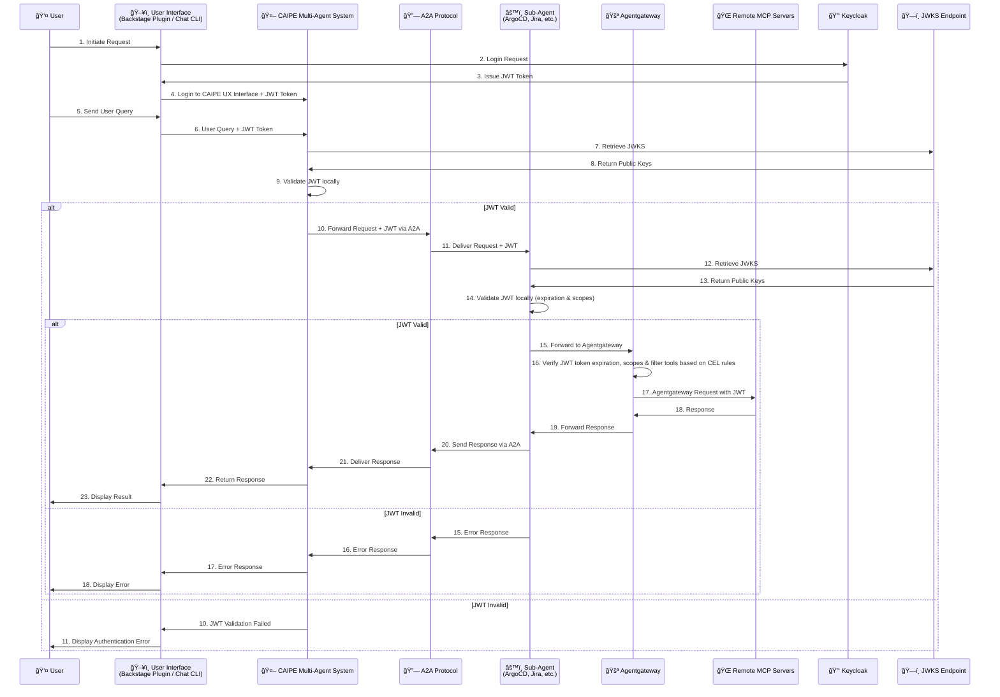

# Use Agentgateway as MCP Proxy

## CAIPE Multi-Agent MCP Flow Solution Architecture

```mermaid
flowchart LR
  U[👤 User]

  subgraph Client["ğŸ–¥ï¸ User Interface"]
    BP[🔌 Backstage Plugin]
    CLI[💬 Chat CLI]
  end

  subgraph CAIPE["🤖 CAIPE Multi-agent System"]
    MAS[🧠 Multi-Agent System]
    A2A[🔗 A2A Protocol]
  end

  subgraph SubAgent["âš™ï¸ Sub-Agent (e.g., ArgoCD, Jira, etc.)"]
    SA[🔧 Sub-Agent]
    JV[🔠JWT Validator]
    MP[🚪 Agentgateway]
  end

  subgraph IDP["🔑 Identity Provider (Keycloak)"]
    K[🔠Login UI / OIDC]
    JWKS[ğŸ—ï¸ Public JWKS Endpoint]
  end

  subgraph MCP["🌠Remote MCP Servers"]
    M1[ğŸ–¥ï¸ Remote MCP Server A]
    M2[ğŸ–¥ï¸ Remote MCP Server B]
    M3[ğŸ–¥ï¸ Remote MCP Server C]
  end

  %% Auth path
  U -->|Login| K
  K -->|Issue JWT| U
  U -->|Provide JWT| BP
  U -->|Provide JWT| CLI

  %% Request flow
  BP -->|Request + JWT| MAS
  CLI -->|Request + JWT| MAS
  MAS -->|Validate JWT| K
  K -->|JWKS validation| MAS
  MAS -->|A2A communication + JWT| A2A
  A2A -->|Forward request + JWT| SA
  SA -->|Validate JWT| JV
  JV -->|JWKS validation| K
  JV -->|Validated| MP
  MP -->|Agentgateway with JWT| M1
  MP -->|Agentgateway with JWT| M2
  MP -->|Agentgateway with JWT| M3

  %% Styling
  classDef userClass fill:#e1f5fe,stroke:#01579b,stroke-width:2px,color:#000
  classDef clientClass fill:#f3e5f5,stroke:#4a148c,stroke-width:2px,color:#000
  classDef caipeClass fill:#e8f5e8,stroke:#1b5e20,stroke-width:2px,color:#000
  classDef subagentClass fill:#fff3e0,stroke:#e65100,stroke-width:2px,color:#000
  classDef idpClass fill:#fce4ec,stroke:#880e4f,stroke-width:2px,color:#000
  classDef mcpClass fill:#e0f2f1,stroke:#004d40,stroke-width:2px,color:#000

  class U userClass
  class BP,CLI clientClass
  class MAS,A2A caipeClass
  class SA,JV,MP subagentClass
  class K,JWKS idpClass
  class M1,M2,M3 mcpClass
```

## Inside Agentgateway Flow

```mermaid
flowchart LR
  U[👤 User]

  subgraph Client["💻 MCP Client (CLI / IDE / UI)"]
    MC[🔧 MCP Client]
  end

  subgraph IDP["🔑 Identity Provider (Keycloak)"]
    K[🔠Login UI / OIDC]
    JWKS[ğŸ—ï¸ Public JWKS Endpoint]
  end

  subgraph AG["🚪 AgentGateway"]
    L[👂 Listener]
    R[ğŸ›£ï¸ Route]
    POL[âš–ï¸ CEL Policy Engine]
    SC[🔠Scope Validator]
    V["🔠JWT Validator - iss, aud, sub, exp"]
    P[🚪 Agentgateway]
  end

  subgraph CAIPE["🌠CAIPE Remote MCP Servers"]
    M1[ğŸ–¥ï¸ Remote MCP Server A]
    M2[ğŸ–¥ï¸ Remote MCP Server B]
    M3[ğŸ–¥ï¸ Remote MCP Server C]
  end

  %% Auth path
  U -->|Login| K
  K -->|Issue JWT| U
  U -->|Provide JWT| MC

  %% Request path
  MC -->|MCP request + JWT| L
  L --> R
  V --- JWKS
  R --> V
  V -->|Validate via JWKS + issuer| SC
  SC -->|Check scopes from config| POL
  POL -->|Apply CEL policy - filter tools| P

  %% Backend selection
  P -->|Agentgateway to backend| M1
  P -->|Agentgateway to backend| M2
  P -->|Agentgateway to backend| M3

  %% Styling
  classDef userClass fill:#e1f5fe,stroke:#01579b,stroke-width:2px,color:#000
  classDef clientClass fill:#f3e5f5,stroke:#4a148c,stroke-width:2px,color:#000
  classDef idpClass fill:#fce4ec,stroke:#880e4f,stroke-width:2px,color:#000
  classDef agentClass fill:#fff3e0,stroke:#e65100,stroke-width:2px,color:#000
  classDef mcpClass fill:#e0f2f1,stroke:#004d40,stroke-width:2px,color:#000

  class U userClass
  class MC clientClass
  class K,JWKS idpClass
  class L,R,POL,SC,V,P agentClass
  class M1,M2,M3 mcpClass
```

## Detailed Sequence Flow

```mermaid
sequenceDiagram
    participant U as 👤 User
    participant UI as ğŸ–¥ï¸ User Interface<br/>(Backstage Plugin / Chat CLI)
    participant CAIPE as 🤖 CAIPE Multi-Agent System
    participant A2A as 🔗 A2A Protocol
    participant SA as âš™ï¸ Sub-Agent<br/>(ArgoCD, Jira, etc.)
    participant MP as 🚪 Agentgateway
    participant MCP as 🌠Remote MCP Servers
    participant K as 🔑 Keycloak
    participant JWKS as ğŸ—ï¸ JWKS Endpoint

    %% User initiates request
    U->>UI: 1. Initiate Request

    %% Authentication Phase
    UI->>K: 2. Login Request
    K->>UI: 3. Issue JWT Token

    %% Login to CAIPE UX Interface
    UI->>CAIPE: 4. Login to CAIPE UX Interface + JWT Token

    %% User sends query
    U->>UI: 5. Send User Query

    %% CAIPE Multi-Agent Flow
    UI->>CAIPE: 6. User Query + JWT Token
    CAIPE->>JWKS: 7. Retrieve JWKS
    JWKS->>CAIPE: 8. Return Public Keys
    CAIPE->>CAIPE: 9. Validate JWT locally

    alt JWT Valid
        CAIPE->>A2A: 10. Forward Request + JWT via A2A
        A2A->>SA: 11. Deliver Request + JWT

        %% Sub-Agent Processing
        SA->>JWKS: 12. Retrieve JWKS
        JWKS->>SA: 13. Return Public Keys
        SA->>SA: 14. Validate JWT locally (expiration & scopes)

        alt JWT Valid
            SA->>MP: 15. Forward to Agentgateway

            %% Agentgateway Processing
            MP->>MP: 16. Verify JWT token expiration, scopes & filter tools based on CEL rules
            MP->>MCP: 17. Agentgateway Request with JWT
            MCP->>MP: 18. Response
            MP->>SA: 19. Forward Response
            SA->>A2A: 20. Send Response via A2A
            A2A->>CAIPE: 21. Deliver Response
            CAIPE->>UI: 22. Return Response
            UI->>U: 23. Display Result
        else JWT Invalid
            SA->>A2A: 15. Error Response
            A2A->>CAIPE: 16. Error Response
            CAIPE->>UI: 17. Error Response
            UI->>U: 18. Display Error
        end
    else JWT Invalid
        CAIPE->>UI: 10. JWT Validation Failed
        UI->>U: 11. Display Authentication Error
    end
```

