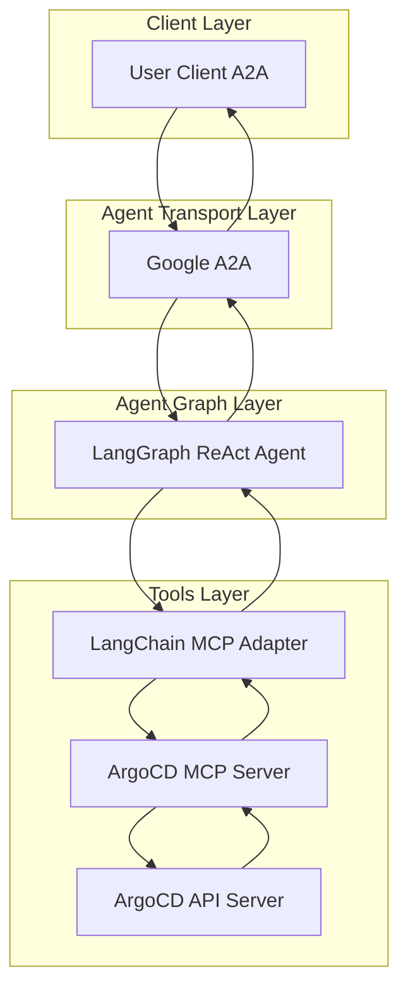

# Solution Architecture

CAIPE (Community AI Platform Engineering) Architecture evolution

1. **Simple ReAct Agent**
   
   *Our journey began with a simple ReAct agent. It could reason about a task and take the right action to deliver an outcome end-to-end. This was our seed — a proof point that agents could reliably support platform operations with a focused persona.*

2. **Tooling Up: Agent + MCP Tools**
   
   *We then added more Platform Services like ArgoCD, GitHub, Jira, and Kubernetes, connected via the MCP protocol. This empowered the agent to create pull requests, manage tickets, trigger deployments, and interact directly with the platform ecosystem.*

3. **Orchestration: Supervisor Agent**
   
   *As requirements expanded, a single agent was no longer sufficient. We introduced a supervisor agent to coordinate multiple specialized sub-agents. This orchestration gave rise to a CAIPE Multi-Agent System, where the supervisor agent could plan, delegate, and integrate results into consistent workflows.*

4. **Distributed Agents: Hierarchical Supervisor over A2A**
   
   *To support scale and resilience, we distributed sub-agents and enabled agent-to-agent communication through the A2A protocol. This created a hierarchical structure of distributed sub-agents, able to securely exchange tasks across environments and adapt to organizational needs.*

5. **Enterprise CAIPE: Gateway Transport + OAuth Agent Identity**
   
   *We adopted Gateway (SLIM/Agentgateway) as the transport between agents, and introduced OAuth based Agent Identity to enforce Authentication and Authorization.*

6. **Enterprise CAIPE: Advanced Integrations**
   
   *Along with distributed tracing, policy enforcement, knowledge retrieval, and integration with Backstage, and use in Visual Studio Code, CAIPE became a secure, scalable, open-source reference system for platform engineering teams.*

---

## Sub-Agent Architecture

---