# Sub-Agent Tool Message Streaming Analysis

> **Note**: This is a historical debugging/investigation document from October 2024. For comprehensive A2A protocol documentation with actual event data, see [A2A Event Flow Architecture](./2025-10-27-a2a-event-flow-architecture.md).

## Overview

This document tracks the investigation and implementation of enhanced transparency for sub-agent tool messages in the CAIPE streaming architecture conducted in October 2024. The goal was to make detailed sub-agent tool executions visible to end users for better debugging and transparency.

**Document Purpose**: Historical record of debugging process (October 2024), architectural limitations discovered, and implementation attempts.

**Date**: October 25, 2024

## Problem Statement

Users were only seeing high-level supervisor notifications like:
- `🔧 Calling argocd...`
- `✅ argocd completed`

But not the detailed sub-agent tool messages like:
- `🔧 Calling tool: **version_service__version**`
- `✅ Tool **version_service__version** completed`

## Architecture Discovery

Through extensive debugging, we mapped the complete event flow from sub-agents to end users:

```mermaid
flowchart TD
    %% End User
    User["👤 End User<br/>curl request"] --> Supervisor["🎛️ Supervisor<br/>platform-engineer-p2p:8000"]
    
    %% Supervisor Processing
    Supervisor --> |POST /argocd| StreamHandler["🔄 Stream Handler<br/>agent.py"]
    StreamHandler --> |astream_events v2| LangGraph["🧠 LangGraph<br/>Deep Agent"]
    
    %% LangGraph Events
    LangGraph --> |on_chat_model_stream| TokenStream["📝 Token Streaming<br/>Execution Plan ⟦⟧"]
    LangGraph --> |on_tool_start| ToolStartEvent["🔧 Tool Start Event<br/>tool_name: argocd"]
    LangGraph --> |on_tool_end| ToolEndEvent["✅ Tool End Event<br/>tool_name: argocd"]
    
    %% Tool Start Processing
    ToolStartEvent --> SupervisorToolMsg["📢 Supervisor Tool Message<br/>🔧 Calling argocd..."]
    
    %% Sub-Agent Communication
    LangGraph --> |A2ARemoteAgentConnectTool| A2AClient["🔗 A2A Client<br/>a2a_remote_agent_connect.py"]
    A2AClient --> |HTTP POST| SubAgent["🤖 Sub-Agent<br/>agent-argocd-p2p:8000"]
    
    %% Sub-Agent Processing
    SubAgent --> |generates| StatusEvents["📊 Status-Update Events"]
    StatusEvents --> |event 1| ToolCallMsg["🔧 Calling tool: version_service__version"]
    StatusEvents --> |event 2| ToolCompleteMsg["✅ Tool version_service__version completed"]
    StatusEvents --> |event 3| ResponseMsg["📄 Full ArgoCD version response"]
    
    %% Event Processing
    ToolCallMsg --> |45 chars| StatusProcessor["⚙️ Status Processor<br/>_arun line 239"]
    ToolCompleteMsg --> |46 chars| StatusProcessor
    ResponseMsg --> |400+ chars| StatusProcessor
    
    %% Status Processing Details
    StatusProcessor --> AccumulateText["📥 Accumulate Text<br/>accumulated_text.append"]
    StatusProcessor --> StreamText["📤 Stream Text<br/>writer a2a_event"]
    StatusProcessor --> LogInfo["📝 Log Info<br/>✅ Streamed + accumulated"]
    
    %% Stream Writer Issue
    StreamText --> |get_stream_writer| CustomEvent["🎨 Custom Event<br/>type: a2a_event"]
    CustomEvent --> |❌ DROPPED| LangGraphLimitation["⚠️ LangGraph Limitation<br/>astream_events no custom events"]
    
    %% Working Stream Path
    TokenStream --> |content| UserOutput["📺 User Output"]
    SupervisorToolMsg --> |tool notification| UserOutput
    ToolEndEvent --> SupervisorCompleteMsg["✅ argocd completed"]
    SupervisorCompleteMsg --> UserOutput
    
    %% Final Output
    UserOutput --> |SSE format| StreamResponse["📡 Server-Sent Events<br/>data: JSON"]
    StreamResponse --> User
    
    %% Fallback Mode (Not Used)
    LangGraph -.-> |fallback exception| FallbackMode["🔄 Fallback Mode<br/>astream messages/custom"]
    FallbackMode -.-> |handles custom events| CustomEventProcessor["🎨 Custom Event Handler<br/>_deserialize_a2a_event"]
    
    %% Status Update Details
    subgraph SubAgentDetails ["Sub-Agent Event Details"]
        SA1["🔧 status-update: tool start<br/>messageId: uuid<br/>45 chars"]
        SA2["✅ status-update: tool complete<br/>messageId: uuid<br/>46 chars"] 
        SA3["📄 status-update: response<br/>messageId: uuid<br/>400+ chars"]
        SA4["🏁 status-update: final<br/>final: true<br/>state: completed"]
    end
    
    %% Event Processing Details  
    subgraph ProcessingDetails ["Event Processing Chain"]
        P1["📨 Received event<br/>kind: status-update"]
        P2["🔍 Extract text<br/>parts[0].text"]
        P3["📥 Accumulate<br/>accumulated_text.append"]
        P4["📤 Stream<br/>writer a2a_event"]
        P5["📝 Log<br/>INFO level"]
        P1 --> P2 --> P3 --> P4 --> P5
    end
    
    %% User Experience
    subgraph UserExperience ["What User Sees"]
        UE1["⟦ Execution Plan ⟧<br/>✅ VISIBLE"]
        UE2["🔧 Calling argocd...<br/>✅ VISIBLE"]
        UE3["✅ argocd completed<br/>✅ VISIBLE"]
        UE4["🔧 Calling tool: version_service<br/>❌ NOT VISIBLE"]
        UE5["✅ Tool version_service completed<br/>❌ NOT VISIBLE"]
    end
    
    %% Styling
    classDef working fill:#d4edda,stroke:#155724,color:#155724
    classDef broken fill:#f8d7da,stroke:#721c24,color:#721c24
    classDef processing fill:#fff3cd,stroke:#856404,color:#856404
    classDef subagent fill:#cce5ff,stroke:#004085,color:#004085
    
    class SupervisorToolMsg,TokenStream,SupervisorCompleteMsg,UE1,UE2,UE3 working
    class LangGraphLimitation,UE4,UE5 broken
    class StatusProcessor,AccumulateText,StreamText,LogInfo processing
    class SubAgent,StatusEvents,ToolCallMsg,ToolCompleteMsg,ResponseMsg subagent
```



## Key Technical Discoveries

### 1. LangGraph Streaming Architecture Limitation

**Critical Finding:** LangGraph has two streaming modes with different event handling capabilities:

- **`astream_events` (primary):** Handles native LangGraph events (`on_tool_start`, `on_chat_model_stream`, `on_tool_end`)
- **`astream` (fallback):** Handles custom events from `get_stream_writer()`

**The Issue:** Custom events generated by `get_stream_writer()` are **not processed** by `astream_events`, even though they are successfully generated and logged.

### 2. Event Processing Pipeline

The complete event processing pipeline:

```
Sub-Agent → Status-Update Events → A2A Client → Stream Writer → Custom Events → [DROPPED] → User
                                                                                     ↓
Supervisor → LangGraph Events → astream_events → Tool Notifications → [SUCCESS] → User
```

### 3. Working vs Non-Working Events

**✅ Working (Visible to User):**
- Execution plans with `⟦⟧` markers
- Supervisor tool notifications: `🔧 Calling argocd...`
- Supervisor completion notifications: `✅ argocd completed`

**❌ Not Working (Captured but Not Visible):**
- Sub-agent tool details: `🔧 Calling tool: **version_service__version**`
- Sub-agent completions: `✅ Tool **version_service__version** completed`
- Detailed sub-agent responses (captured and accumulated but not streamed to user)

## Implementation Changes Made

### 1. Removed Status-Update Filtering

**File:** `ai_platform_engineering/utils/a2a_common/a2a_remote_agent_connect.py`

**Before:**
```python
if text and not text.startswith(('🔧', '✅', '❌', '🔍')):
    accumulated_text.append(text)
    logger.debug(f"✅ Accumulated text from status-update: {len(text)} chars")
```

**After:**
```python
if text:
    accumulated_text.append(text)
    # Stream status-update text immediately for real-time display
    writer({"type": "a2a_event", "data": text})
    logger.info(f"✅ Streamed + accumulated text from status-update: {len(text)} chars")
```

**Impact:** All sub-agent tool messages are now captured and attempted to be streamed.

### 2. Enhanced Error Handling

**File:** `ai_platform_engineering/multi_agents/platform_engineer/protocol_bindings/a2a/agent.py`

**Added:**
```python
import asyncio

# In main streaming loop
except asyncio.CancelledError:
    logging.info("Primary stream cancelled by client disconnection")
    return

# In fallback streaming loop  
except asyncio.CancelledError:
    logging.info("Fallback stream cancelled by client disconnection")
    return
```

**Impact:** Graceful handling of client disconnections without server-side errors.

### 3. Custom Event Handler (Attempted)

**File:** `ai_platform_engineering/multi_agents/platform_engineer/protocol_bindings/a2a/agent.py`

**Added:**
```python
# Handle custom events from sub-agents (like detailed tool messages)
elif event_type == "on_custom":
    custom_data = event.get("data", {})
    if isinstance(custom_data, dict) and custom_data.get("type") == "a2a_event":
        custom_text = custom_data.get("data", "")
        if custom_text:
            logging.info(f"Processing custom a2a_event: {len(custom_text)} chars")
            yield {
                "is_task_complete": False,
                "require_user_input": False,
                "content": custom_text,
                "custom_event": {
                    "type": "sub_agent_detail",
                    "source": "a2a_tool"
                }
            }
```

**Impact:** This handler was added but never triggered due to LangGraph's architecture limitations.

### 4. Logging Enhancement

**Changed:** Debug-level logs to INFO-level for better visibility during debugging.

**Impact:** Confirmed that status-update events are being processed correctly:
```
✅ Streamed + accumulated text from status-update: 45 chars
✅ Streamed + accumulated text from status-update: 46 chars  
✅ Streamed + accumulated text from status-update: 400+ chars
```

## Current Status

### ✅ Successfully Implemented
1. **Transparent status-update processing** - All sub-agent messages are captured and processed
2. **Real-time streaming infrastructure** - Events are immediately passed to stream writer
3. **Robust error handling** - Client disconnections handled gracefully
4. **Enhanced logging** - Full visibility into event processing pipeline
5. **Comprehensive architecture mapping** - Complete understanding of event flow

### ❌ Architectural Limitation
- **Custom events not displayed:** Due to LangGraph's `astream_events` mode not processing custom events from `get_stream_writer()`
- **Sub-agent tool details not visible:** Users still don't see detailed tool execution steps

### 📊 Current User Experience

**What Users See:**
```
⟦🎯 Execution Plan: Retrieve ArgoCD Version Information⟧
🔧 Calling argocd...
✅ argocd completed
[Final response with version details]
```

**What Users Don't See (but is captured):**
```
🔧 Calling tool: **version_service__version**
✅ Tool **version_service__version** completed
```

## Possible Solutions

### Option 1: Force Fallback Mode
Modify the supervisor to use `astream` instead of `astream_events` to enable custom event processing.

**Pros:** Would display detailed sub-agent tool messages
**Cons:** Might lose token-level streaming capabilities

### Option 2: Enhanced Supervisor Notifications
Add more detailed information to supervisor-level tool notifications using available metadata.

**Pros:** Works within current architecture
**Cons:** Limited detail compared to actual sub-agent messages

### Option 3: Hybrid Approach
Use both streaming modes or implement custom event bridging.

**Pros:** Best of both worlds
**Cons:** Increased complexity

## Files Modified

- `ai_platform_engineering/utils/a2a_common/a2a_remote_agent_connect.py`
- `ai_platform_engineering/multi_agents/platform_engineer/protocol_bindings/a2a/agent.py`

## Testing Validation

### Test Command
```bash
curl -X POST http://10.99.255.178:8000 \
  -H "Content-Type: application/json" \
  -H "Accept: text/event-stream" \
  -d '{"id":"test","method":"message/stream","params":{"message":{"role":"user","parts":[{"kind":"text","text":"show argocd version"}],"messageId":"msg-test"}}}'
```

### Log Validation
```bash
docker logs platform-engineer-p2p --since=2m | grep -E "(Streamed.*accumulated|Processing.*custom)"
```

**Expected Output:**
```
✅ Streamed + accumulated text from status-update: 45 chars
✅ Streamed + accumulated text from status-update: 46 chars
✅ Streamed + accumulated text from status-update: 400+ chars
```

## Next Steps

1. **Decision on solution approach** - Choose between forcing fallback mode, enhancing supervisor notifications, or hybrid approach
2. **Implementation** - Based on chosen solution
3. **Testing** - Validate that detailed tool messages reach end users
4. **Documentation updates** - Update this diagram as changes are implemented

## Current Status & Updated Documentation

> **⚠️ Historical Document**: This document captures the investigation as of October 25, 2024.

For the **current, comprehensive A2A protocol documentation** with actual event data, real-world examples, and complete event flow analysis, see:

### 📚 [A2A Event Flow Architecture (2025-10-27)](./2025-10-27-a2a-event-flow-architecture.md)

**What's included in the new documentation:**
- ✅ Complete architecture flowchart (Client → Supervisor → Sub-Agent → MCP → Tools)
- ✅ Detailed sequence diagram showing all 6 phases of execution
- ✅ Actual A2A event structures from real tests
- ✅ Token-by-token streaming analysis with append flags
- ✅ Comprehensive event type reference (task, artifact-update, status-update)
- ✅ Event count metrics (600+ events for simple query)
- ✅ Frontend integration examples
- ✅ Testing commands for both supervisor and sub-agents

**Use cases:**
- Understanding A2A protocol: → New doc
- Debugging streaming issues: → This doc (historical context)
- Implementing frontend clients: → New doc
- Understanding architectural limitations: → This doc

---

**Investigation Date:** October 25, 2024  
**Document Status:** Historical - See [2025-10-27-a2a-event-flow-architecture.md](./2025-10-27-a2a-event-flow-architecture.md) for current documentation  
**Findings:** Infrastructure Complete - Architecture Limitation Identified  
**Outcome:** LangGraph streaming limitation documented; sub-agent tool details not visible to end users via `astream_events`
