# A2A Event Flow Architecture - Complete Analysis

## Overview

This document provides a thorough analysis of the Agent-to-Agent (A2A) protocol event flow in the CAIPE platform, from end client through supervisor to sub-agents, documenting actual event types, streaming behavior, and data flow patterns.

## Architecture Layers

```
End Client (curl/browser)
    ↓ HTTP POST with SSE
Platform Engineer Supervisor (:8000)
    ↓ HTTP POST A2A
Sub-Agent (e.g., ArgoCD :8001)
    ↓ MCP Client
MCP Server (ArgoCD tools)
```

## Architecture Flow Diagram

```mermaid
flowchart TD
    %% Client Layer
    Client["👤 End Client<br/>Browser/CLI"]
    
    %% Supervisor Layer
    SupervisorAPI["🎛️ Supervisor API<br/>:8000 /message/stream"]
    SupervisorLLM["🧠 LLM Engine<br/>Claude/GPT/Gemini"]
    SupervisorLangGraph["📊 LangGraph<br/>Agent Orchestration"]
    
    %% Sub-Agent Layer
    SubAgentAPI["🤖 Sub-Agent API<br/>:8001 /message/stream"]
    SubAgentLangGraph["📊 LangGraph<br/>Tool Orchestration"]
    
    %% MCP Layer
    MCPClient["🔌 MCP Client<br/>stdio/http"]
    MCPServer["🔧 MCP Server<br/>Tool Definitions"]
    
    %% Tool Layer
    Tools["⚙️ Actual Tools<br/>ArgoCD API, kubectl, etc."]
    
    %% Flow: Client to Supervisor
    Client -->|"POST<br/>{role:user,text:query}"| SupervisorAPI
    SupervisorAPI -->|"SSE Response<br/>task:submitted"| Client
    
    %% Flow: Supervisor Processing
    SupervisorAPI --> SupervisorLangGraph
    SupervisorLangGraph --> SupervisorLLM
    SupervisorLLM -->|"Token Stream<br/>Execution Plan ⟦⟧"| SupervisorAPI
    SupervisorAPI -->|"artifact-update<br/>execution_plan_streaming<br/>append=false/true"| Client
    
    %% Flow: Supervisor calls Sub-Agent
    SupervisorLLM -->|"Tool Call<br/>argocd tool"| SupervisorLangGraph
    SupervisorLangGraph -->|"artifact-update<br/>tool_notification_start"| SupervisorAPI
    SupervisorAPI -->|"🔧 Calling Agent..."| Client
    
    SupervisorLangGraph -->|"A2A POST<br/>{role:user,text:query}"| SubAgentAPI
    
    %% Flow: Sub-Agent Processing
    SubAgentAPI --> SubAgentLangGraph
    SubAgentLangGraph --> MCPClient
    MCPClient -->|"MCP Request<br/>get_version"| MCPServer
    MCPServer --> Tools
    
    %% Flow: Tool Response
    Tools -->|"API Response<br/>version data"| MCPServer
    MCPServer -->|"MCP Response<br/>formatted data"| MCPClient
    MCPClient --> SubAgentLangGraph
    
    %% Flow: Sub-Agent Streaming
    SubAgentLangGraph -->|"Token Stream<br/>Each character"| SubAgentAPI
    SubAgentAPI -->|"status-update<br/>state:working<br/>text:'H','e','r','e'..."| SupervisorLangGraph
    
    %% Flow: Supervisor Forwards to Client
    SupervisorLangGraph --> SupervisorAPI
    SupervisorAPI -->|"artifact-update<br/>streaming_result<br/>append=false/true"| Client
    
    %% Flow: Completion
    SubAgentAPI -->|"status-update<br/>final:true<br/>state:completed"| SupervisorLangGraph
    SupervisorLangGraph --> SupervisorAPI
    SupervisorAPI -->|"artifact-update<br/>partial_result<br/>lastChunk:true"| Client
    SupervisorAPI -->|"status-update<br/>final:true"| Client
    
    %% Styling
    classDef clientLayer fill:#e1f5ff,stroke:#01579b,stroke-width:2px
    classDef supervisorLayer fill:#f3e5f5,stroke:#4a148c,stroke-width:2px
    classDef subagentLayer fill:#e8f5e9,stroke:#1b5e20,stroke-width:2px
    classDef mcpLayer fill:#fff3e0,stroke:#e65100,stroke-width:2px
    classDef toolLayer fill:#fce4ec,stroke:#880e4f,stroke-width:2px
    
    class Client clientLayer
    class SupervisorAPI,SupervisorLLM,SupervisorLangGraph supervisorLayer
    class SubAgentAPI,SubAgentLangGraph subagentLayer
    class MCPClient,MCPServer mcpLayer
    class Tools toolLayer
```



## Complete Event Flow Sequence

```mermaid
sequenceDiagram
    participant Client as 👤 End Client
    participant Super as 🎛️ Supervisor<br/>(platform-engineer-p2p:8000)
    participant SubAgent as 🤖 Sub-Agent<br/>(agent-argocd-p2p:8001)
    participant MCP as 🔧 MCP Server<br/>(ArgoCD Tools)
    
    Note over Client,MCP: Phase 1: Task Submission
    Client->>Super: POST /message/stream<br/>{"role":"user","text":"show argocd version"}
    Super-->>Client: task: {"kind":"task","status":"submitted"}
    
    Note over Client,MCP: Phase 2: Execution Plan Streaming
    Super->>Super: LLM generates plan
    Super-->>Client: artifact-update: execution_plan_streaming<br/>append=false, text="⟦"
    Super-->>Client: artifact-update: execution_plan_streaming<br/>append=true, text="**"
    Super-->>Client: artifact-update: execution_plan_streaming<br/>append=true, text="🎯"
    Super-->>Client: ... (streaming token by token)
    Super-->>Client: artifact-update: execution_plan_streaming<br/>append=true, text="⟧"
    Super-->>Client: artifact-update: execution_plan_update<br/>Complete plan content
    
    Note over Client,MCP: Phase 3: Tool Notification
    Super->>Super: LLM calls argocd tool
    Super-->>Client: artifact-update: tool_notification_start<br/>"🔧 Supervisor: Calling Agent Argocd..."
    
    Note over Client,MCP: Phase 4: Sub-Agent Communication
    Super->>SubAgent: POST /message/stream<br/>A2A protocol
    SubAgent->>SubAgent: LangGraph processes
    SubAgent->>MCP: MCP tool call: get_version
    MCP-->>SubAgent: Return version data
    
    Note over Client,MCP: Phase 5: Sub-Agent Streaming Response
    SubAgent-->>Super: status-update: state=working<br/>{"text":"🔧 Calling tool..."}
    SubAgent-->>Super: status-update: state=working<br/>{"text":"✅ Tool completed"}
    SubAgent-->>Super: status-update: state=working<br/>{"text":"H"}
    SubAgent-->>Super: status-update: state=working<br/>{"text":"ere"}
    SubAgent-->>Super: ... (token-by-token streaming)
    SubAgent-->>Super: status-update: state=working<br/>{"text":"v3.1.8+becb020"}
    SubAgent-->>Super: artifact-update: current_result<br/>lastChunk=true
    SubAgent-->>Super: status-update: final=true<br/>state=completed
    
    Note over Client,MCP: Phase 6: Supervisor Streams Sub-Agent Response
    Super-->>Client: artifact-update: streaming_result<br/>append=false, text="Here..."
    Super-->>Client: artifact-update: streaming_result<br/>append=true, text="is..."
    Super-->>Client: ... (forwarding sub-agent tokens)
    Super-->>Client: artifact-update: partial_result<br/>lastChunk=true
    Super-->>Client: status-update: final=true<br/>state=completed
```



## A2A Event Types

### 1. Task Events

#### Task Submission (`kind: "task"`)
**Direction**: Supervisor → Client  
**When**: Immediately after request received  
**Structure**:
```json
{
  "id": "test-id",
  "jsonrpc": "2.0",
  "result": {
    "kind": "task",
    "id": "0b18d90c-b92a-40d1-a205-df9fc70f739c",
    "status": {"state": "submitted"},
    "contextId": "07c0f068-23ce-41e1-a989-f428769b5033",
    "history": [{
      "kind": "message",
      "role": "user",
      "parts": [{"kind": "text", "text": "show argocd version"}],
      "messageId": "msg-supervisor-1"
    }]
  }
}
```

**Characteristics**:
- ✅ Sent once per request
- ✅ Contains full message history
- ✅ Provides taskId for tracking

### 2. Artifact Update Events (`kind: "artifact-update"`)

#### Execution Plan Streaming (`name: "execution_plan_streaming"`)
**Direction**: Supervisor → Client  
**When**: LLM generates execution plan  
**Streaming Type**: **Token-by-token streaming with append flags**

**First Chunk**:
```json
{
  "result": {
    "kind": "artifact-update",
    "append": false,
    "lastChunk": false,
    "artifact": {
      "artifactId": "20e09366-fc4d-4485-b1b4-b4651415d22c",
      "name": "execution_plan_streaming",
      "description": "Execution plan streaming in progress",
      "parts": [{"kind": "text", "text": "⟦"}]
    }
  }
}
```

**Subsequent Chunks**:
```json
{
  "result": {
    "kind": "artifact-update",
    "append": true,  // ← Reuses same artifactId
    "lastChunk": false,
    "artifact": {
      "artifactId": "20e09366-fc4d-4485-b1b4-b4651415d22c",  // ← Same ID
      "name": "execution_plan_streaming",
      "description": "Execution plan streaming in progress",
      "parts": [{"kind": "text", "text": "**"}]  // ← Next token
    }
  }
}
```

**Characteristics**:
- ✅ Token-by-token streaming
- ✅ Single shared `artifactId` across all chunks
- ✅ `append=false` for first chunk, `append=true` for rest
- ✅ Wrapped in `⟦...⟧` Unicode markers
- ✅ Each chunk contains 1-10 characters

#### Execution Plan Complete (`name: "execution_plan_update"`)
**Direction**: Supervisor → Client  
**When**: After execution plan streaming completes  
**Streaming Type**: **Single complete chunk**

```json
{
  "result": {
    "kind": "artifact-update",
    "append": true,
    "lastChunk": false,
    "artifact": {
      "artifactId": "75d62509-51c0-4e04-b5be-2908036c4a8a",  // ← NEW ID
      "name": "execution_plan_update",
      "description": "Complete execution plan streamed to user",
      "parts": [{
        "kind": "text",
        "text": "⟦**🎯 Execution Plan...**⟧"  // ← Full plan
      }]
    }
  }
}
```

**Characteristics**:
- ✅ Sent once after streaming completes
- ⚠️ Currently uses different artifact ID (potential issue)
- ✅ Contains complete plan text

#### Tool Notifications (`name: "tool_notification_start"`, `"tool_notification_complete"`)
**Direction**: Supervisor → Client  
**When**: Tool (sub-agent) invocation starts/ends  
**Streaming Type**: **Single-event notifications**

**Start Notification**:
```json
{
  "result": {
    "kind": "artifact-update",
    "append": false,
    "artifact": {
      "artifactId": "d8373de2-1d91-4484-a8ec-dce88b077bd6",
      "name": "tool_notification_start",
      "description": "Tool call started: argocd",
      "parts": [{
        "kind": "text",
        "text": "🔧 Supervisor: Calling Agent Argocd...\n"
      }]
    }
  }
}
```

**Characteristics**:
- ✅ Each notification gets unique artifact ID
- ✅ `append=false` (standalone notifications)
- ✅ User-friendly emoji prefixes

#### Streaming Result (`name: "streaming_result"`)
**Direction**: Supervisor → Client  
**When**: Forwarding sub-agent response tokens  
**Streaming Type**: **Token-by-token streaming with append flags**

**First Chunk**:
```json
{
  "result": {
    "kind": "artifact-update",
    "append": false,
    "lastChunk": false,
    "artifact": {
      "artifactId": "04c6b73a-fb00-40c4-a23c-3da41a1334bd",
      "name": "streaming_result",
      "description": "Streaming result from Platform Engineer",
      "parts": [{"kind": "text", "text": "Here"}]
    }
  }
}
```

**Subsequent Chunks**:
```json
{
  "result": {
    "kind": "artifact-update",
    "append": true,
    "artifact": {
      "artifactId": "04c6b73a-fb00-40c4-a23c-3da41a1334bd",  // ← Same ID
      "name": "streaming_result",
      "parts": [{"kind": "text", "text": " is"}]
    }
  }
}
```

**Characteristics**:
- ✅ Token-by-token streaming from sub-agent
- ✅ Single shared `artifactId`
- ✅ `append=false` for first, `append=true` for rest

#### Partial Result (`name: "partial_result"`)
**Direction**: Supervisor → Client  
**When**: End of streaming sequence  
**Streaming Type**: **Single complete result**

```json
{
  "result": {
    "kind": "artifact-update",
    "append": false,
    "lastChunk": true,  // ← Marks end
    "artifact": {
      "artifactId": "3881cbbc-08e8-4c5b-90d5-a8dccf4368f7",
      "name": "partial_result",
      "description": "Partial result from Platform Engineer (stream ended)",
      "parts": [{
        "kind": "text",
        "text": "Here is the ArgoCD version information..."  // ← Complete text
      }]
    }
  }
}
```

**Characteristics**:
- ✅ `lastChunk=true` indicates end
- ✅ Contains complete accumulated text
- ✅ Sent once at completion

### 3. Status Update Events (`kind: "status-update"`)

#### Sub-Agent Working Status
**Direction**: Sub-Agent → Supervisor  
**When**: During sub-agent processing  
**Streaming Type**: **Individual token events**

```json
{
  "result": {
    "kind": "status-update",
    "final": false,
    "contextId": "57a8b9ea-1580-422f-a387-177c4840b133",
    "taskId": "06c54ebb-50cd-4210-9a35-13899c23815e",
    "status": {
      "state": "working",
      "message": {
        "kind": "message",
        "role": "agent",
        "messageId": "cc07f0d2-ab2c-46ba-ab88-d55eebec96cf",  // ← Unique per token
        "contextId": "57a8b9ea-1580-422f-a387-177c4840b133",
        "taskId": "06c54ebb-50cd-4210-9a35-13899c23815e",
        "parts": [{"kind": "text", "text": "H"}]  // ← Single token
      }
    }
  }
}
```

**Characteristics**:
- ✅ Each token has unique `messageId`
- ✅ `final=false` for all intermediate tokens
- ✅ `state="working"` during processing
- ✅ Can contain tool notifications: "🔧 Calling tool: version_service__version"

#### Sub-Agent Final Status
**Direction**: Sub-Agent → Supervisor  
**When**: Sub-agent task complete  
**Streaming Type**: **Single completion event**

```json
{
  "result": {
    "kind": "status-update",
    "final": true,  // ← Marks completion
    "status": {
      "state": "completed"
    },
    "taskId": "06c54ebb-50cd-4210-9a35-13899c23815e"
  }
}
```

**Characteristics**:
- ✅ `final=true` indicates end
- ✅ `state="completed"` (or "failed")
- ✅ Sent once at task completion

## Event Flow Comparison

### Supervisor Events (Platform Engineer → Client)

| Event Type | Artifact Name | Streaming | append Flag | Use Case |
|------------|---------------|-----------|-------------|----------|
| `artifact-update` | `execution_plan_streaming` | Token-by-token | false (first), true (rest) | LLM execution plan |
| `artifact-update` | `execution_plan_update` | Single chunk | true | Complete plan |
| `artifact-update` | `tool_notification_start` | Single chunk | false | Tool call started |
| `artifact-update` | `streaming_result` | Token-by-token | false (first), true (rest) | Sub-agent response |
| `artifact-update` | `partial_result` | Single chunk | false | Final accumulated result |

### Sub-Agent Events (ArgoCD → Supervisor)

| Event Type | Status State | final Flag | Use Case |
|------------|--------------|------------|----------|
| `status-update` | `working` | false | Each response token |
| `status-update` | `working` | false | Tool notifications |
| `status-update` | `completed` | true | Task completion |
| `artifact-update` | `current_result` | N/A | Empty final artifact |

## Token Streaming vs. Chunks

### Token-by-Token Streaming
**Used for**: Execution plans, sub-agent responses  
**Mechanism**:
1. First event: `append=false`, new `artifactId`
2. Subsequent events: `append=true`, same `artifactId`
3. Each event contains 1-10 characters
4. Frontend appends to same display area

**Example**:
```
Event 1: append=false, artifactId="abc", text="H"
Event 2: append=true,  artifactId="abc", text="ere"
Event 3: append=true,  artifactId="abc", text=" is"
Result: "Here is"
```

### Single-Chunk Events
**Used for**: Tool notifications, completion markers  
**Mechanism**:
1. One event with complete content
2. `append=false` (standalone)
3. Unique `artifactId` per notification
4. Frontend displays as new element

**Example**:
```
Event: append=false, artifactId="xyz", text="🔧 Calling Agent..."
Result: New notification appears
```

## Complete Example Flow

### Query: "show argocd version"

#### Step 1: Client → Supervisor
```bash
curl -X POST http://10.99.255.178:8000 \
  -H "Content-Type: application/json" \
  -d '{"id":"req-1","method":"message/stream","params":{...}}'
```

#### Step 2: Supervisor Responds

**Task Submission**:
```json
{"kind":"task","status":"submitted"}
```

**Execution Plan Streaming** (50+ events):
```json
{"kind":"artifact-update","name":"execution_plan_streaming","append":false,"text":"⟦"}
{"kind":"artifact-update","name":"execution_plan_streaming","append":true,"text":"**"}
{"kind":"artifact-update","name":"execution_plan_streaming","append":true,"text":"🎯"}
... (token by token)
{"kind":"artifact-update","name":"execution_plan_streaming","append":true,"text":"⟧"}
```

**Execution Plan Complete**:
```json
{"kind":"artifact-update","name":"execution_plan_update","text":"⟦**🎯 Execution Plan...**⟧"}
```

**Tool Notification**:
```json
{"kind":"artifact-update","name":"tool_notification_start","text":"🔧 Supervisor: Calling Agent Argocd..."}
```

#### Step 3: Supervisor → Sub-Agent (Internal A2A)
```json
POST http://agent-argocd-p2p:8000
{"id":"sub-req","method":"message/stream","params":{...}}
```

#### Step 4: Sub-Agent Responds (500+ events)

**Working Status** (each token):
```json
{"kind":"status-update","state":"working","text":"H"}
{"kind":"status-update","state":"working","text":"ere"}
{"kind":"status-update","state":"working","text":" is"}
... (hundreds of tokens)
{"kind":"status-update","state":"working","text":"v3.1.8+becb020"}
```

**Final Status**:
```json
{"kind":"artifact-update","name":"current_result","lastChunk":true,"text":""}
{"kind":"status-update","final":true,"state":"completed"}
```

#### Step 5: Supervisor Forwards to Client

**Streaming Result** (500+ events):
```json
{"kind":"artifact-update","name":"streaming_result","append":false,"text":"Here"}
{"kind":"artifact-update","name":"streaming_result","append":true,"text":" is"}
... (forwarding each token)
```

**Partial Result**:
```json
{"kind":"artifact-update","name":"partial_result","lastChunk":true,"text":"Here is the ArgoCD version..."}
```

**Final Status**:
```json
{"kind":"status-update","final":true,"state":"completed"}
```

## Key Insights

### Streaming Efficiency
- **Supervisor**: Streams LLM tokens directly to client (low latency)
- **Sub-Agent**: Streams every single character (very granular)
- **Total Events**: 600+ events for simple version query

### Artifact ID Management
- **Execution Plan**: Single ID shared across ~50 chunks
- **Tool Notifications**: Unique ID per notification
- **Streaming Result**: Single ID shared across ~500 chunks
- **⚠️ Issue**: `execution_plan_update` uses different ID than streaming chunks

### Append Flag Pattern
```
First chunk:     append=false, artifactId="new-id"
Subsequent:      append=true,  artifactId="same-id"
Standalone:      append=false, artifactId="unique-id"
```

### Message IDs
- **Supervisor**: Reuses `artifactId` with `append` flag
- **Sub-Agent**: Unique `messageId` per token in status-update

## Protocol Specifications

### A2A Message Format
```json
{
  "id": "request-id",
  "jsonrpc": "2.0",
  "method": "message/stream",
  "params": {
    "message": {
      "role": "user|agent",
      "parts": [{"kind": "text", "text": "content"}],
      "messageId": "unique-message-id"
    }
  }
}
```

### A2A Response Format
```json
{
  "id": "request-id",
  "jsonrpc": "2.0",
  "result": {
    "kind": "task|artifact-update|status-update",
    "contextId": "context-uuid",
    "taskId": "task-uuid",
    ... (kind-specific fields)
  }
}
```

## Frontend Integration

### Event Handling
```typescript
// Handle execution plan streaming
if (event.kind === "artifact-update" && 
    event.artifact.name === "execution_plan_streaming") {
  if (event.append === false) {
    // Create new plan display
    planElement = createPlanElement(event.artifact.artifactId);
  } else {
    // Append to existing plan
    planElement.append(event.artifact.parts[0].text);
  }
}

// Handle tool notifications
if (event.kind === "artifact-update" && 
    event.artifact.name === "tool_notification_start") {
  // Show new notification (don't append)
  showNotification(event.artifact.parts[0].text);
}

// Handle streaming results
if (event.kind === "artifact-update" && 
    event.artifact.name === "streaming_result") {
  if (event.append === false) {
    resultElement = createResultElement(event.artifact.artifactId);
  } else {
    resultElement.append(event.artifact.parts[0].text);
  }
}
```

## Testing Commands

### Test Supervisor
```bash
curl -X POST http://10.99.255.178:8000 \
  -H "Content-Type: application/json" \
  -H "Accept: text/event-stream" \
  -d '{"id":"test-1","method":"message/stream","params":{"message":{"role":"user","parts":[{"kind":"text","text":"show argocd version"}],"messageId":"msg-1"}}}'
```

### Test Sub-Agent Direct
```bash
curl -X POST http://localhost:8001 \
  -H "Content-Type: application/json" \
  -H "Accept: text/event-stream" \
  -d '{"id":"test-2","method":"message/stream","params":{"message":{"role":"user","parts":[{"kind":"text","text":"show argocd version"}],"messageId":"msg-2"}}}'
```

## Related Documentation

### External References
- [A2A Protocol Specification](https://github.com/google/A2A) - Official Google A2A protocol spec
- [Model Context Protocol (MCP)](https://modelcontextprotocol.io/) - MCP official documentation
- [LangGraph Event Streaming](https://python.langchain.com/docs/langgraph/) - LangGraph streaming guide

### Internal Documentation
- [Sub-Agent Tool Message Streaming (Oct 25, 2024)](./2024-10-25-sub-agent-tool-message-streaming.md) - Historical debugging investigation
  - Documents LangGraph streaming limitations
  - Investigation of sub-agent tool message visibility
  - Architectural discoveries and attempted solutions
- [Session Context (Oct 25, 2024)](./session-context-2024-10-25.md) - Earlier investigation session

