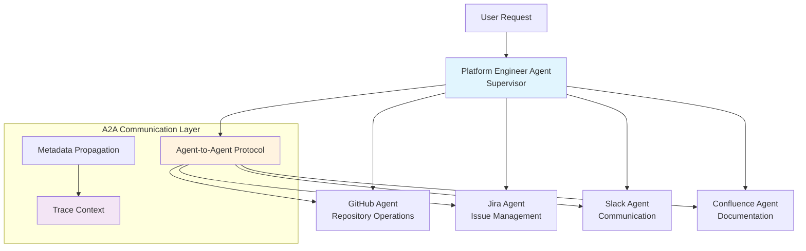
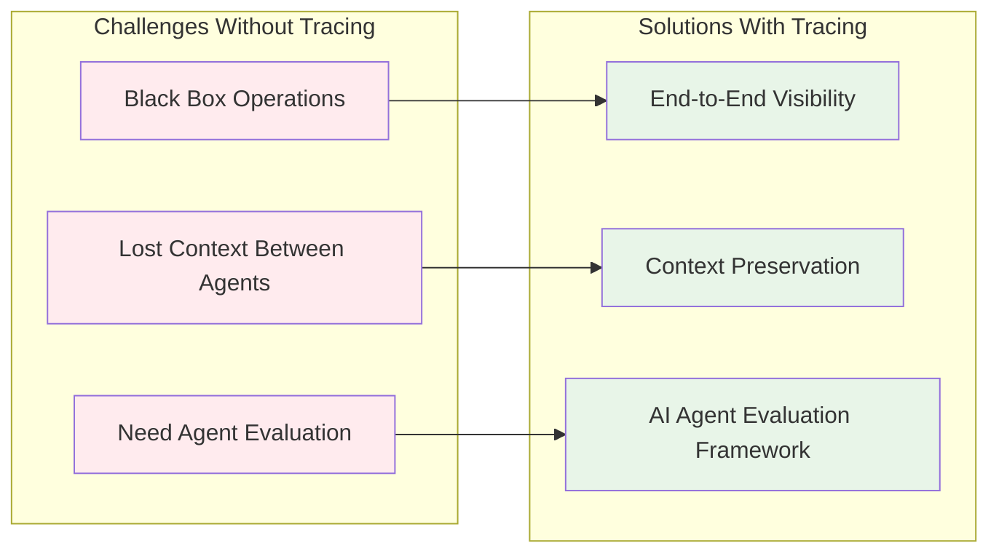
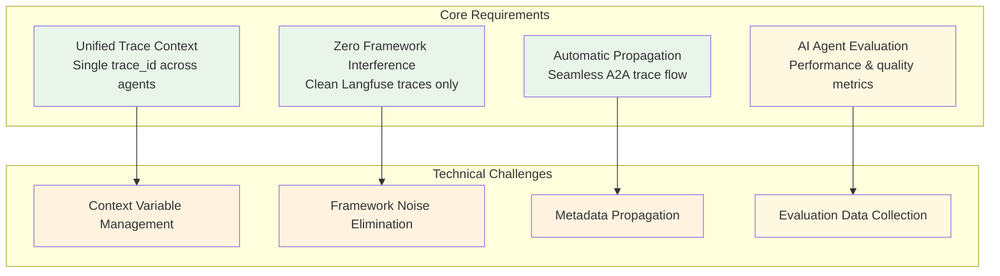
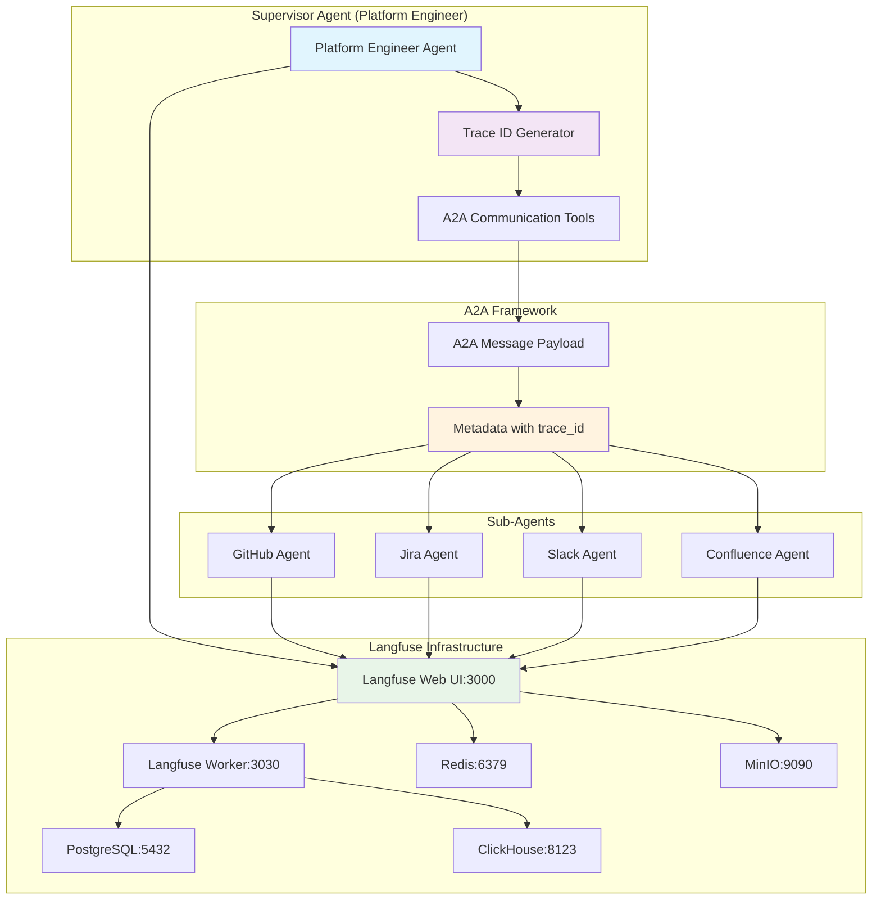
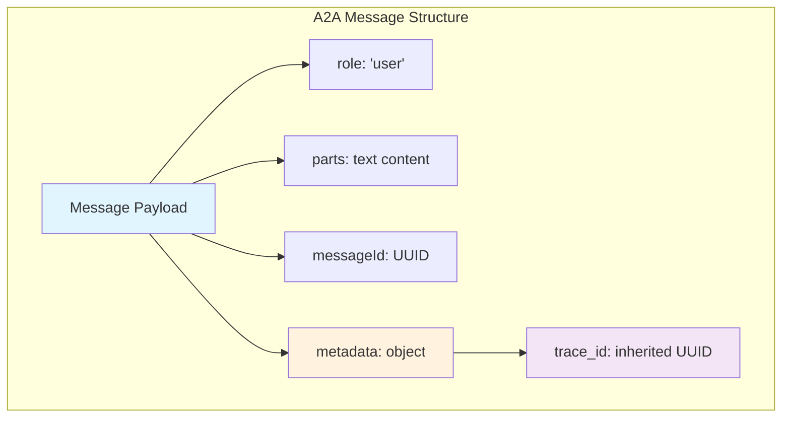
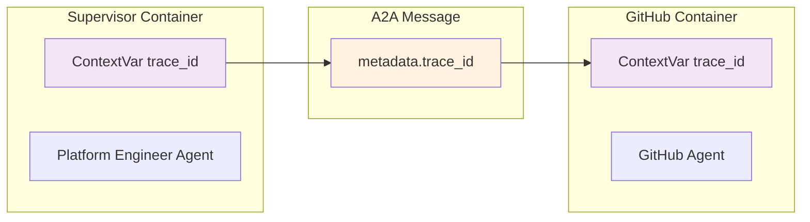
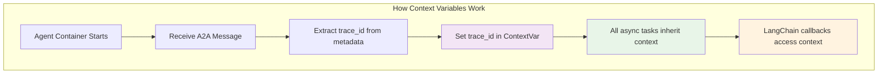
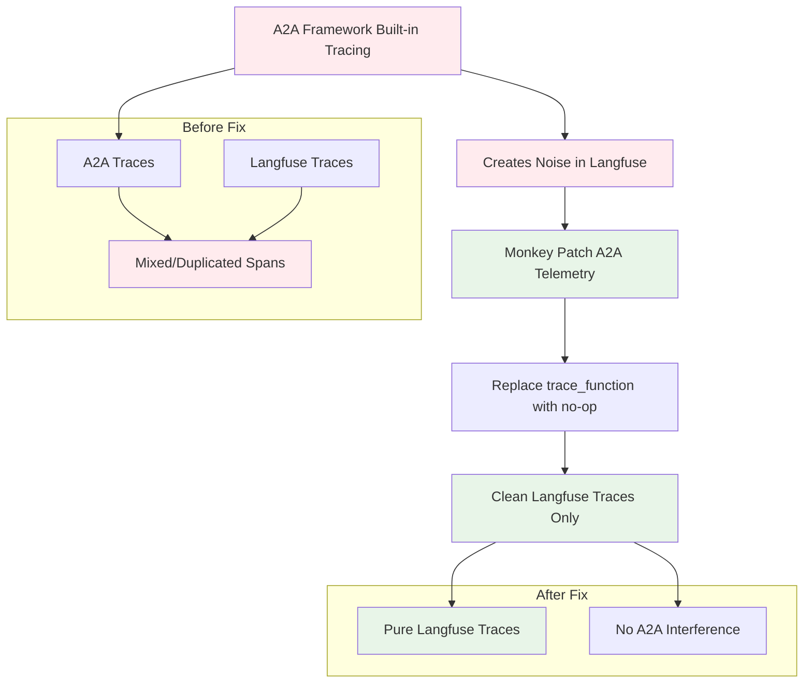
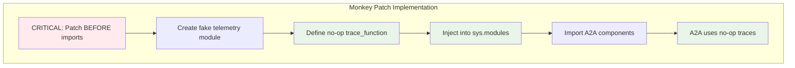

# Multi-Agent Distributed Tracing Architecture

The architecture diagram illustrates a multi-agent distributed tracing system designed to provide end-to-end observability across various agents in a supervisor multi-agent architecture. Here's a breakdown of the components:

1. **User Request**: The process begins with a user request, which is handled by the **Supervisor Agent**. This agent acts as the central orchestrator for all subsequent operations.

2. **Sub-Agents**: The supervisor interacts with multiple sub-agents

3. **A2A Communication Layer**:
   - This layer provides communication between agents using the **Agent-to-Agent Protocol (A2A)**.
   - **Metadata Propagation** ensures that critical information, such as trace IDs, is passed along with each request.
   - **Trace Context** maintains the continuity of tracing information across agent boundaries.

4. **Tracing Flow**:
   - The end user generates a unique trace ID for request.
   - This trace ID is propagated through the A2A communication layer to all sub-agents, ensuring that all operations are linked to the same trace context.


**Styling notes**:
  - The supervisor agent is highlighted in blue (`#e1f5fe`) to indicate its central role.
  - The A2A communication layer is styled in orange (`#fff3e0`) to emphasize its role in connecting agents.
  - The trace context is styled in purple (`#f3e5f5`) to signify its importance in maintaining observability.
### Why Distributed Tracing is Critical

In a multi-agent environment, understanding the flow of operations across agent boundaries becomes essential for:



### Tracing Implementation Goals

Our distributed tracing implementation addresses these specific requirements:



## Overview

The CAIPE (Community AI Platform Engineering) system implements distributed tracing using **Langfuse** to provide end-to-end observability across multi-agent workflows. This enables debugging, performance analysis, and understanding of complex agent-to-agent interactions.

## Architecture Diagram



## Trace Flow

```mermaid
sequenceDiagram
    participant User
    participant Supervisor as Platform Engineer Agent
    participant A2A as A2A Framework
    participant GitHub as GitHub Agent
    participant Langfuse

    User->>Supervisor: Request (e.g., "Create PR")
    Supervisor->>Supervisor: Generate UUID trace_id
    Note over Supervisor: 🔍 Supervisor initialized trace_id: abc123

    Supervisor->>Langfuse: Create parent span
    Supervisor->>A2A: Call GitHub agent with trace_id in metadata
    Note over A2A: Message payload includes trace_id

    A2A->>GitHub: Forward request with trace_id
    GitHub->>GitHub: Extract trace_id from metadata
    Note over GitHub: 🔍 GitHub Agent using SUPERVISOR trace_id: abc123

    GitHub->>Langfuse: Create child span with same trace_id
    GitHub->>GitHub: Execute GitHub operations
    GitHub->>Langfuse: Log span completion

    GitHub->>A2A: Return response
    A2A->>Supervisor: Forward response
    Supervisor->>Langfuse: Complete parent span
    Supervisor->>User: Final response
```



## Key Components

### 1. Trace ID Management

**Location**: `ai_platform_engineering/utils/a2a/a2a_remote_agent_connect.py`

```python
# Thread-safe trace ID storage
current_trace_id: ContextVar[Optional[str]] = ContextVar('current_trace_id', default=None)

# Langfuse v3 compliant trace ID generation
def generate_trace_id() -> str:
    return uuid4().hex.lower()  # 32-char lowercase hex
```

### 2. A2A Communication with Tracing

**Location**: `ai_platform_engineering/utils/a2a/a2a_remote_agent_connect.py:176-188`

#### Message Payload Structure with Trace ID




**Most common flow:** The supervisor agent sets trace_id in context variable, and A2A tools inherit it automatically without needing explicit input.


#### Context Variable Isolation



**Context Variable Mechanism:**

Each agent container runs in isolation with its own Python `contextvars.ContextVar` for trace ID storage. This provides:

- **Thread Safety**: Each async task maintains its own trace context
- **Container Isolation**: No shared memory between supervisor and sub-agents
- **Automatic Inheritance**: Child tasks inherit parent context within the same container
- **Cross-Container Bridge**: A2A metadata serves as the bridge between isolated contexts



### 4. A2A Noise Reduction

#### Problem and Solution Flow



**Monkey Patching Method:**

The A2A framework has built-in telemetry that creates unwanted trace spans. Our solution uses Python's module system to intercept and disable this tracing:



**Implementation Details:**

- **Timing is Critical**: Patch must happen before any A2A imports
- **Module Replacement**: Replace `a2a.utils.telemetry` with custom no-op module
- **Function Signature Preservation**: No-op function maintains same interface as original
- **Clean Separation**: Langfuse tracing continues unaffected by A2A framework

## Environment Configuration

### Development Setup

```bash
# Enable tracing
ENABLE_TRACING=true

# Langfuse configuration
LANGFUSE_PUBLIC_KEY=<your-public-key>
LANGFUSE_SECRET_KEY=<your-secret-key>
LANGFUSE_HOST=http://langfuse-web:3000
LANGFUSE_SESSION_ID=ai-platform-engineering
LANGFUSE_USER_ID=platform-engineer
```

### Tracing Implementation Details

#### Conditional Langfuse Imports

The system uses environment-based conditional imports to prevent dependency issues:

```python
# Conditional langfuse import based on ENABLE_TRACING
if os.getenv("ENABLE_TRACING", "false").lower() == "true":
    from langfuse import get_client
    from langfuse.langchain import CallbackHandler
    langfuse_handler = CallbackHandler()
else:
    langfuse_handler = None
```

#### Thread-Safe Context Management

Each agent container maintains its own context variable for trace ID storage:

```python
# Context variable declaration (supervisor)
current_trace_id: ContextVar[Optional[str]] = ContextVar('current_trace_id', default=None)

# Context variable declaration (GitHub agent)
current_trace_id: ContextVar[Optional[str]] = ContextVar('current_trace_id', default=None)
```

#### Langfuse Span Creation

Spans are created with the CallbackHandler in LangChain's RunnableConfig:

```python
runnable_config = RunnableConfig(
    configurable={"thread_id": context_id},
    callbacks=[langfuse_handler] if langfuse_handler else []
)

# Execute with tracing
result = await self.graph.ainvoke(inputs, config=runnable_config)
```

### Docker Compose Profiles

**Development with Tracing**:
```bash
docker-compose -f docker-compose.dev.yaml --profile build-tracing up
```

**Production with Tracing**:
```bash
docker-compose --profile tracing up
```

## Recent Improvements

Based on recent commits, the distributed tracing system has been enhanced with:

1. **Unified Trace Trees** (`5cd9edf`): Connected supervisor-github-agent traces into coherent trace hierarchies
2. **A2A Noise Elimination** (`0d4926f`): Disabled A2A framework's built-in tracing to prevent interference
3. **Volume Mount Updates** (`48287cd`): All agents now receive tracing environment variables
4. **Langfuse Environment Setup** (`887f879`): Enhanced build-tracing profile with proper Langfuse configuration
5. **Code Deduplication** (`e231568`): Cleaned up duplicate tracing code across agent implementations

