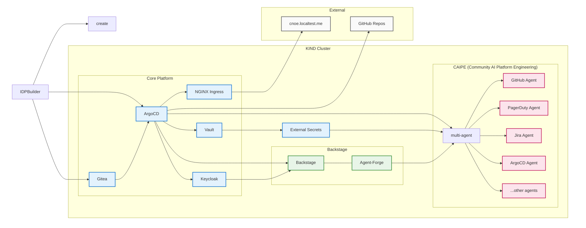

# Run with IDPBuilder 🏗️ 💻

[IDPBuilder](https://cnoe.io/docs/idpbuilder) is a tool for creating local Internal Developer Platform environments using KIND clusters. It provides a fast way to deploy and test platform components including ArgoCD, Vault, Backstage, and AI Platform Engineering agents.

<div style={{paddingBottom: '56.25%', position: 'relative', display: 'block', width: '100%'}}>
	<iframe src="https://app.vidcast.io/share/embed/3dc7f168-c8b0-40d3-aa45-66f74ec0ec03?disableCopyDropdown=1" width="100%" height="100%" title="Run CAIPE (Community AI Platform Engineering) using IDPBuilder" loading="lazy" allow="fullscreen *;autoplay *;" style={{position: 'absolute', top: 0, left: 0, border: 'solid', borderRadius: '12px'}}></iframe>
</div>


## Architecture Overview

IDPBuilder creates a KIND cluster and deploys platform components via ArgoCD. The CAIPE (Community AI Platform Engineering) stack adds authentication, secret management, and multi-agent AI capabilities:



### Component Flow

1. **IDPBuilder Initialization**: Creates KIND cluster and deploys ArgoCD + Gitea as foundation
2. **Platform Deployment**: ArgoCD deploys all platform components from Git repositories
3. **Authentication Setup**: Keycloak provides SSO for Backstage and other platform services
4. **Secret Management**: Vault stores secrets, External Secrets distributes to applications
5. **Developer Access**: NGINX Ingress routes traffic, Backstage provides developer portal
6. **AI Integration**: Agent-Forge plugin in Backstage connects to CAIPE MAS Agent
7. **Multi-Agent System**: Orchestrator manages individual agents for different platform domains

## Step 1: Install Pre-requisities (Recommended)

### Option 1: Automated Setup from a fresh Ubuntu VM or Ubuntu EC2 instance

> **Note:** These instructions are based on a Ubuntu/Debian VM

For a complete development environment with i3 desktop and VNC access on a vanilla Ubuntu VM or Ubuntu EC2 instance:

**System Requirements:**

- 8 CPUs
- 16 GB RAM
- 80 GB Disk Space
- Docker installed and ready

:::warning IMPORTANT WARNING - READ BEFORE RUNNING 🚨
This script makes SIGNIFICANT system changes and is ONLY intended for fresh Ubuntu VMs/EC2 instances. DO NOT run on your personal machine or production systems!
:::

#### What This Script Installs:

- **Development Tools:** Docker, Kubernetes (kubectl, Kind, K9s), HashiCorp Vault, GitHub CLI, IDPBuilder
- **Desktop Environment:** i3 window manager, TigerVNC server, Firefox, Terminator
- **System Utilities:** git, vim, jq, curl, wget, and more

#### ⚠️ Important Warnings:

**This script will:**
- **Remove GNOME desktop** if installed
- Modify system configuration files
- Add APT repositories and Docker group permissions

**✅ Safe for:** Fresh Ubuntu VMs/EC2 instances and dedicated dev environments

**❌ DO NOT use on:** Personal machines, production servers, or systems where you need GNOME

```bash
curl -sSL https://raw.githubusercontent.com/sriaradhyula/stacks/refs/heads/main/caipe/scripts/setup-ubuntu-prerequisites.sh -o /tmp/setup-ubuntu-prerequisites.sh && chmod +x /tmp/setup-ubuntu-prerequisites.sh && /tmp/setup-ubuntu-prerequisites.sh
```

### Option 2: Manual Setup

For detailed manual installation and configuration steps, see [Manual Setup Guide](./ubuntu-prerequisites.md).

### Option 3: Existing Machine Setup

If you're running on your existing machine, ensure you have the following prerequisites installed as well as ensureing it does meet the above system requirements.

**Required:**
- **Docker**: Container runtime ([Install Docker](https://docs.docker.com/engine/install/))
- **kubectl**: Kubernetes CLI ([Install kubectl](https://kubernetes.io/docs/tasks/tools/))
- **IDPBuilder**: Install [idpbuilder CLI](https://github.com/cnoe-io/idpbuilder?tab=readme-ov-file#installation)

## Step 2: Clone CAIPE Stack

Clone the CAIPE stack GitHub repository which contains the CAIPE platform and all the components to deploy the IDPBuilder cluster:

```bash
git clone https://github.com/sriaradhyula/stacks
```

## CAIPE Runtime/Deployment Profiles

CAIPE (Community AI Platform Engineering) offers multiple runtime/deployment profiles to suit different use cases:

### Available Profiles

| Profile | Description | Use Case |
|---------|-------------|----------|
| `caipe-basic-p2p` | Basic peer-to-peer AI platform with essential components | Quick testing, minimal setup, *best for learning* |
| `caipe-complete-p2p` **(recommended)** | Full-featured platform with all AI agents and integrations | Production-like with complete with CAIPE + A2A Peer-to-Peer betwen agents |
<!-- | `caipe-complete-slim` | Complete platform with SLIM pub/sub | Production-like with complete with CAIPE + A2A over AGNTCY SLIM  | -->

## Step 3: Pick your runtime/deployment CAIPE profile

IDPBuilder supports different profiles as listed above:

#### Option 1: CAIPE Complete A2A P2P Profile (recommended)

```bash
# From the dicrectory that the stacks repository is cloned to
# Create cluster with CAIPE complete-p2p profile
idpbuilder create \
  --use-path-routing \
  --package stacks/ref-implementation \
  --package stacks/caipe/base \
  --package stacks/caipe/complete
```

#### Option 2: CAIPE Basic A2A P2P Profile (for learning and quick start)

```bash
# Create cluster with CAIPE basic-p2p profile
idpbuilder create \
  --use-path-routing \
  --package stacks/ref-implementation \
  --package stacks/caipe/base
```


<!-- #### Option 3: CAIPE Complete A2A over Slim Profile

```bash
# Create cluster with CAIPE complete-slim profile
idpbuilder create \
  --use-path-routing \
  --package https://github.com/sriaradhyula/stacks//ref-implementation \
  --package https://github.com/sriaradhyula/stacks//caipe/base \
  --package https://github.com/sriaradhyula/stacks//caipe/complete-slim
``` -->

Run your preferred runtime option. This process will:

* Create a KIND cluster
* Install core platform components
* Deploy ArgoCD, Vault, and Backstage
* Configure ingress with path-based routing

:::note
This takes around 5-10 minutes. Feel free to grab a coffee while it's deploying :coffee:
:::

:::note
Before proceeding to configure secrets, you may want to access ArgoCD to monitor the deployment progress of platform components.
:::

## Access ArgoCD and Monitor Deployments

Once the cluster is created, IDPBuilder outputs the ArgoCD URL.

### Get ArgoCD Credentials

```bash
# Get admin password
idpbuilder get secrets -p argocd
```

### Access ArgoCD

Open https://cnoe.localtest.me:8443/argocd/ and login with:
- Username: `admin`
- Password: From the command above

Monitor application sync status for vault, ai-platform-engineering. Initial synchronization takes 3-5 minutes as the cluster will be pulling all the required images.

### Verify Vault Application Sync Status

Before proceeding to the next step, verify that the Vault application has synced successfully on ArgoCD like below:

:::note
If you can't see Vault application in the ArgoCD UI, go to the 2nd page and check if Vault application is listed.
:::

<div class="img-quarter-width">


</div>

## Step 4: Configure Vault Secrets

After Vault application syncs successfully on ArgoCD, configure your LLM provider credentials:

### Run Setup Secrets using setup-all.sh (Recommended)

:::note
If you prefer to configure secrets manually through the Vault UI, see [Manual Vault Secret Setup](./manual-vault-secret-setup.md).
:::

By default, ArgoCD and Backstage secrets are already populated in Vault using the local deployment credentials (if the sub-agents are running in your cluster). However, you can override these secrets if you want to run the sub-agents on your remote ArgoCD and Backstage deployments.

The below script will do the following:
- Prompt you to select your LLM provider. Collect the required credentials securely and store them in cluster local Vault automatically
- Detect all sub-agents running in your cluster and populate thier secrets in Vault automatically
- Refresh the Kubernetes secrets and restart the deployments to ensure all agents pick up the new credentials

If you already have LLM credentials and other sub-agent secrets in `.env` file, you can run the setup-all.sh script to configure them automatically:

:::info
The below script will automatically detect all sub-agents running in your cluster and populate only those secrets in Vault. It will not overwrite any existing secrets in Vault by default (ArgoCD and Backstage). If you want to overwrite these secrets, you can add the `--override-all` flag to the command.
:::

:::note
If any secret is missing in the `.env` file, the script will prompt you to enter it interactively.
:::

```bash
stacks/caipe/scripts/setup-all.sh --envFile <path-to-your-env-file>
```

If you don't have a `.env` file, you can run the script without the `--envFile` option and it will prompt you to enter your credentials interactively:

```bash
stacks/caipe/scripts/setup-all.sh
```

Once the script is complete, you will see the following message:

```
✅ Cleanup process completed successfully!
🎯 All secrets and pods have been refreshed in the ai-platform-engineering namespace
✅ All done.
```

You can also verify the secrets are correctly configured in Vault by checking the Vault UI at https://vault.cnoe.localtest.me:8443/ui/vault/secrets/secret/kv/list/ai-platform-engineering/

When asked for the token to access Vault, use the root token from the command below:

```bash
# Extract root token
kubectl get secret vault-root-token -n vault -o jsonpath="{.data}" | \
  jq -r 'to_entries[] | "\(.key): \(.value | @base64d)"'
```

## Step 5: Access RAG WebUI Portal (Optional)

The RAG (Retrieval-Augmented Generation) WebUI provides a powerful interface for ingesting, querying, and managing knowledge bases that enhance your AI agents' capabilities.

### Access RAG Ingestion WebUI

Open https://rag-webui.cnoe.localtest.me:8443/ to access the RAG WebUI Portal.

### RAG Ingestion Interface

Use the ingestion interface to add documents, websites, and other knowledge sources to your RAG system:


### RAG Querying Interface

Query your ingested knowledge bases to test retrieval and get insights from your documents:


### Advanced RAG Search

Perform advanced searches with filters, similarity thresholds, and custom parameters:


The RAG WebUI allows you to:
- **Ingest Documents**: Upload PDFs, text files, and web content
- **Query Knowledge**: Search and retrieve relevant information
- **Test Retrieval**: Validate your knowledge base responses
- **Monitor Performance**: Track ingestion and query metrics
- **Configure Settings**: Adjust embedding models and search parameters

## Step 6: Access Backstage Portal

### Get Backstage Credentials

```bash
# Get user1 password
idpbuilder get secrets | grep USER_PASSWORD | sed 's/.*USER_PASSWORD=\([^,]*\).*/\1/'
```

### Login to Backstage

Open https://cnoe.localtest.me:8443/ and login with:
- Username: `user1`
- Password: From the command above

### Interact with the AI Platform Engineer Assistant

Once logged into the Backstage portal, you can interact with the AI Platform Engineer assistant by clicking on the AI agent icon in the bottom-right corner.


When you click on the AI agent icon, it will open up the AI Platform Engineer assistant UI where you will be able to interact directly with the agent.


### Some example prompts to try out

```
What can you do?
```

```
What ArgoCD version are you using? # If running ArgoCD agent
```

```
Get my Github profile detatils # If running Github agent
```

## Useful Addresses for IDPBuilder Cluster

- ArgoCD: https://cnoe.localtest.me:8443/argocd/
- Backstage: https://cnoe.localtest.me:8443/
- Vault: https://vault.cnoe.localtest.me:8443/
- Keycloak: https://cnoe.localtest.me:8443/keycloak/admin/master/console/
- Gitea: https://cnoe.localtest.me:8443/gitea/
- RAG Ingestion WebUI: https://rag-webui.cnoe.localtest.me:8443/

## Troubleshooting

### Verify Kubernetes Cluster

If you need to verify the cluster status and configuration:

```bash
# Check cluster status
kubectl get nodes
```

```bash
# Verify all pods are running
kubectl get pods --all-namespaces
```

```bash
# Check ingress configuration
kubectl get ingress --all-namespaces
```

### Manual Refresh Commands

If you prefer to run the commands manually:

```bash
# Delete all secrets
kubectl delete secret --all -n ai-platform-engineering
```

```bash
# Restart all deployments
kubectl rollout restart deployment -n ai-platform-engineering
```

```bash
# Wait for deployments to be ready
kubectl rollout status deployment -n ai-platform-engineering --timeout=300s
```

```bash
# Check final status
kubectl get pods -n ai-platform-engineering
```

```bash
kubectl get deployments -n ai-platform-engineering
```

### Troubleshooting Not-Ready Pods

If pods are running but not ready (0/1 Ready), the script will automatically:
- Show pod events to identify startup issues
- Display container logs for troubleshooting
- Wait additional time for readiness checks
- Provide guidance for manual investigation

Common issues and solutions:
- **Readiness probe failures**: Check application health endpoints
- **Missing secrets**: Ensure secrets are properly configured in Vault
- **Application startup time**: Some applications need more time to initialize
- **Dependency issues**: Verify all required services are available

## VNC Management Commands

```bash
# List VNC sessions
vncserver -list
```

```bash
# Kill VNC session
vncserver -kill :1
```

```bash
# Restart VNC with new resolution
vncserver :1 -geometry 2560x1400 -depth 24 -localhost yes
```

```bash
# Start VNC viewer with SSH tunnel
ssh -i ~/.ssh/private.pem -L 5903:localhost:5901 ubuntu@<YOUR UBUNTU IP> -f -N && vncviewer localhost:5903
```

## Cleanup

```bash
# Destroy the cluster and all resources
kind delete cluster --name localdev
```

```bash
# Stop VNC server (if running)
vncserver -kill :1
```

## Problem
Kubernetes pod `ai-platform-engineering-supervisor-agent-d8cffb7fb-vg4w4` failing with:
```
to create fsnotify watcher: too many open files
```

## Root Cause
Default system limit of 1024 file descriptors insufficient for applications creating multiple file watchers.

## Solution 1: Pod-level Fix (Recommended)

```yaml
apiVersion: apps/v1
kind: Deployment
metadata:
  name: ai-platform-engineering-supervisor-agent
  namespace: ai-platform-engineering
spec:
  template:
    spec:
      securityContext:
        sysctls:
        - name: fs.inotify.max_user_instances
          value: "8192"
        - name: fs.inotify.max_user_watches
          value: "524288"
      containers:
      - name: supervisor-agent
        securityContext:
          capabilities:
            add:
            - SYS_RESOURCE
        resources:
          limits:
            memory: "512Mi"
            cpu: "500m"
```

## Solution 2: System-wide Fix

```bash
# Increase inotify limits
echo 'fs.inotify.max_user_watches=524288' | sudo tee -a /etc/sysctl.conf
sudo sysctl -p

# Restart the pod
kubectl delete pod ai-platform-engineering-supervisor-agent-d8cffb7fb-vg4w4 -n ai-platform-engineering
```

## Verification

```bash
# Check current limits
ulimit -n
cat /proc/sys/fs/inotify/max_user_watches
```

Apply the deployment changes and the pod will automatically restart with increased file descriptor limits.