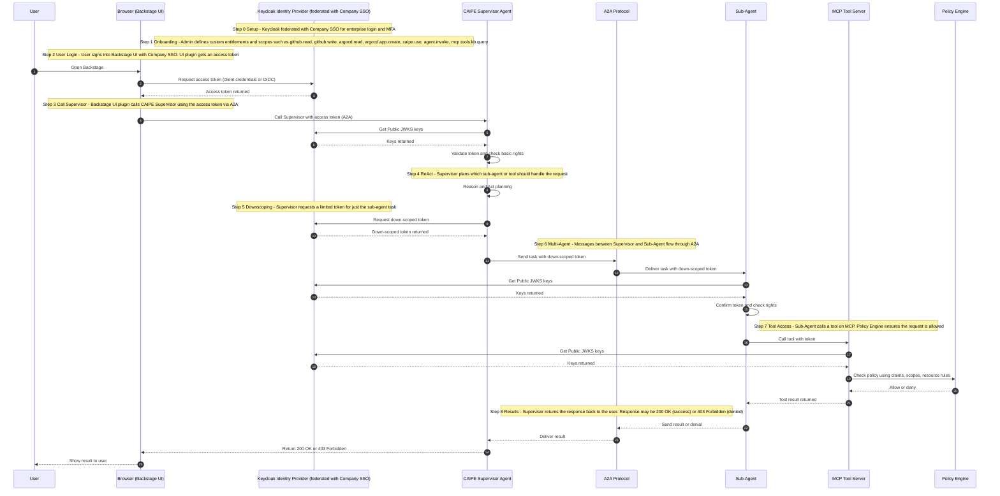

# Security

The CAIPE (Community AI Platform Engineering) Multi-agent Systems provide robust user interfaces that facilitate seamless interaction between agents using the Agent-to-Agent (A2A) protocol. These interfaces are designed to support secure communication and collaboration among agents, leveraging OAuth for authentication to ensure data integrity and privacy.

These interfaces empower users to build and manage sophisticated multi-agent systems with ease and security.

> **Note:** Authorization and scope validation are currently handled by MCP servers. Additional details regarding this process will be provided in future updates.

Refer to [User Interfaces](../getting-started/user-interfaces.md) for additional details on client authentication.

## Login Flow

