# Platform Engineer Evaluation System

Automated testing framework for validating Platform Engineer multi-agent workflows using Langfuse dataset evaluation capabilities.

## 🏗️ Architecture Overview

The evaluation system provides end-to-end testing of agent routing decisions and tool usage patterns:

```mermaid
graph TB
    subgraph "External Systems"
        UI[Langfuse UI<br/>Dashboard]
        PE[Platform Engineer<br/>Multi-Agent System]
        LF[Langfuse Server<br/>Trace Storage]
    end

    subgraph "Evaluation System"
        WH[Webhook Service<br/>langfuse_webhook.py]
        ER[Evaluation Runner<br/>runner.py]
        EC[A2A Client<br/>eval_client.py]
        TE[Trace Extractor<br/>extractor.py]

        subgraph "Dual Evaluators"
            RE[Routing Evaluator<br/>supervisor → agent]
            TME[Tool Match Evaluator<br/>agent → tool]
        end

        DS[Dataset Files<br/>YAML]
        US[Upload Script<br/>upload_dataset.py]
    end

    DS -->|Upload| US
    US -->|Store Datasets| LF
    UI -->|Trigger Evaluation| WH
    WH -->|Orchestrate| ER
    ER -->|Send Prompts| EC
    EC -->|A2A Protocol| PE
    PE -->|Auto-trace| LF
    ER -->|Extract Traces| TE
    TE -->|Analyze| LF
    ER -->|Evaluate Routing| RE
    ER -->|Evaluate Tools| TME
    RE -->|Submit Scores| LF
    TME -->|Submit Scores| LF
    LF -->|Display Results| UI

    style WH fill:#f3e5f5
    style ER fill:#e8f5e8
    style PE fill:#fff3e0
    style LF fill:#fce4ec
    style RE fill:#e3f2fd
    style TME fill:#e8f5e8
```



## 🚀 Quick Start

### 1. **Start the System**
```bash
# Start evaluation webhook with tracing
docker-compose -f docker-compose.dev.yaml --profile p2p-tracing up
```

### 2. **Upload Dataset**
```bash
cd evals
python upload_dataset.py datasets/single_agent.yaml
```

### 3. **Configure Webhook in Langfuse**
- Navigate to Langfuse UI: http://localhost:3000
- Go to **Datasets** → Select your dataset
- Click **"Start Experiment"** → **"Custom Experiment"** (⚡ button)
- Set webhook URL: **`http://evaluation-webhook:8000/evaluate`**
- Click **"Run"** to start evaluation

### 4. **Monitor Results**
- View evaluation progress in Langfuse dashboard
- Check individual trace scores and reasoning
- Analyze routing and tool usage patterns

## 📁 Directory Structure

```
evals/
├── webhook/              # FastAPI webhook service
│   └── langfuse_webhook.py   # Handles Langfuse evaluation triggers
├── evaluators/           # Dual evaluation system
│   ├── routing_evaluator.py      # Supervisor → agent routing quality
│   └── tool_match_evaluator.py   # Agent → tool alignment quality
├── models/               # Pydantic data models
│   ├── evaluation.py         # EvaluationResult, RoutingResult, ToolMatchResult
│   └── dataset.py            # Dataset and WebhookPayload models
├── trace_analysis/       # Trace processing
│   └── extractor.py          # Extract tool calls from Langfuse traces
├── clients/              # A2A communication
│   └── eval_client.py        # Send requests to Platform Engineer
├── datasets/             # Test datasets
│   ├── single_agent.yaml    # Single agent test cases
│   └── multi_agent.yaml     # Multi-agent workflow tests
├── runner.py             # Core evaluation orchestration engine
├── upload_dataset.py     # Dataset upload utility
└── Dockerfile           # Container image definition
```

## 🔧 Environment Setup

### Required Environment Variables
```bash
# Langfuse configuration
export LANGFUSE_PUBLIC_KEY="pk-lf-your-key"
export LANGFUSE_SECRET_KEY="sk-lf-your-key"
export LANGFUSE_HOST="http://localhost:3000"

# Platform Engineer connection
export PLATFORM_ENGINEER_URL="http://localhost:8000"

# Optional: LLM evaluation (fallback uses pattern matching)
export OPENAI_API_KEY="your-openai-key"
```

### Docker Configuration
The webhook service runs as `evaluation-webhook` container on port **8011** (external) → **8000** (internal):

```yaml
# docker-compose.dev.yaml
evaluation-webhook:
  build:
    context: ./evals
    dockerfile: Dockerfile
  container_name: evaluation-webhook
  profiles: [p2p-tracing, slim-tracing]
  ports:
    - "8011:8000"  # External:Internal
  environment:
    - PLATFORM_ENGINEER_URL=http://platform-engineering:8000
    - LANGFUSE_HOST=http://langfuse-web:3000
```

**Webhook URL for Langfuse**: `http://evaluation-webhook:8000/evaluate`

## 🎯 How It Works

### Dual Evaluator System
The system uses two specialized evaluators for comprehensive assessment:

1. **Routing Evaluator** - Validates supervisor-to-agent routing decisions
2. **Tool Match Evaluator** - Validates agent-to-tool usage patterns

### Key Data Structures

```python
# Evaluation Results
class EvaluationResult(BaseModel):
    trace_id: str
    routing_score: float        # 0.0 - 1.0
    tool_match_score: float     # 0.0 - 1.0
    routing_reasoning: str
    tool_match_reasoning: str
    user_prompt: str

# Dataset Items
class DatasetItem(BaseModel):
    id: str
    messages: List[Message]
    expected_agents: List[str]     # For routing evaluation
    expected_behavior: str         # For tool match evaluation
    expected_output: Optional[str]
```

### Evaluation Flow

1. **Dataset Upload**: YAML datasets uploaded to Langfuse
2. **Webhook Trigger**: Langfuse UI triggers evaluation via webhook
3. **Request Processing**: Runner sends prompts to Platform Engineer via A2A
4. **Trace Analysis**: Extract tool calls and agent interactions from traces
5. **Dual Evaluation**:
   - Route correctness (supervisor → agent)
   - Tool alignment (agent → tool)
6. **Score Submission**: Results submitted back to Langfuse with detailed reasoning

### Dataset Format Example

```yaml
name: single_agent_tests
description: Single agent evaluation tests
prompts:
  - id: "github_repo_description"
    messages:
      - role: "user"
        content: "show repo description for ai-platform-engineering"
    expected_agents: ["github"]
    expected_behavior: "Should use GitHub agent to fetch repository description"
    expected_output: "The ai-platform-engineering repository is a platform engineering toolkit..."
```

## 🔍 Monitoring

### Service Health
```bash
# Check webhook service status
curl http://localhost:8011/health

# Response shows evaluator availability
{
  "status": "healthy",
  "langfuse": "configured",
  "evaluators": ["routing", "tool_match"],
  "platform_engineer": "connected"
}
```

### Evaluation Progress
- **Langfuse Dashboard**: Real-time trace analysis and scoring
- **Individual Traces**: Detailed tool call sequences and timing
- **Aggregate Metrics**: Success rates and performance patterns

## 🐳 Development

### Local Testing
```bash
# Test individual components
python upload_dataset.py datasets/single_agent.yaml
python webhook/langfuse_webhook.py

# Test with Docker
docker build -t platform-engineer-evals .
docker run -p 8000:8000 platform-engineer-evals
```

### Adding New Datasets
Create YAML files in `datasets/` with the required structure, then upload using the upload script.

---

This evaluation system is part of the CAIPE (Community AI Platform Engineering) multi-agent platform for automated infrastructure operations and incident response.